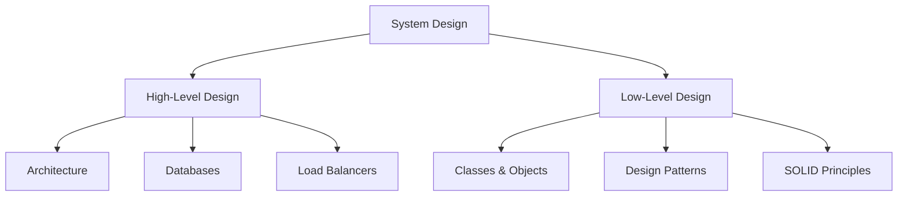
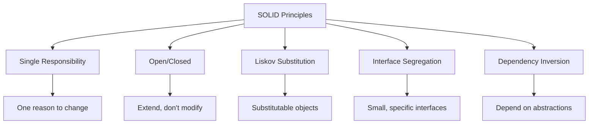

# 📚 Object-Oriented Programming (OOP) \& SOLID Principles Complete Guide

## 📖 Table of Contents

- [Introduction](#introduction)
- [Object-Oriented Programming Basics](#object-oriented-programming-basics)
- [SOLID Principles](#solid-principles)
- [Code Examples](#code-examples)
- [Interview Tips](#interview-tips)

***

## 🎯 Introduction

Welcome to the comprehensive guide on **Object-Oriented Programming (OOP)** and **SOLID Principles**! This documentation covers fundamental concepts essential for Low-Level System Design (LLD) and software development best practices.

### 🎪 What is Low-Level Design (LLD)?

> **LLD focuses on writing clean, maintainable, and extensible code**

- **High-Level Design (HLD)**: System architecture, databases, microservices, load balancers
- **Low-Level Design (LLD)**: Classes, functions, code structure, design patterns




***

## 🏗️ Object-Oriented Programming Basics

### 🔧 Classes and Objects

#### 📝 Definition

- **Class**: Blueprint or template that defines structure
- **Object**: Instance of a class with actual values


#### 💡 Real-World Examples

```java
// Class - Blueprint
public class Order {
    private String orderId;
    private String status;
    private List<Item> items;
    
    // Methods
    public void placeOrder() { /* implementation */ }
    public void getOrderDetails() { /* implementation */ }
}

// Objects - Instances
Order order1 = new Order(); // Specific order instance
Order order2 = new Order(); // Another order instance
```

```cpp
// C++ Example
class Car {
private:
    string model;
    int year;
public:
    void start() { /* implementation */ }
    void stop() { /* implementation */ }
};

// Objects
Car hondaCivic;  // Object of Car class
Car toyotaCamry; // Another object
```


***

### 🔐 Access Modifiers

| Modifier | C++ | Java | Description |
| :-- | :-- | :-- | :-- |
| **Private** | ✅ | ✅ | Accessible only within the class |
| **Public** | ✅ | ✅ | Accessible from anywhere |
| **Protected** | ✅ | ✅ | Accessible by subclasses (C++) or within package (Java) |


***

## 🎭 Four Pillars of OOP

### 1. 🎒 Encapsulation

> **Bundling data and methods together while controlling access**

#### 🎯 Benefits:

- Data integrity
- Clear separation of concerns
- Access control

```java
public class BankAccount {
    private double balance; // Private data
    
    // Controlled access through methods
    public void deposit(double amount) {
        if (amount > 0) {
            balance += amount;
        }
    }
    
    public double getBalance() {
        return balance;
    }
}
```


### 2. 🎭 Abstraction

> **Hiding complex implementation details and showing only essential features**

#### 📱 Real-World Example:

When using Google Maps, you don't need to know the complex algorithms behind route calculation.

```java
// Interface - Abstract layer
public interface PaymentProcessor {
    void processPayment(double amount);
}

// Concrete implementations
public class UPIPayment implements PaymentProcessor {
    public void processPayment(double amount) {
        // UPI-specific implementation
    }
}

public class CreditCardPayment implements PaymentProcessor {
    public void processPayment(double amount) {
        // Credit card-specific implementation
    }
}
```


### 3. 🧬 Inheritance

> **Creating new classes based on existing classes to promote code reuse**

```java
// Base class
public class Employee {
    protected String name;
    protected String employeeId;
    
    public void paySalary() { /* common implementation */ }
    public void promote() { /* common implementation */ }
}

// Derived classes
public class Manager extends Employee {
    private int teamSize;
    
    public void conductMeeting() { /* manager-specific */ }
}

public class Developer extends Employee {
    private String programmingLanguage;
    
    public void writeCode() { /* developer-specific */ }
}
```


### 4. 🔄 Polymorphism

> **One interface, multiple implementations**

#### Types:

1. **Compile-time**: Function overloading
2. **Runtime**: Function overriding
```java
// Runtime Polymorphism Example
public class OrderProcessor {
    public void processOrder(Order order) {
        // Base implementation
    }
}

public class BuyOrderProcessor extends OrderProcessor {
    @Override
    public void processOrder(Order order) {
        // Buy-specific logic
        checkWalletBalance();
        executeBuyOrder();
    }
}

public class SellOrderProcessor extends OrderProcessor {
    @Override
    public void processOrder(Order order) {
        // Sell-specific logic
        checkStockAvailability();
        executeSellOrder();
    }
}
```


***

## 🏛️ Abstract Classes vs Interfaces

### 📊 Comparison Table

| Feature | Abstract Class | Interface |
| :-- | :-- | :-- |
| **Implementation** | Can have some implemented methods | No implementation (traditionally) |
| **Variables** | Can have instance variables | Only constants |
| **Inheritance** | Single inheritance | Multiple inheritance |
| **Usage** | `extends` | `implements` |

### 💡 When to Use What?

```java
// Abstract Class - When you have common code
abstract class Vehicle {
    protected String model;
    
    // Common implementation
    public void start() {
        System.out.println("Starting " + model);
    }
    
    // Must be implemented by subclasses
    public abstract void move();
}

// Interface - When you want to enforce a contract
public interface Flyable {
    void fly();
    void land();
}

public class Airplane extends Vehicle implements Flyable {
    public void move() {
        fly(); // Implementation of abstract method
    }
    
    public void fly() {
        System.out.println("Flying in the sky");
    }
    
    public void land() {
        System.out.println("Landing on runway");
    }
}
```


***

## 💎 SOLID Principles

> **Five design principles for writing maintainable, flexible code**

### 🎯 S - Single Responsibility Principle (SRP)

> **A class should have only one reason to change**

#### ❌ Violating SRP:

```java
// BAD: Multiple responsibilities
public class OrderValidator {
    public boolean validateUserInput(Order order) { /* ... */ }
    public boolean checkSecurity(User user) { /* ... */ }
    public boolean validateFunds(User user, double amount) { /* ... */ }
    public void sendErrorEmail(String error) { /* ... */ }
    public void logError(String error) { /* ... */ }
}
```


#### ✅ Following SRP:

```java
// GOOD: Separated responsibilities
public class UserInputValidator {
    public boolean validate(Order order) { /* ... */ }
}

public class SecurityChecker {
    public boolean checkPermissions(User user) { /* ... */ }
}

public class FundsValidator {
    public boolean hasSufficientFunds(User user, double amount) { /* ... */ }
}

public class NotificationService {
    public void sendErrorEmail(String error) { /* ... */ }
}
```


### 🚪 O - Open/Closed Principle (OCP)

> **Open for extension, closed for modification**

#### ❌ Violating OCP:

```java
// BAD: Need to modify existing code for new features
public class Logger {
    public void log(String message, String type) {
        if (type.equals("DEBUG")) {
            System.out.println("DEBUG: " + message);
        } else if (type.equals("INFO")) {
            System.out.println("INFO: " + message);
        } else if (type.equals("ERROR")) {  // Adding this requires modification
            System.err.println("ERROR: " + message);
        }
    }
}
```


#### ✅ Following OCP:

```java
// GOOD: Extensible without modification
public abstract class Logger {
    public abstract void log(String message);
}

public class DebugLogger extends Logger {
    public void log(String message) {
        System.out.println("DEBUG: " + message);
    }
}

public class InfoLogger extends Logger {
    public void log(String message) {
        System.out.println("INFO: " + message);
    }
}

// New logger can be added without changing existing code
public class ErrorLogger extends Logger {
    public void log(String message) {
        System.err.println("ERROR: " + message);
    }
}
```


### 🔄 L - Liskov Substitution Principle (LSP)

> **Objects of superclass should be replaceable with objects of subclass**

#### ❌ Violating LSP:

```java
// BAD: Square violates Rectangle's behavior
public class Rectangle {
    protected int width, height;
    
    public void setWidth(int width) { this.width = width; }
    public void setHeight(int height) { this.height = height; }
    public int getArea() { return width * height; }
}

public class Square extends Rectangle {
    @Override
    public void setWidth(int width) {
        this.width = width;
        this.height = width; // Violates expectation!
    }
}

// This test will fail for Square
public void testRectangle(Rectangle r) {
    r.setWidth(5);
    r.setHeight(4);
    assert r.getArea() == 20; // Fails for Square!
}
```


#### ✅ Following LSP:

```java
// GOOD: Proper inheritance hierarchy
public abstract class Shape {
    public abstract double getArea();
}

public class Rectangle extends Shape {
    private int width, height;
    
    public Rectangle(int width, int height) {
        this.width = width;
        this.height = height;
    }
    
    public double getArea() { return width * height; }
}

public class Square extends Shape {
    private int side;
    
    public Square(int side) {
        this.side = side;
    }
    
    public double getArea() { return side * side; }
}
```


### 🧩 I - Interface Segregation Principle (ISP)

> **No client should be forced to depend on methods it doesn't use**

#### ❌ Violating ISP:

```java
// BAD: Fat interface forces unnecessary implementation
public interface User {
    void login();
    void logout();
    void doKYC(); // Not needed for all users!
    void processPayment();
}

public class Customer implements User {
    public void login() { /* implementation */ }
    public void logout() { /* implementation */ }
    public void doKYC() { 
        // Empty implementation - violation!
        throw new UnsupportedOperationException("Customers don't need KYC");
    }
    public void processPayment() { /* implementation */ }
}
```


#### ✅ Following ISP:

```java
// GOOD: Smaller, specific interfaces
public interface Authenticatable {
    void login();
    void logout();
}

public interface PaymentCapable {
    void processPayment();
}

public interface KYCRequired {
    void doKYC();
}

public class Customer implements Authenticatable, PaymentCapable {
    public void login() { /* implementation */ }
    public void logout() { /* implementation */ }
    public void processPayment() { /* implementation */ }
}

public class DeliveryPartner implements Authenticatable, KYCRequired {
    public void login() { /* implementation */ }
    public void logout() { /* implementation */ }
    public void doKYC() { /* implementation */ }
}
```


### ⬇️ D - Dependency Inversion Principle (DIP)

> **High-level modules should not depend on low-level modules. Both should depend on abstractions.**

#### ❌ Violating DIP:

```java
// BAD: Direct dependency on concrete classes
public class NotificationManager {
    private SMSSender smsSender = new SMSSender();
    private EmailSender emailSender = new EmailSender();
    
    public void sendNotification(String message, String type) {
        if (type.equals("SMS")) {
            smsSender.sendSMS(message);
        } else if (type.equals("EMAIL")) {
            emailSender.sendEmail(message);
        }
        // Adding new type requires code change!
    }
}
```


#### ✅ Following DIP:

```java
// GOOD: Depend on abstractions
public interface NotificationSender {
    void send(String message);
}

public class SMSSender implements NotificationSender {
    public void send(String message) {
        // SMS implementation
    }
}

public class EmailSender implements NotificationSender {
    public void send(String message) {
        // Email implementation
    }
}

public class NotificationManager {
    private List<NotificationSender> senders;
    
    public NotificationManager(List<NotificationSender> senders) {
        this.senders = senders;
    }
    
    public void sendNotification(String message) {
        for (NotificationSender sender : senders) {
            sender.send(message);
        }
    }
}
```


***

## 📊 SOLID Principles Summary




***

## 🎯 Benefits of Following SOLID

| Principle | Benefit | Example |
| :-- | :-- | :-- |
| **SRP** | 🎯 **Focused classes** | Easy to understand and maintain |
| **OCP** | 🔧 **Extensible code** | Add features without breaking existing code |
| **LSP** | 🔄 **Reliable inheritance** | Predictable behavior in polymorphism |
| **ISP** | 🧩 **Clean interfaces** | No forced implementations |
| **DIP** | ⚡ **Loose coupling** | Easy to test and modify |


***

## 🏆 Best Practices

### ✅ Do's

- 🎯 Keep classes focused on single responsibility
- 🔧 Use inheritance and composition wisely
- 📝 Write self-documenting code
- 🧪 Make code testable
- 🔄 Favor composition over inheritance when appropriate


### ❌ Don'ts

- 🚫 Don't create "God classes" that do everything
- 🚫 Don't force inheritance where it doesn't make sense
- 🚫 Don't write comments to explain bad code
- 🚫 Don't violate SOLID principles for short-term gains

***

## 📚 Key Takeaways

> **Remember: SOLID principles work together!**

1. **Start with requirements** - Understand what you're building
2. **Design before coding** - Think about structure first
3. **Keep it simple** - Don't over-engineer
4. **Make it extensible** - Code should grow with requirements
5. **Write for humans** - Code should be readable and maintainable

***

## 🎓 Interview Tips

### Common Questions:

1. **Explain OOP concepts with real-world examples**
2. **What are SOLID principles and why are they important?**
3. **When would you use abstract classes vs interfaces?**
4. **Give an example of violating and following each SOLID principle**

### 💡 Pro Tips:

- Always use real-world examples (Swiggy, Uber, Amazon)
- Explain the "why" behind each principle
- Show both violation and correct implementation
- Connect principles to actual work scenarios

***

