## 🧩 Single Responsibility Principle (SRP) in Detail

The **Single Responsibility Principle (SRP)** means that every module, class, or function should have only one reason to change—only one job or responsibility.

***

### 🚦 Levels of SRP Application

SRP can be applied at multiple levels:

- **Function Level:** Each function does one thing.
- **Class Level:** Each class has a well-focused purpose.
- **Module/Component Level:** Each module is responsible for one area (e.g., billing, reporting).
- **Service/System Level:** Each microservice or service handles one domain concern.

***

### 🚫 What happens if SRP is violated?

- **Code becomes harder to maintain.**
- **A change in one aspect can accidentally break unrelated logic.**
- **Testing and refactoring are more difficult.**

***

## 💡 C++ Examples: SRP Violated vs. Respected

### ❌ Example 1: SRP Violated (A C++ User class with mixed responsibilities)

```cpp
#include <iostream>
#include <string>
using namespace std;

class User {
public:
    void login() {
        cout << "User logged in" << endl;
    }
    void logout() {
        cout << "User logged out" << endl;
    }
    void printUserInfo(const string& username) {
        cout << "Username: " << username << endl;
    }
};
```

**Problem:**

- `User` is handling both authentication *and* printing information.
- If print or authentication logic changes, both may need to be touched, even though they're unrelated.[^1]

***

### ✅ Example 2: SRP Respected (Focused Classes)

```cpp
#include <iostream>
#include <string>
using namespace std;

// Handles authentication only
class Authentication {
public:
    void login() {
        cout << "User logged in" << endl;
    }
    void logout() {
        cout << "User logged out" << endl;
    }
};

// Handles user information only
class UserInfo {
public:
    void printUserInfo(const string& username) {
        cout << "Username: " << username << endl;
    }
};

// User class inherits responsibilities
class User : public Authentication, public UserInfo { };

int main() {
    User user;
    user.login();
    user.printUserInfo("Alice");
    user.logout();
    return 0;
}
```

**Explanation:**

- `Authentication` and `UserInfo` are independent, so changes in one do not affect the other.
- Code is more maintainable and testable.[^5][^1]

***

### 🗂️ Example 3: SRP in File Operations (Too Many Responsibilities)

```cpp
#include <fstream>
#include <string>
#include <vector>
using namespace std;

class FileManager {
public:
    void saveToFile(const string& filename, const string& data) {
        ofstream file(filename);
        file << data;
        file.close();
    }
    vector<string> readFromFile(const string& filename) {
        vector<string> result;
        ifstream file(filename);
        string line;
        while (getline(file, line)) {
            result.push_back(line);
        }
        file.close();
        return result;
    }
};
```

**Problem:**

- `FileManager` is responsible for *both* reading and writing files.

***

#### ✨ Proper SRP File Classes

```cpp
// Only writes files
class FileWriter {
public:
    void saveToFile(const string& filename, const string& data) {
        ofstream file(filename);
        file << data;
        file.close();
    }
};

// Only reads files
class FileReader {
public:
    vector<string> readFromFile(const string& filename) {
        vector<string> result;
        ifstream file(filename);
        string line;
        while (getline(file, line)) {
            result.push_back(line);
        }
        file.close();
        return result;
    }
};

// Compose where you need both
class FileManager : public FileReader, public FileWriter { };

int main() {
    FileManager fm;
    fm.saveToFile("data.txt", "Hello, World!\nThis is SRP.");
    auto lines = fm.readFromFile("data.txt");
    for (const auto& line : lines) {
        cout << line << endl;
    }
    return 0;
}
```

**Explanation:**

- `FileWriter` and `FileReader` can be changed independently.
- Each class is narrowly focused, so features can be added or changed without affecting unrelated code.[^1]

***

## 🍞 Realistic Example: The Bakery (Roles as Responsibilities)

Suppose a bakery has one worker for everything:

- Baking bread
- Managing inventory
- Ordering supplies
- Cleaning the store

**This is a recipe for mistakes and confusion—SRP is violated!**

```cpp
#include <iostream>
using namespace std;

class BreadBaker {
public:
    void bakeBread() {
        cout << "Baking high-quality bread..." << endl;
    }
};
class InventoryManager {
public:
    void manageInventory() {
        cout << "Managing inventory..." << endl;
    }
};
class SupplyOrder {
public:
    void orderSupplies() {
        cout << "Ordering supplies..." << endl;
    }
};
class BakeryCleaner {
public:
    void cleanBakery() {
        cout << "Cleaning the bakery..." << endl;
    }
};

int main() {
    BreadBaker baker;
    InventoryManager invMgr;
    SupplyOrder supply;
    BakeryCleaner cleaner;

    baker.bakeBread();
    invMgr.manageInventory();
    supply.orderSupplies();
    cleaner.cleanBakery();

    return 0;
}
```

**Each class has a single reason to change—SRP respected!**[^5]

***

## 🌳 Emoji Graph: SRP Refactoring

```mermaid
graph TD
    A["🚶 User (Everything)"] --> B["🔑 Auth Logic"]
    A --> C["🖨️ Print Info"]

    %% Refactored version
    D["🔑 Authentication"] --> E["login, logout"]
    F["🖨️ UserInfo"] --> G["printUserInfo"]
    H["👤 User"] --> D
    H --> F
```




***
## 🏗️ Single Responsibility Principle (SRP): In Microservices, Classes, and Functions

***

### 🌐 SRP in Microservices

**Definition:**  
In microservices architecture, the Single Responsibility Principle means:  
> **Each microservice is responsible for a single business capability, and has a single reason to change.**

#### 💡 Example: Food Delivery Platform

- **Order Service:** Handles order creation, tracking, and customer notifications.
- **Payment Service:** Processes payments and refunds.
- **Delivery Service:** Manages assignment of delivery partners and tracking deliveries.

**Why?**
- Each service is separately deployable, scalable, and maintainable.
- If order logic changes (e.g., new order status), only the Order Service is modified—not payment or delivery.[2][3]

```mermaid
graph TB
    Customer[Customer]
    OrderService[Order Service 📝]
    PaymentService[Payment Service 💸]
    DeliveryService[Delivery Service 🚚]
    Customer-->|Places order|OrderService
    OrderService-->|Triggers|PaymentService
    OrderService-->|Assigns|DeliveryService
```



**Benefits:**
- Clear boundaries ⛔ No hidden dependencies.
- Easier team ownership (each team can own a service).
- Services can be scaled independently.
- Changes in one business capability don’t impact unrelated services.[3][5]

***

### 👑 SRP in Classes (C++ Example)

**Definition:**  
A class should have only a single, well-defined responsibility—that is, only one reason to change.[6][8]

#### ✏️ Example: Violating vs Respecting SRP

##### ❌ Violating SRP
```cpp
class Report {
public:
    void generateReport() {/*...*/}
    void saveToFile(const std::string& filename) {/*...*/}
};
```
- **Problem:** Combines report generation and file saving. Changes to file I/O or format break both responsibilities.

##### ✅ Respecting SRP
```cpp
class Report {
public:
    void generate() {/*...*/}
};

class ReportSaver {
public:
    void saveToFile(const Report& report, const std::string& filename) {/*...*/}
};
```
- **Explanation:**  
  - `Report` focuses only on report creation.
  - `ReportSaver` is concerned solely with persistence.  
- Changes in saving logic (e.g., saving to database vs file) don’t touch report creation logic.

***

### 🔧 SRP in Functions

**Definition:**  
A function should do only one thing. If you need to change one aspect of your application, you should only have to change one function—not several.

#### ✏️ Example: C++ Functions

##### ❌ Violating SRP
```cpp
void processOrder(Order& order) {
    // Validate input
    // Calculate total
    // Save to database
    // Send confirmation email
}
```
- **Problem:** Multiple responsibilities—validation, calculation, persistence, notification—are tightly coupled.

##### ✅ Respecting SRP
```cpp
bool validateOrder(const Order& order) { /*...*/ }
double calculateTotal(const Order& order) { /*...*/ }
void saveOrder(const Order& order) { /*...*/ }
void sendConfirmation(const Order& order) { /*...*/ }
```
- **Explanation:**  
  - Each function is focused.
  - If logic for email confirmation changes, you only update `sendConfirmation`.

***

## 🧩 Graphical Recap


***

## 💎 Summary Table

| Level         | SRP Application                     | Example (C++)                        | Benefit                                           |
|---------------|-------------------------------------|--------------------------------------|---------------------------------------------------|
| Microservice  | One business capability per service | `OrderService`, `PaymentService`     | Scalable, deployable, clear team responsibility   |
| Class         | One responsibility per class        | `Report`, `ReportSaver`              | Easy testing, code changes localized              |
| Function      | One task per function               | `validateOrder()`, `saveOrder()`     | Readable, maintainable, easier refactoring        |

***

**SRP means: One unit. One reason to change. Always!**
