## 🧩 Single Responsibility Principle (SRP) in Detail

The **Single Responsibility Principle (SRP)** means that every module, class, or function should have only one reason to change—only one job or responsibility.

***

### 🚦 Levels of SRP Application

SRP can be applied at multiple levels:

- **Function Level:** Each function does one thing.
- **Class Level:** Each class has a well-focused purpose.
- **Module/Component Level:** Each module is responsible for one area (e.g., billing, reporting).
- **Service/System Level:** Each microservice or service handles one domain concern.

***

### 🚫 What happens if SRP is violated?

- **Code becomes harder to maintain.**
- **A change in one aspect can accidentally break unrelated logic.**
- **Testing and refactoring are more difficult.**

***

## 💡 C++ Examples: SRP Violated vs. Respected

### ❌ Example 1: SRP Violated (A C++ User class with mixed responsibilities)

```cpp
#include <iostream>
#include <string>
using namespace std;

class User {
public:
    void login() {
        cout << "User logged in" << endl;
    }
    void logout() {
        cout << "User logged out" << endl;
    }
    void printUserInfo(const string& username) {
        cout << "Username: " << username << endl;
    }
};
```

**Problem:**

- `User` is handling both authentication *and* printing information.
- If print or authentication logic changes, both may need to be touched, even though they're unrelated.[^1]

***

### ✅ Example 2: SRP Respected (Focused Classes)

```cpp
#include <iostream>
#include <string>
using namespace std;

// Handles authentication only
class Authentication {
public:
    void login() {
        cout << "User logged in" << endl;
    }
    void logout() {
        cout << "User logged out" << endl;
    }
};

// Handles user information only
class UserInfo {
public:
    void printUserInfo(const string& username) {
        cout << "Username: " << username << endl;
    }
};

// User class inherits responsibilities
class User : public Authentication, public UserInfo { };

int main() {
    User user;
    user.login();
    user.printUserInfo("Alice");
    user.logout();
    return 0;
}
```

**Explanation:**

- `Authentication` and `UserInfo` are independent, so changes in one do not affect the other.
- Code is more maintainable and testable.[^5][^1]

***

### 🗂️ Example 3: SRP in File Operations (Too Many Responsibilities)

```cpp
#include <fstream>
#include <string>
#include <vector>
using namespace std;

class FileManager {
public:
    void saveToFile(const string& filename, const string& data) {
        ofstream file(filename);
        file << data;
        file.close();
    }
    vector<string> readFromFile(const string& filename) {
        vector<string> result;
        ifstream file(filename);
        string line;
        while (getline(file, line)) {
            result.push_back(line);
        }
        file.close();
        return result;
    }
};
```

**Problem:**

- `FileManager` is responsible for *both* reading and writing files.

***

#### ✨ Proper SRP File Classes

```cpp
// Only writes files
class FileWriter {
public:
    void saveToFile(const string& filename, const string& data) {
        ofstream file(filename);
        file << data;
        file.close();
    }
};

// Only reads files
class FileReader {
public:
    vector<string> readFromFile(const string& filename) {
        vector<string> result;
        ifstream file(filename);
        string line;
        while (getline(file, line)) {
            result.push_back(line);
        }
        file.close();
        return result;
    }
};

// Compose where you need both
class FileManager : public FileReader, public FileWriter { };

int main() {
    FileManager fm;
    fm.saveToFile("data.txt", "Hello, World!\nThis is SRP.");
    auto lines = fm.readFromFile("data.txt");
    for (const auto& line : lines) {
        cout << line << endl;
    }
    return 0;
}
```

**Explanation:**

- `FileWriter` and `FileReader` can be changed independently.
- Each class is narrowly focused, so features can be added or changed without affecting unrelated code.[^1]

***

## 🍞 Realistic Example: The Bakery (Roles as Responsibilities)

Suppose a bakery has one worker for everything:

- Baking bread
- Managing inventory
- Ordering supplies
- Cleaning the store

**This is a recipe for mistakes and confusion—SRP is violated!**

```cpp
#include <iostream>
using namespace std;

class BreadBaker {
public:
    void bakeBread() {
        cout << "Baking high-quality bread..." << endl;
    }
};
class InventoryManager {
public:
    void manageInventory() {
        cout << "Managing inventory..." << endl;
    }
};
class SupplyOrder {
public:
    void orderSupplies() {
        cout << "Ordering supplies..." << endl;
    }
};
class BakeryCleaner {
public:
    void cleanBakery() {
        cout << "Cleaning the bakery..." << endl;
    }
};

int main() {
    BreadBaker baker;
    InventoryManager invMgr;
    SupplyOrder supply;
    BakeryCleaner cleaner;

    baker.bakeBread();
    invMgr.manageInventory();
    supply.orderSupplies();
    cleaner.cleanBakery();

    return 0;
}
```

**Each class has a single reason to change—SRP respected!**[^5]

***

## 🌳 Emoji Graph: SRP Refactoring

```mermaid
graph TD
    A["🚶 User (Everything)"] --> B["🔑 Auth Logic"]
    A --> C["🖨️ Print Info"]

    %% Refactored version
    D["🔑 Authentication"] --> E["login, logout"]
    F["🖨️ UserInfo"] --> G["printUserInfo"]
    H["👤 User"] --> D
    H --> F
```




***
## 🏗️ Single Responsibility Principle (SRP): In Microservices, Classes, and Functions

***

### 🌐 SRP in Microservices

**Definition:**  
In microservices architecture, the Single Responsibility Principle means:  
> **Each microservice is responsible for a single business capability, and has a single reason to change.**

#### 💡 Example: Food Delivery Platform

- **Order Service:** Handles order creation, tracking, and customer notifications.
- **Payment Service:** Processes payments and refunds.
- **Delivery Service:** Manages assignment of delivery partners and tracking deliveries.

**Why?**
- Each service is separately deployable, scalable, and maintainable.
- If order logic changes (e.g., new order status), only the Order Service is modified—not payment or delivery.[2][3]

```mermaid
graph TB
    Customer[Customer]
    OrderService[Order Service 📝]
    PaymentService[Payment Service 💸]
    DeliveryService[Delivery Service 🚚]
    Customer-->|Places order|OrderService
    OrderService-->|Triggers|PaymentService
    OrderService-->|Assigns|DeliveryService
```



**Benefits:**
- Clear boundaries ⛔ No hidden dependencies.
- Easier team ownership (each team can own a service).
- Services can be scaled independently.
- Changes in one business capability don’t impact unrelated services.[3][5]

***

### 👑 SRP in Classes (C++ Example)

**Definition:**  
A class should have only a single, well-defined responsibility—that is, only one reason to change.[6][8]

#### ✏️ Example: Violating vs Respecting SRP

##### ❌ Violating SRP
```cpp
class Report {
public:
    void generateReport() {/*...*/}
    void saveToFile(const std::string& filename) {/*...*/}
};
```
- **Problem:** Combines report generation and file saving. Changes to file I/O or format break both responsibilities.

##### ✅ Respecting SRP
```cpp
class Report {
public:
    void generate() {/*...*/}
};

class ReportSaver {
public:
    void saveToFile(const Report& report, const std::string& filename) {/*...*/}
};
```
- **Explanation:**  
  - `Report` focuses only on report creation.
  - `ReportSaver` is concerned solely with persistence.  
- Changes in saving logic (e.g., saving to database vs file) don’t touch report creation logic.

***

### 🔧 SRP in Functions

**Definition:**  
A function should do only one thing. If you need to change one aspect of your application, you should only have to change one function—not several.

#### ✏️ Example: C++ Functions

##### ❌ Violating SRP
```cpp
void processOrder(Order& order) {
    // Validate input
    // Calculate total
    // Save to database
    // Send confirmation email
}
```
- **Problem:** Multiple responsibilities—validation, calculation, persistence, notification—are tightly coupled.

##### ✅ Respecting SRP
```cpp
bool validateOrder(const Order& order) { /*...*/ }
double calculateTotal(const Order& order) { /*...*/ }
void saveOrder(const Order& order) { /*...*/ }
void sendConfirmation(const Order& order) { /*...*/ }
```
- **Explanation:**  
  - Each function is focused.
  - If logic for email confirmation changes, you only update `sendConfirmation`.

***

## 🧩 Graphical Recap


***

## 💎 Summary Table

| Level         | SRP Application                     | Example (C++)                        | Benefit                                           |
|---------------|-------------------------------------|--------------------------------------|---------------------------------------------------|
| Microservice  | One business capability per service | `OrderService`, `PaymentService`     | Scalable, deployable, clear team responsibility   |
| Class         | One responsibility per class        | `Report`, `ReportSaver`              | Easy testing, code changes localized              |
| Function      | One task per function               | `validateOrder()`, `saveOrder()`     | Readable, maintainable, easier refactoring        |

***

**SRP means: One unit. One reason to change. Always!**
---
## 🟩 Open-Closed Principle (OCP) in SOLID

### 🏛️ O stands for “Open-Closed Principle” 
**Emoji:** 🟩 *(Open Door For New Functionalities, Closed For Modifications)*

***

### 📜 Definition

**"Software entities (classes, modules, functions, etc.) should be open for extension, but closed for modification."**  
—[Bertrand Meyer, Object-Oriented Software Construction][1][2][3]

This means you should be able to add new functionality *without changing* existing, tested, reliable code.

***

### ❓ Why Does It Matter?
- **Extensible:** You can grow your system by adding new behavior.
- **Stable & Safe:** You avoid breaking working code, which reduces bugs and regression.
- **Flexible:** Teams can work on independent extensions.

***

### 🤔 How Is This Achieved?

- Use **abstraction**: base classes or interfaces.
- Use **inheritance** or **composition** to extend behaviors.
- Avoid putting `if`, `switch`, or type-checks that require code changes when adding new types.

***

## 🪄 Real-World Illustration (With Emojis):  
Think of a game 🎮 with different weapons:
- Adding a new weapon should not require changing the code that manages weapons.
- We just subclass or implement an interface.

***

## 🛑 Anti-Pattern: Not Following OCP

### Example In C++
```cpp
enum ShapeType { CIRCLE, RECTANGLE };

class Shape {
public:
    ShapeType type;
};

class AreaCalculator {
public:
    double calculateArea(const Shape& shape) {
        if (shape.type == CIRCLE) {
            // ... Calculate circle area
        } else if (shape.type == RECTANGLE) {
            // ... Calculate rectangle area
        }
        // Adding new shape? Must edit this method!
    }
};
```
**😱 Adding a Triangle means modifying `AreaCalculator`, risking bugs everywhere it’s used!**[2][5]

***

## ✅ OCP: The Right Way With Extension

### Example In C++
```cpp
class Shape {
public:
    virtual double area() const = 0;
    virtual ~Shape() {}
};

class Circle : public Shape {
    double radius;
public:
    Circle(double r) : radius(r) {}
    double area() const override { return 3.14159 * radius * radius; }
};

class Rectangle : public Shape {
    double width, height;
public:
    Rectangle(double w, double h) : width(w), height(h) {}
    double area() const override { return width * height; }
};

// Adding a new shape: Just add a new class!
class Triangle : public Shape {
    double base, height;
public:
    Triangle(double b, double h) : base(b), height(h) {}
    double area() const override { return 0.5 * base * height; }
};
```

### 👀 Usage Example
```cpp
#include <vector>
#include <memory>
#include <iostream>
using namespace std;

int main() {
    vector<shared_ptr<Shape>> shapes;
    shapes.push_back(make_shared<Circle>(5.0));
    shapes.push_back(make_shared<Rectangle>(4.0, 6.0));
    shapes.push_back(make_shared<Triangle>(4.0, 6.0));

    for(const auto& shape : shapes)
        cout << "Area: " << shape->area() << endl;
}
```
**No existing code was changed to add `Triangle`. Extension is possible without modification!**[5][6]

***

## 🔍 Emoji "Open-Closed" Graph

```mermaid
graph TD
    A["🪟 Shape (abstract)"] --> B["⚪ Circle"]
    A --> C["◼️ Rectangle"]
    A --> D["🔺 Triangle"]
    A -.-> E["🆕 (Add new shapes here, no code changed elsewhere)"]
```



***

### 📋 Summary Table

| 🟩 Principle            | What It Means                                | Key Techniques               | C++ Pattern      |
|------------------------|----------------------------------------------|------------------------------|------------------|
| Open-Closed Principle  | Open for extension, closed for modification  | Inheritance, interfaces, composition | Abstract Classes |

***

## 💎 Key Tips

- **Don’t change working code to add a feature—extend it!**  
- Use interfaces, virtual functions, and inheritance.
- Prefer "plug in" new behavior over editing old logic.
- Avoid growing `if-else` or `switch` in "manager" classes.

***

### 🌟 Benefits

- **Fewer bugs:** Reducing code changes means fewer new bugs.
- **Ease of testing:** Extensions are independently testable.
- **Collaborative:** Teams can develop features in parallel.[6][2][5]

***

**O in SOLID = OCP (🟩 Open for extension, closed for modification)**  
Design so that "adding" doesn't mean "changing"!
---
## 🪵 Logger Example: Open-Closed Principle in C++

### 🟩 Open-Closed Principle Definition
**Software entities (classes, modules, functions) should be:**
- **🔓 OPEN for Extension** - You can add new functionality
- **🔒 CLOSED for Modification** - You shouldn't change existing tested code

***

## ❌ BAD Example: Logger That VIOLATES Open-Closed Principle

```cpp
#include <iostream>
#include <fstream>
#include <string>
using namespace std;

enum LogType { CONSOLE, FILE, DATABASE };

class Logger {
public:
    void log(const string& message, LogType type) {
        if (type == CONSOLE) {
            cout << "Console Log: " << message << endl;
        }
        else if (type == FILE) {
            ofstream file("log.txt", ios::app);
            file << "File Log: " << message << endl;
            file.close();
        }
        else if (type == DATABASE) {
            cout << "Database Log: " << message << endl;
            // Simulate database logging
        }
        // 🚨 PROBLEM: Adding EMAIL logging means MODIFYING this method!
        // What about SMS logging? Network logging? We keep modifying!
    }
};

int main() {
    Logger logger;
    logger.log("Application started", CONSOLE);
    logger.log("User logged in", FILE);
    logger.log("Error occurred", DATABASE);
    
    // 😱 To add EMAIL logging, we must modify Logger class!
    return 0;
}
```

### 🚨 Problems with this approach:
1. **Modification Required**: Every new log type needs code changes
2. **Risk of Bugs**: Touching working code can break existing functionality
3. **Testing Overhead**: Need to re-test all logging types when adding one
4. **Violation of OCP**: Not closed for modification

***

## ✅ GOOD Example: Logger That FOLLOWS Open-Closed Principle

```cpp
#include <iostream>
#include <fstream>
#include <string>
#include <vector>
#include <memory>
using namespace std;

// 🎯 Abstract Base Class (Interface)
class Logger {
public:
    virtual void log(const string& message) = 0;
    virtual ~Logger() = default;
};

// 🖥️ Console Logger Implementation
class ConsoleLogger : public Logger {
public:
    void log(const string& message) override {
        cout << "[CONSOLE] " << message << endl;
    }
};

// 📄 File Logger Implementation
class FileLogger : public Logger {
private:
    string filename;
public:
    FileLogger(const string& file) : filename(file) {}
    
    void log(const string& message) override {
        ofstream file(filename, ios::app);
        file << "[FILE] " << message << endl;
        file.close();
    }
};

// 🗄️ Database Logger Implementation
class DatabaseLogger : public Logger {
public:
    void log(const string& message) override {
        cout << "[DATABASE] Saving to DB: " << message << endl;
        // Simulate database save operation
    }
};

// 📧 Email Logger (NEW! Added without modifying existing code)
class EmailLogger : public Logger {
private:
    string emailAddress;
public:
    EmailLogger(const string& email) : emailAddress(email) {}
    
    void log(const string& message) override {
        cout << "[EMAIL] Sending to " << emailAddress << ": " << message << endl;
        // Simulate email sending
    }
};

// 📱 SMS Logger (ANOTHER NEW! Still no modifications needed)
class SMSLogger : public Logger {
private:
    string phoneNumber;
public:
    SMSLogger(const string& phone) : phoneNumber(phone) {}
    
    void log(const string& message) override {
        cout << "[SMS] Sending to " << phoneNumber << ": " << message << endl;
        // Simulate SMS sending
    }
};

// 📊 Application Class (Uses loggers)
class Application {
private:
    vector<shared_ptr<Logger>> loggers;
    
public:
    void addLogger(shared_ptr<Logger> logger) {
        loggers.push_back(logger);
    }
    
    void logMessage(const string& message) {
        for (const auto& logger : loggers) {
            logger->log(message);
        }
    }
};

int main() {
    Application app;
    
    // Add different loggers
    app.addLogger(make_shared<ConsoleLogger>());
    app.addLogger(make_shared<FileLogger>("app.log"));
    app.addLogger(make_shared<DatabaseLogger>());
    
    // ✨ Adding new loggers without changing existing code!
    app.addLogger(make_shared<EmailLogger>("admin@example.com"));
    app.addLogger(make_shared<SMSLogger>("+1234567890"));
    
    // Log messages to all configured loggers
    app.logMessage("Application started successfully");
    app.logMessage("User authentication completed");
    app.logMessage("Critical error in payment module");
    
    return 0;
}
```

***

## 🎨 Visual Representation

```mermaid
graph TD
    A["🎯 Logger (Abstract Base)"] --> B["🖥️ ConsoleLogger"]
    A --> C["📄 FileLogger"]  
    A --> D["🗄️ DatabaseLogger"]
    A --> E["📧 EmailLogger"]
    A --> F["📱 SMSLogger"]
    A -.-> G["🆕 NetworkLogger (Future)"]
    A -.-> H["🆕 SlackLogger (Future)"]
    
    I["📊 Application"] --> A
    I -.-> J["✅ No changes needed when adding new loggers!"]
```



***

## 🏆 Benefits of Following OCP

| Aspect | ❌ Bad Design | ✅ Good Design |
|--------|--------------|----------------|
| **Adding New Logger** | Modify existing Logger class | Create new class inheriting from Logger |
| **Testing** | Re-test all logging methods | Test only new logger class |
| **Risk** | High (can break existing logs) | Low (existing code untouched) |
| **Maintenance** | Difficult | Easy |
| **Team Work** | Conflicts in same file | Parallel development |

***

## 📋 Key Principles Applied

### 🔓 OPEN for Extension:
- New logger types can be added easily
- Each new logger implements the `Logger` interface
- No limits on how many logger types you can add

### 🔒 CLOSED for Modification:
- Existing logger classes are never modified
- The `Logger` base class remains unchanged
- The `Application` class doesn't need updates

***

## 💡 Real-World Applications

This pattern is used in:
- **🔌 Plugin architectures** - Add new plugins without changing core
- **💳 Payment systems** - Add new payment methods easily
- **📤 Notification systems** - Add new notification channels
- **🎮 Game engines** - Add new game objects without core changes

***

## 🎯 Summary

**Open-Closed Principle ensures:**
- 🔧 **Extensibility**: Easy to add new features
- 🛡️ **Stability**: Existing code remains safe
- 🧪 **Testability**: Only test new functionality
- 👥 **Collaboration**: Teams work independently on extensions

**Remember**: If adding a feature requires modifying existing classes with `if-else` or `switch` statements, you're probably violating OCP! Use inheritance and polymorphism instead! 🚀

---
# 🔄 Liskov Substitution Principle (LSP) - Detailed Guide

## 🎯 What is Liskov Substitution Principle?

**LSP Definition**: Objects of a superclass should be replaceable with objects of its subclasses without breaking the application.

> **"If S is a subtype of T, then objects of type T may be replaced with objects of type S without altering any of the desirable properties of that program"** - Barbara Liskov (1987)

***

## 🧩 L in SOLID = Liskov Substitution Principle

**Simple Definition**: A child class must be able to do everything its parent class can do, **without breaking anything**.

***

## 🔍 Why LSP Matters?

- **🛡️ Reliability**: Ensures inheritance doesn't break existing functionality
- **🔄 Polymorphism**: Makes polymorphism work correctly
- **🧪 Testing**: Subclasses behave predictably
- **📈 Maintainability**: Changes don't introduce unexpected bugs

***

## ❌ Classic Example: LSP Violation (Rectangle-Square Problem)

### The Problem Code (C++)

```cpp
#include <iostream>
using namespace std;

class Rectangle {
protected:
    int width, height;
    
public:
    Rectangle(int w, int h) : width(w), height(h) {}
    
    virtual void setWidth(int w) { width = w; }
    virtual void setHeight(int h) { height = h; }
    
    int getWidth() const { return width; }
    int getHeight() const { return height; }
    int getArea() const { return width * height; }
};

class Square : public Rectangle {
public:
    Square(int side) : Rectangle(side, side) {}
    
    // 🚨 VIOLATION: Changing both width and height
    void setWidth(int w) override {
        width = height = w;  // Forces square constraint
    }
    
    void setHeight(int h) override {
        width = height = h;  // Forces square constraint
    }
};

// 🧪 Test Function
void testRectangle(Rectangle& rect) {
    rect.setWidth(5);
    rect.setHeight(4);
    
    cout << "Expected area: 20" << endl;
    cout << "Actual area: " << rect.getArea() << endl;
    
    // ❌ This fails for Square! Expected: 20, Got: 16
    if (rect.getArea() == 20) {
        cout << "✅ Test PASSED" << endl;
    } else {
        cout << "❌ Test FAILED - LSP VIOLATED!" << endl;
    }
}

int main() {
    Rectangle rectangle(3, 4);
    Square square(3);
    
    cout << "Testing Rectangle:" << endl;
    testRectangle(rectangle);  // ✅ Works fine
    
    cout << "\nTesting Square:" << endl;
    testRectangle(square);     // ❌ Violates LSP!
    
    return 0;
}
```

### 🚨 Output:
```
Testing Rectangle:
Expected area: 20
Actual area: 20
✅ Test PASSED

Testing Square:
Expected area: 20
Actual area: 16
❌ Test FAILED - LSP VIOLATED!
```

***

## ✅ Correct Approach: Following LSP

### Solution 1: Abstract Base Class

```cpp
#include <iostream>
using namespace std;

// 🎯 Abstract base class
class Shape {
public:
    virtual double getArea() const = 0;
    virtual void display() const = 0;
    virtual ~Shape() = default;
};

// 📐 Rectangle implementation
class Rectangle : public Shape {
private:
    double width, height;
    
public:
    Rectangle(double w, double h) : width(w), height(h) {}
    
    void setDimensions(double w, double h) {
        width = w;
        height = h;
    }
    
    double getArea() const override {
        return width * height;
    }
    
    void display() const override {
        cout << "Rectangle: " << width << "x" << height 
             << " (Area: " << getArea() << ")" << endl;
    }
    
    double getWidth() const { return width; }
    double getHeight() const { return height; }
};

// ⬜ Square implementation
class Square : public Shape {
private:
    double side;
    
public:
    Square(double s) : side(s) {}
    
    void setSide(double s) { side = s; }
    
    double getArea() const override {
        return side * side;
    }
    
    void display() const override {
        cout << "Square: " << side << "x" << side 
             << " (Area: " << getArea() << ")" << endl;
    }
    
    double getSide() const { return side; }
};

// 🧪 Test function that works with any Shape
void testShape(Shape& shape) {
    cout << "Shape area: " << shape.getArea() << endl;
    shape.display();
}

int main() {
    Rectangle rect(5, 4);
    Square sq(4);
    
    cout << "Testing shapes:" << endl;
    testShape(rect);  // ✅ Works perfectly
    testShape(sq);    // ✅ Works perfectly
    
    return 0;
}
```

***

## 🎮 Real-World Example: Vehicle System

### ❌ LSP Violation Example

```cpp
#include <iostream>
using namespace std;

class Vehicle {
public:
    virtual void startEngine() {
        cout << "Engine started" << endl;
    }
    
    virtual void accelerate() {
        cout << "Vehicle accelerating" << endl;
    }
    
    virtual void brake() {
        cout << "Vehicle braking" << endl;
    }
};

class Car : public Vehicle {
public:
    void startEngine() override {
        cout << "Car engine started" << endl;
    }
};

class Bicycle : public Vehicle {
public:
    void startEngine() override {
        // 🚨 LSP VIOLATION: Bicycles don't have engines!
        throw runtime_error("Bicycles don't have engines!");
    }
};

// This function expects all vehicles to have engines
void testVehicle(Vehicle& vehicle) {
    vehicle.startEngine();  // ❌ Breaks for Bicycle!
    vehicle.accelerate();
    vehicle.brake();
}
```

### ✅ LSP Compliant Solution

```cpp
#include <iostream>
using namespace std;

// 🎯 Base Vehicle class
class Vehicle {
public:
    virtual void accelerate() {
        cout << "Vehicle accelerating" << endl;
    }
    
    virtual void brake() {
        cout << "Vehicle braking" << endl;
    }
    
    virtual void display() const = 0;
    virtual ~Vehicle() = default;
};

// 🚗 Motorized vehicles
class MotorVehicle : public Vehicle {
public:
    virtual void startEngine() {
        cout << "Engine started" << endl;
    }
    
    virtual void stopEngine() {
        cout << "Engine stopped" << endl;
    }
};

// 🚙 Car implementation
class Car : public MotorVehicle {
public:
    void startEngine() override {
        cout << "Car engine started with key" << endl;
    }
    
    void display() const override {
        cout << "🚗 This is a Car" << endl;
    }
};

// 🏍️ Motorcycle implementation
class Motorcycle : public MotorVehicle {
public:
    void startEngine() override {
        cout << "Motorcycle engine started with button" << endl;
    }
    
    void display() const override {
        cout << "🏍️ This is a Motorcycle" << endl;
    }
};

// 🚲 Bicycle implementation
class Bicycle : public Vehicle {
public:
    void accelerate() override {
        cout << "Pedaling faster" << endl;
    }
    
    void display() const override {
        cout << "🚲 This is a Bicycle" << endl;
    }
};

// ✅ Functions that work with appropriate base classes
void testVehicle(Vehicle& vehicle) {
    vehicle.display();
    vehicle.accelerate();
    vehicle.brake();
    cout << "---" << endl;
}

void testMotorVehicle(MotorVehicle& motor) {
    motor.display();
    motor.startEngine();
    motor.accelerate();
    motor.brake();
    motor.stopEngine();
    cout << "---" << endl;
}

int main() {
    Car car;
    Motorcycle motorcycle;
    Bicycle bicycle;
    
    cout << "Testing all vehicles:" << endl;
    testVehicle(car);
    testVehicle(motorcycle);
    testVehicle(bicycle);  // ✅ Works fine now!
    
    cout << "\nTesting motor vehicles:" << endl;
    testMotorVehicle(car);
    testMotorVehicle(motorcycle);
    // testMotorVehicle(bicycle);  // Won't compile - correct!
    
    return 0;
}
```

***

## 📊 Visual Representation

```mermaid
graph TD
    A["🚗 Vehicle"] --> B["🚙 MotorVehicle"]
    A --> C["🚲 Bicycle"]
    B --> D["🚗 Car"]
    B --> E["🏍️ Motorcycle"]
    
    F["❌ Bad Design"] --> G["Vehicle has startEngine()"]
    G --> H["Bicycle throws exception"]
    
    I["✅ Good Design"] --> J["Proper inheritance hierarchy"]
    J --> K["Each subclass can do everything parent can"]
```



***

## 🎯 LSP Rules to Follow

### ✅ Do's:
1. **Strengthen postconditions** (subclass can do more)
2. **Weaken preconditions** (subclass can accept more inputs)
3. **Preserve method signatures**
4. **Don't throw new exceptions** in subclass methods

### ❌ Don'ts:
1. **Don't strengthen preconditions** (subclass can't be more restrictive)
2. **Don't weaken postconditions** (subclass can't do less)
3. **Don't change expected behavior**
4. **Don't throw unexpected exceptions**

***

## 🔧 How to Identify LSP Violations

### 🚨 Warning Signs:
- Subclass throws exceptions that parent doesn't
- Subclass has empty implementations
- Subclass overrides methods to do nothing
- "Is-a" relationship doesn't work in practice
- Need type checking (`instanceof`, `dynamic_cast`)

### 🧪 The Substitution Test:
```cpp
// If you can't replace Parent with Child here, LSP is violated
void function(Parent& obj) {
    // This should work with any Child object
    obj.method();
}
```

***

## 📈 Benefits of Following LSP

| Benefit | Description | Example |
|---------|-------------|---------|
| **🔄 Polymorphism** | Runtime substitution works correctly | `Vehicle*` can point to any vehicle type |
| **🧪 Testing** | Tests written for base class work for all subclasses | Test `Shape` works for all shapes |
| **🛡️ Reliability** | No unexpected behavior when using inheritance | Functions don't break with subclasses |
| **📈 Maintainability** | Changes don't introduce subtle bugs | Adding new shapes doesn't break existing code |

***

## 🎮 Interactive Example: Payment System

```cpp
#include <iostream>
#include <string>
using namespace std;

class PaymentProcessor {
public:
    virtual bool processPayment(double amount) {
        if (amount <= 0) return false;
        return performPayment(amount);
    }
    
protected:
    virtual bool performPayment(double amount) = 0;
    
public:
    virtual string getPaymentMethod() const = 0;
    virtual ~PaymentProcessor() = default;
};

class CreditCardProcessor : public PaymentProcessor {
protected:
    bool performPayment(double amount) override {
        cout << "Processing $" << amount << " via Credit Card" << endl;
        return true;  // Assume success
    }
    
public:
    string getPaymentMethod() const override {
        return "Credit Card";
    }
};

class PayPalProcessor : public PaymentProcessor {
protected:
    bool performPayment(double amount) override {
        cout << "Processing $" << amount << " via PayPal" << endl;
        return true;  // Assume success
    }
    
public:
    string getPaymentMethod() const override {
        return "PayPal";
    }
};

// ✅ This function works with ANY payment processor (LSP compliant)
void processOrder(PaymentProcessor& processor, double amount) {
    cout << "Processing order with " << processor.getPaymentMethod() << endl;
    
    if (processor.processPayment(amount)) {
        cout << "✅ Payment successful!" << endl;
    } else {
        cout << "❌ Payment failed!" << endl;
    }
    cout << "---" << endl;
}

int main() {
    CreditCardProcessor creditCard;
    PayPalProcessor paypal;
    
    // ✅ Both work seamlessly - LSP respected!
    processOrder(creditCard, 99.99);
    processOrder(paypal, 149.50);
    
    return 0;
}
```

***

## 🏆 Summary

**LSP ensures that inheritance actually works as expected:**

- 🔄 **Substitutability**: Child objects can replace parent objects
- 🎯 **Behavioral compatibility**: Subclasses preserve parent's contract
- 🛡️ **Reliability**: No surprises when using polymorphism
- 🧪 **Testability**: Tests for parent work for all children

**Remember**: If you can't substitute a child for its parent without breaking something, you're violating LSP! 🚨

---
# 🔄 Classic Rectangle-Square LSP Violation & Solution

## 🚨 The Classic Problem: Rectangle-Square Dilemma

The **Rectangle-Square problem** is the most famous example of Liskov Substitution Principle violation. Let's see why "A square is a rectangle" doesn't work in programming!

***

## ❌ LSP VIOLATION: The Broken Implementation

### 🧮 Mathematical Reality vs Programming Reality

**Mathematically**: Every square IS a rectangle (special case where width = height)  
**Programming**: Square behavior breaks Rectangle's contract!

### 💥 The Problematic Code

```cpp
#include <iostream>
#include <cassert>
using namespace std;

class Rectangle {
protected:
    int width, height;
    
public:
    Rectangle(int w, int h) : width(w), height(h) {}
    
    // 🎯 These methods define Rectangle's contract
    virtual void setWidth(int w) { 
        width = w; 
        cout << "Rectangle: Set width to " << w << endl;
    }
    
    virtual void setHeight(int h) { 
        height = h; 
        cout << "Rectangle: Set height to " << h << endl;
    }
    
    int getWidth() const { return width; }
    int getHeight() const { return height; }
    int getArea() const { return width * height; }
    
    void display() const {
        cout << "Rectangle: " << width << "x" << height 
             << " (Area: " << getArea() << ")" << endl;
    }
};

class Square : public Rectangle {
public:
    Square(int side) : Rectangle(side, side) {}
    
    // 🚨 LSP VIOLATION: Changing both dimensions when only one should change
    void setWidth(int w) override {
        width = height = w;  // Forces square constraint
        cout << "Square: Set both width and height to " << w << endl;
    }
    
    void setHeight(int h) override {
        width = height = h;  // Forces square constraint  
        cout << "Square: Set both width and height to " << h << endl;
    }
};

// 🧪 The Breaking Test Function
void testRectangleBehavior(Rectangle& rect) {
    cout << "\n=== Testing Rectangle Behavior ===" << endl;
    
    cout << "Initial state: ";
    rect.display();
    
    cout << "\nStep 1: Setting width to 5" << endl;
    rect.setWidth(5);
    rect.display();
    
    cout << "\nStep 2: Setting height to 4" << endl;
    rect.setHeight(4);
    rect.display();
    
    cout << "\nExpected behavior: Width=5, Height=4, Area=20" << endl;
    cout << "Actual result: Width=" << rect.getWidth() 
         << ", Height=" << rect.getHeight() 
         << ", Area=" << rect.getArea() << endl;
    
    // 🎯 Rectangle Contract: Changing width shouldn't affect height
    if (rect.getWidth() == 5 && rect.getHeight() == 4 && rect.getArea() == 20) {
        cout << "✅ TEST PASSED: Rectangle contract respected" << endl;
    } else {
        cout << "❌ TEST FAILED: LSP VIOLATED!" << endl;
        cout << "   Width and height should be independent!" << endl;
    }
}

// 🎯 Another test that demonstrates the violation
void testWidthIndependence(Rectangle& rect) {
    cout << "\n=== Testing Width Independence ===" << endl;
    
    rect.setWidth(10);
    rect.setHeight(5);
    int originalHeight = rect.getHeight();
    
    cout << "After setting width=10, height=5: ";
    rect.display();
    
    rect.setWidth(8);  // This should NOT change height
    cout << "After changing width to 8: ";
    rect.display();
    
    if (rect.getHeight() == originalHeight) {
        cout << "✅ PASS: Height unchanged when width modified" << endl;
    } else {
        cout << "❌ FAIL: Height changed when width modified!" << endl;
        cout << "   Expected height: " << originalHeight 
             << ", Got: " << rect.getHeight() << endl;
    }
}

int main() {
    cout << "🔸 DEMONSTRATING LSP VIOLATION 🔸" << endl;
    
    Rectangle rectangle(3, 4);
    Square square(3);
    
    cout << "\n📐 Testing with Rectangle:" << endl;
    testRectangleBehavior(rectangle);
    testWidthIndependence(rectangle);
    
    cout << "\n⬜ Testing with Square (LSP Violation):" << endl;
    testRectangleBehavior(square);     // ❌ This will fail!
    testWidthIndependence(square);     // ❌ This will also fail!
    
    return 0;
}
```

### 💥 Output (Showing the Violation):

```
🔸 DEMONSTRATING LSP VIOLATION 🔸

📐 Testing with Rectangle:

=== Testing Rectangle Behavior ===
Initial state: Rectangle: 3x4 (Area: 12)

Step 1: Setting width to 5
Rectangle: Set width to 5
Rectangle: 5x4 (Area: 20)

Step 2: Setting height to 4
Rectangle: Set height to 4
Rectangle: 5x4 (Area: 20)

Expected behavior: Width=5, Height=4, Area=20
Actual result: Width=5, Height=4, Area=20
✅ TEST PASSED: Rectangle contract respected

=== Testing Width Independence ===
After setting width=10, height=5: Rectangle: 10x5 (Area: 50)
After changing width to 8: Rectangle: 8x5 (Area: 40)
✅ PASS: Height unchanged when width modified

⬜ Testing with Square (LSP Violation):

=== Testing Rectangle Behavior ===
Initial state: Rectangle: 3x3 (Area: 9)

Step 1: Setting width to 5
Square: Set both width and height to 5
Rectangle: 5x5 (Area: 25)

Step 2: Setting height to 4
Square: Set both width and height to 4
Rectangle: 4x4 (Area: 16)

Expected behavior: Width=5, Height=4, Area=20
Actual result: Width=4, Height=4, Area=16
❌ TEST FAILED: LSP VIOLATED!
   Width and height should be independent!

=== Testing Width Independence ===
After setting width=10, height=5: Rectangle: 5x5 (Area: 25)
After changing width to 8: Rectangle: 8x8 (Area: 64)
❌ FAIL: Height changed when width modified!
   Expected height: 5, Got: 8
```

***

## 🚨 Why This Violates LSP

### 1. **Broken Contract** 📜
- Rectangle contract: `setWidth()` only changes width
- Square breaks this: `setWidth()` changes both width AND height

### 2. **Unexpected Behavior** 😱
- Client code expects width/height independence
- Square coupling them breaks this expectation

### 3. **Substitution Fails** 🔄
- Can't substitute Square for Rectangle without breaking functionality
- Tests that pass for Rectangle fail for Square

***

## ✅ SOLUTION 1: Separate Hierarchy (Recommended)

```cpp
#include <iostream>
using namespace std;

// 🎯 Abstract base class - no concrete behavior that can be violated
class Shape {
public:
    virtual double getArea() const = 0;
    virtual double getPerimeter() const = 0;
    virtual void display() const = 0;
    virtual ~Shape() = default;
    
    // Common behavior that works for all shapes
    virtual bool isValid() const {
        return getArea() > 0;
    }
};

// 📐 Rectangle with independent width/height
class Rectangle : public Shape {
private:
    double width, height;
    
public:
    Rectangle(double w, double h) : width(w), height(h) {}
    
    // Rectangle-specific methods
    void setWidth(double w) { 
        width = w; 
        cout << "Rectangle: Width set to " << w << endl;
    }
    
    void setHeight(double h) { 
        height = h; 
        cout << "Rectangle: Height set to " << h << endl;
    }
    
    void setDimensions(double w, double h) {
        width = w;
        height = h;
        cout << "Rectangle: Dimensions set to " << w << "x" << h << endl;
    }
    
    // Shape interface implementation
    double getArea() const override {
        return width * height;
    }
    
    double getPerimeter() const override {
        return 2 * (width + height);
    }
    
    void display() const override {
        cout << "📐 Rectangle: " << width << "x" << height 
             << " (Area: " << getArea() << ", Perimeter: " 
             << getPerimeter() << ")" << endl;
    }
    
    // Getters
    double getWidth() const { return width; }
    double getHeight() const { return height; }
};

// ⬜ Square with single dimension
class Square : public Shape {
private:
    double side;
    
public:
    Square(double s) : side(s) {}
    
    // Square-specific methods
    void setSide(double s) { 
        side = s; 
        cout << "Square: Side set to " << s << endl;
    }
    
    // Shape interface implementation
    double getArea() const override {
        return side * side;
    }
    
    double getPerimeter() const override {
        return 4 * side;
    }
    
    void display() const override {
        cout << "⬜ Square: " << side << "x" << side 
             << " (Area: " << getArea() << ", Perimeter: " 
             << getPerimeter() << ")" << endl;
    }
    
    // Getter
    double getSide() const { return side; }
};

// ✅ Functions that work with appropriate abstractions
void testShape(Shape& shape) {
    cout << "\n=== Testing Shape Interface ===" << endl;
    shape.display();
    cout << "Area: " << shape.getArea() << endl;
    cout << "Perimeter: " << shape.getPerimeter() << endl;
    cout << "Valid: " << (shape.isValid() ? "Yes" : "No") << endl;
}

void testRectangle(Rectangle& rect) {
    cout << "\n=== Testing Rectangle-Specific Behavior ===" << endl;
    rect.display();
    
    rect.setWidth(8);
    rect.display();
    
    rect.setHeight(6);
    rect.display();
    
    cout << "✅ Width and height modified independently!" << endl;
}

void testSquare(Square& square) {
    cout << "\n=== Testing Square-Specific Behavior ===" << endl;
    square.display();
    
    square.setSide(7);
    square.display();
    
    cout << "✅ Square maintains equal sides!" << endl;
}

int main() {
    cout << "🎯 LSP COMPLIANT SOLUTION" << endl;
    
    Rectangle rect(5, 4);
    Square square(4);
    
    // ✅ Both work perfectly with Shape interface
    testShape(rect);
    testShape(square);
    
    // ✅ Each works with its specific interface
    testRectangle(rect);
    testSquare(square);
    
    cout << "\n🏆 All tests pass - LSP respected!" << endl;
    
    return 0;
}
```

***

## ✅ SOLUTION 2: Immutable Shapes

```cpp
#include <iostream>
using namespace std;

class ImmutableShape {
public:
    virtual double getArea() const = 0;
    virtual void display() const = 0;
    virtual ~ImmutableShape() = default;
};

class ImmutableRectangle : public ImmutableShape {
private:
    const double width, height;
    
public:
    ImmutableRectangle(double w, double h) : width(w), height(h) {}
    
    double getArea() const override {
        return width * height;
    }
    
    void display() const override {
        cout << "Immutable Rectangle: " << width << "x" << height 
             << " (Area: " << getArea() << ")" << endl;
    }
    
    // Factory methods for creating new instances
    ImmutableRectangle withWidth(double w) const {
        return ImmutableRectangle(w, height);
    }
    
    ImmutableRectangle withHeight(double h) const {
        return ImmutableRectangle(width, h);
    }
    
    double getWidth() const { return width; }
    double getHeight() const { return height; }
};

class ImmutableSquare : public ImmutableShape {
private:
    const double side;
    
public:
    ImmutableSquare(double s) : side(s) {}
    
    double getArea() const override {
        return side * side;
    }
    
    void display() const override {
        cout << "Immutable Square: " << side << "x" << side 
             << " (Area: " << getArea() << ")" << endl;
    }
    
    ImmutableSquare withSide(double s) const {
        return ImmutableSquare(s);
    }
    
    double getSide() const { return side; }
};
```

***

## 📊 Comparison: Violation vs Solution

```mermaid
graph TD
    subgraph "❌ LSP Violation"
        A[Rectangle] --> B[Square]
        B --> C["setWidth() changes height too!"]
        C --> D["Contract broken 💥"]
    end
    
    subgraph "✅ LSP Compliant"
        E[Shape] --> F[Rectangle]
        E --> G[Square]
        F --> H["Independent width/height"]
        G --> I["Single side dimension"]
        H --> J["Contract preserved ✅"]
        I --> J
    end
```



***

## 🎯 Key Takeaways

### 🚨 LSP Violation Signs:
- Child class changes parent's expected behavior
- Need to check object type before using (`instanceof`)
- Exceptions thrown in child that parent doesn't throw
- Child class has stronger preconditions

### ✅ LSP Compliance:
- Child objects can replace parent objects seamlessly
- All parent methods work as expected in child
- No type checking needed
- Behavioral compatibility maintained

### 🛠️ Solutions:
1. **Separate hierarchies** - Don't force "is-a" when behavior differs
2. **Immutable objects** - Prevent state modification issues
3. **Composition over inheritance** - Use "has-a" relationships
4. **Interface segregation** - Create smaller, focused contracts

***

## 🏆 The Golden Rule

> **"If it walks like a duck and quacks like a duck, but needs batteries - you probably have the wrong abstraction!"**

**LSP ensures that inheritance actually means "is-a" in behavior, not just in structure!** 🦆✨