**SRP means: One unit. One reason to change. Always!**
---
## 🟩 Open-Closed Principle (OCP) in SOLID

### 🏛️ O stands for “Open-Closed Principle” 
**Emoji:** 🟩 *(Open Door For New Functionalities, Closed For Modifications)*

***

### 📜 Definition

**"Software entities (classes, modules, functions, etc.) should be open for extension, but closed for modification."**  
—[Bertrand Meyer, Object-Oriented Software Construction][1][2][3]

This means you should be able to add new functionality *without changing* existing, tested, reliable code.

***

### ❓ Why Does It Matter?
- **Extensible:** You can grow your system by adding new behavior.
- **Stable & Safe:** You avoid breaking working code, which reduces bugs and regression.
- **Flexible:** Teams can work on independent extensions.

***

### 🤔 How Is This Achieved?

- Use **abstraction**: base classes or interfaces.
- Use **inheritance** or **composition** to extend behaviors.
- Avoid putting `if`, `switch`, or type-checks that require code changes when adding new types.

***

## 🪄 Real-World Illustration (With Emojis):  
Think of a game 🎮 with different weapons:
- Adding a new weapon should not require changing the code that manages weapons.
- We just subclass or implement an interface.

***

## 🛑 Anti-Pattern: Not Following OCP

### Example In C++
```cpp
enum ShapeType { CIRCLE, RECTANGLE };

class Shape {
public:
    ShapeType type;
};

class AreaCalculator {
public:
    double calculateArea(const Shape& shape) {
        if (shape.type == CIRCLE) {
            // ... Calculate circle area
        } else if (shape.type == RECTANGLE) {
            // ... Calculate rectangle area
        }
        // Adding new shape? Must edit this method!
    }
};
```
**😱 Adding a Triangle means modifying `AreaCalculator`, risking bugs everywhere it’s used!**[2][5]

***

## ✅ OCP: The Right Way With Extension

### Example In C++
```cpp
class Shape {
public:
    virtual double area() const = 0;
    virtual ~Shape() {}
};

class Circle : public Shape {
    double radius;
public:
    Circle(double r) : radius(r) {}
    double area() const override { return 3.14159 * radius * radius; }
};

class Rectangle : public Shape {
    double width, height;
public:
    Rectangle(double w, double h) : width(w), height(h) {}
    double area() const override { return width * height; }
};

// Adding a new shape: Just add a new class!
class Triangle : public Shape {
    double base, height;
public:
    Triangle(double b, double h) : base(b), height(h) {}
    double area() const override { return 0.5 * base * height; }
};
```

### 👀 Usage Example
```cpp
#include <vector>
#include <memory>
#include <iostream>
using namespace std;

int main() {
    vector<shared_ptr<Shape>> shapes;
    shapes.push_back(make_shared<Circle>(5.0));
    shapes.push_back(make_shared<Rectangle>(4.0, 6.0));
    shapes.push_back(make_shared<Triangle>(4.0, 6.0));

    for(const auto& shape : shapes)
        cout << "Area: " << shape->area() << endl;
}
```
**No existing code was changed to add `Triangle`. Extension is possible without modification!**[5][6]

***

## 🔍 Emoji "Open-Closed" Graph

```mermaid
graph TD
    A["🪟 Shape (abstract)"] --> B["⚪ Circle"]
    A --> C["◼️ Rectangle"]
    A --> D["🔺 Triangle"]
    A -.-> E["🆕 (Add new shapes here, no code changed elsewhere)"]
```



***

### 📋 Summary Table

| 🟩 Principle            | What It Means                                | Key Techniques               | C++ Pattern      |
|------------------------|----------------------------------------------|------------------------------|------------------|
| Open-Closed Principle  | Open for extension, closed for modification  | Inheritance, interfaces, composition | Abstract Classes |

***

## 💎 Key Tips

- **Don’t change working code to add a feature—extend it!**  
- Use interfaces, virtual functions, and inheritance.
- Prefer "plug in" new behavior over editing old logic.
- Avoid growing `if-else` or `switch` in "manager" classes.

***

### 🌟 Benefits

- **Fewer bugs:** Reducing code changes means fewer new bugs.
- **Ease of testing:** Extensions are independently testable.
- **Collaborative:** Teams can develop features in parallel.[6][2][5]

***

**O in SOLID = OCP (🟩 Open for extension, closed for modification)**  
Design so that "adding" doesn't mean "changing"!
---
## 🪵 Logger Example: Open-Closed Principle in C++

### 🟩 Open-Closed Principle Definition
**Software entities (classes, modules, functions) should be:**
- **🔓 OPEN for Extension** - You can add new functionality
- **🔒 CLOSED for Modification** - You shouldn't change existing tested code

***

## ❌ BAD Example: Logger That VIOLATES Open-Closed Principle

```cpp
#include <iostream>
#include <fstream>
#include <string>
using namespace std;

enum LogType { CONSOLE, FILE, DATABASE };

class Logger {
public:
    void log(const string& message, LogType type) {
        if (type == CONSOLE) {
            cout << "Console Log: " << message << endl;
        }
        else if (type == FILE) {
            ofstream file("log.txt", ios::app);
            file << "File Log: " << message << endl;
            file.close();
        }
        else if (type == DATABASE) {
            cout << "Database Log: " << message << endl;
            // Simulate database logging
        }
        // 🚨 PROBLEM: Adding EMAIL logging means MODIFYING this method!
        // What about SMS logging? Network logging? We keep modifying!
    }
};

int main() {
    Logger logger;
    logger.log("Application started", CONSOLE);
    logger.log("User logged in", FILE);
    logger.log("Error occurred", DATABASE);
    
    // 😱 To add EMAIL logging, we must modify Logger class!
    return 0;
}
```

### 🚨 Problems with this approach:
1. **Modification Required**: Every new log type needs code changes
2. **Risk of Bugs**: Touching working code can break existing functionality
3. **Testing Overhead**: Need to re-test all logging types when adding one
4. **Violation of OCP**: Not closed for modification

***

## ✅ GOOD Example: Logger That FOLLOWS Open-Closed Principle

```cpp
#include <iostream>
#include <fstream>
#include <string>
#include <vector>
#include <memory>
using namespace std;

// 🎯 Abstract Base Class (Interface)
class Logger {
public:
    virtual void log(const string& message) = 0;
    virtual ~Logger() = default;
};

// 🖥️ Console Logger Implementation
class ConsoleLogger : public Logger {
public:
    void log(const string& message) override {
        cout << "[CONSOLE] " << message << endl;
    }
};

// 📄 File Logger Implementation
class FileLogger : public Logger {
private:
    string filename;
public:
    FileLogger(const string& file) : filename(file) {}
    
    void log(const string& message) override {
        ofstream file(filename, ios::app);
        file << "[FILE] " << message << endl;
        file.close();
    }
};

// 🗄️ Database Logger Implementation
class DatabaseLogger : public Logger {
public:
    void log(const string& message) override {
        cout << "[DATABASE] Saving to DB: " << message << endl;
        // Simulate database save operation
    }
};

// 📧 Email Logger (NEW! Added without modifying existing code)
class EmailLogger : public Logger {
private:
    string emailAddress;
public:
    EmailLogger(const string& email) : emailAddress(email) {}
    
    void log(const string& message) override {
        cout << "[EMAIL] Sending to " << emailAddress << ": " << message << endl;
        // Simulate email sending
    }
};

// 📱 SMS Logger (ANOTHER NEW! Still no modifications needed)
class SMSLogger : public Logger {
private:
    string phoneNumber;
public:
    SMSLogger(const string& phone) : phoneNumber(phone) {}
    
    void log(const string& message) override {
        cout << "[SMS] Sending to " << phoneNumber << ": " << message << endl;
        // Simulate SMS sending
    }
};

// 📊 Application Class (Uses loggers)
class Application {
private:
    vector<shared_ptr<Logger>> loggers;
    
public:
    void addLogger(shared_ptr<Logger> logger) {
        loggers.push_back(logger);
    }
    
    void logMessage(const string& message) {
        for (const auto& logger : loggers) {
            logger->log(message);
        }
    }
};

int main() {
    Application app;
    
    // Add different loggers
    app.addLogger(make_shared<ConsoleLogger>());
    app.addLogger(make_shared<FileLogger>("app.log"));
    app.addLogger(make_shared<DatabaseLogger>());
    
    // ✨ Adding new loggers without changing existing code!
    app.addLogger(make_shared<EmailLogger>("admin@example.com"));
    app.addLogger(make_shared<SMSLogger>("+1234567890"));
    
    // Log messages to all configured loggers
    app.logMessage("Application started successfully");
    app.logMessage("User authentication completed");
    app.logMessage("Critical error in payment module");
    
    return 0;
}
```

***

## 🎨 Visual Representation

```mermaid
graph TD
    A["🎯 Logger (Abstract Base)"] --> B["🖥️ ConsoleLogger"]
    A --> C["📄 FileLogger"]  
    A --> D["🗄️ DatabaseLogger"]
    A --> E["📧 EmailLogger"]
    A --> F["📱 SMSLogger"]
    A -.-> G["🆕 NetworkLogger (Future)"]
    A -.-> H["🆕 SlackLogger (Future)"]
    
    I["📊 Application"] --> A
    I -.-> J["✅ No changes needed when adding new loggers!"]
```



***

## 🏆 Benefits of Following OCP

| Aspect | ❌ Bad Design | ✅ Good Design |
|--------|--------------|----------------|
| **Adding New Logger** | Modify existing Logger class | Create new class inheriting from Logger |
| **Testing** | Re-test all logging methods | Test only new logger class |
| **Risk** | High (can break existing logs) | Low (existing code untouched) |
| **Maintenance** | Difficult | Easy |
| **Team Work** | Conflicts in same file | Parallel development |

***

## 📋 Key Principles Applied

### 🔓 OPEN for Extension:
- New logger types can be added easily
- Each new logger implements the `Logger` interface
- No limits on how many logger types you can add

### 🔒 CLOSED for Modification:
- Existing logger classes are never modified
- The `Logger` base class remains unchanged
- The `Application` class doesn't need updates

***

## 💡 Real-World Applications

This pattern is used in:
- **🔌 Plugin architectures** - Add new plugins without changing core
- **💳 Payment systems** - Add new payment methods easily
- **📤 Notification systems** - Add new notification channels
- **🎮 Game engines** - Add new game objects without core changes

***

## 🎯 Summary

**Open-Closed Principle ensures:**
- 🔧 **Extensibility**: Easy to add new features
- 🛡️ **Stability**: Existing code remains safe
- 🧪 **Testability**: Only test new functionality
- 👥 **Collaboration**: Teams work independently on extensions

**Remember**: If adding a feature requires modifying existing classes with `if-else` or `switch` statements, you're probably violating OCP! Use inheritance and polymorphism instead! 🚀

---