# 🔄 Liskov Substitution Principle (LSP) - Detailed Guide

## 🎯 What is Liskov Substitution Principle?

**LSP Definition**: Objects of a superclass should be replaceable with objects of its subclasses without breaking the application.

> **"If S is a subtype of T, then objects of type T may be replaced with objects of type S without altering any of the desirable properties of that program"** - Barbara Liskov (1987)

***

## 🧩 L in SOLID = Liskov Substitution Principle

**Simple Definition**: A child class must be able to do everything its parent class can do, **without breaking anything**.

***

## 🔍 Why LSP Matters?

- **🛡️ Reliability**: Ensures inheritance doesn't break existing functionality
- **🔄 Polymorphism**: Makes polymorphism work correctly
- **🧪 Testing**: Subclasses behave predictably
- **📈 Maintainability**: Changes don't introduce unexpected bugs

***

## ❌ Classic Example: LSP Violation (Rectangle-Square Problem)

### The Problem Code (C++)

```cpp
#include <iostream>
using namespace std;

class Rectangle {
protected:
    int width, height;
    
public:
    Rectangle(int w, int h) : width(w), height(h) {}
    
    virtual void setWidth(int w) { width = w; }
    virtual void setHeight(int h) { height = h; }
    
    int getWidth() const { return width; }
    int getHeight() const { return height; }
    int getArea() const { return width * height; }
};

class Square : public Rectangle {
public:
    Square(int side) : Rectangle(side, side) {}
    
    // 🚨 VIOLATION: Changing both width and height
    void setWidth(int w) override {
        width = height = w;  // Forces square constraint
    }
    
    void setHeight(int h) override {
        width = height = h;  // Forces square constraint
    }
};

// 🧪 Test Function
void testRectangle(Rectangle& rect) {
    rect.setWidth(5);
    rect.setHeight(4);
    
    cout << "Expected area: 20" << endl;
    cout << "Actual area: " << rect.getArea() << endl;
    
    // ❌ This fails for Square! Expected: 20, Got: 16
    if (rect.getArea() == 20) {
        cout << "✅ Test PASSED" << endl;
    } else {
        cout << "❌ Test FAILED - LSP VIOLATED!" << endl;
    }
}

int main() {
    Rectangle rectangle(3, 4);
    Square square(3);
    
    cout << "Testing Rectangle:" << endl;
    testRectangle(rectangle);  // ✅ Works fine
    
    cout << "\nTesting Square:" << endl;
    testRectangle(square);     // ❌ Violates LSP!
    
    return 0;
}
```

### 🚨 Output:
```
Testing Rectangle:
Expected area: 20
Actual area: 20
✅ Test PASSED

Testing Square:
Expected area: 20
Actual area: 16
❌ Test FAILED - LSP VIOLATED!
```

***

## ✅ Correct Approach: Following LSP

### Solution 1: Abstract Base Class

```cpp
#include <iostream>
using namespace std;

// 🎯 Abstract base class
class Shape {
public:
    virtual double getArea() const = 0;
    virtual void display() const = 0;
    virtual ~Shape() = default;
};

// 📐 Rectangle implementation
class Rectangle : public Shape {
private:
    double width, height;
    
public:
    Rectangle(double w, double h) : width(w), height(h) {}
    
    void setDimensions(double w, double h) {
        width = w;
        height = h;
    }
    
    double getArea() const override {
        return width * height;
    }
    
    void display() const override {
        cout << "Rectangle: " << width << "x" << height 
             << " (Area: " << getArea() << ")" << endl;
    }
    
    double getWidth() const { return width; }
    double getHeight() const { return height; }
};

// ⬜ Square implementation
class Square : public Shape {
private:
    double side;
    
public:
    Square(double s) : side(s) {}
    
    void setSide(double s) { side = s; }
    
    double getArea() const override {
        return side * side;
    }
    
    void display() const override {
        cout << "Square: " << side << "x" << side 
             << " (Area: " << getArea() << ")" << endl;
    }
    
    double getSide() const { return side; }
};

// 🧪 Test function that works with any Shape
void testShape(Shape& shape) {
    cout << "Shape area: " << shape.getArea() << endl;
    shape.display();
}

int main() {
    Rectangle rect(5, 4);
    Square sq(4);
    
    cout << "Testing shapes:" << endl;
    testShape(rect);  // ✅ Works perfectly
    testShape(sq);    // ✅ Works perfectly
    
    return 0;
}
```

***

## 🎮 Real-World Example: Vehicle System

### ❌ LSP Violation Example

```cpp
#include <iostream>
using namespace std;

class Vehicle {
public:
    virtual void startEngine() {
        cout << "Engine started" << endl;
    }
    
    virtual void accelerate() {
        cout << "Vehicle accelerating" << endl;
    }
    
    virtual void brake() {
        cout << "Vehicle braking" << endl;
    }
};

class Car : public Vehicle {
public:
    void startEngine() override {
        cout << "Car engine started" << endl;
    }
};

class Bicycle : public Vehicle {
public:
    void startEngine() override {
        // 🚨 LSP VIOLATION: Bicycles don't have engines!
        throw runtime_error("Bicycles don't have engines!");
    }
};

// This function expects all vehicles to have engines
void testVehicle(Vehicle& vehicle) {
    vehicle.startEngine();  // ❌ Breaks for Bicycle!
    vehicle.accelerate();
    vehicle.brake();
}
```

### ✅ LSP Compliant Solution

```cpp
#include <iostream>
using namespace std;

// 🎯 Base Vehicle class
class Vehicle {
public:
    virtual void accelerate() {
        cout << "Vehicle accelerating" << endl;
    }
    
    virtual void brake() {
        cout << "Vehicle braking" << endl;
    }
    
    virtual void display() const = 0;
    virtual ~Vehicle() = default;
};

// 🚗 Motorized vehicles
class MotorVehicle : public Vehicle {
public:
    virtual void startEngine() {
        cout << "Engine started" << endl;
    }
    
    virtual void stopEngine() {
        cout << "Engine stopped" << endl;
    }
};

// 🚙 Car implementation
class Car : public MotorVehicle {
public:
    void startEngine() override {
        cout << "Car engine started with key" << endl;
    }
    
    void display() const override {
        cout << "🚗 This is a Car" << endl;
    }
};

// 🏍️ Motorcycle implementation
class Motorcycle : public MotorVehicle {
public:
    void startEngine() override {
        cout << "Motorcycle engine started with button" << endl;
    }
    
    void display() const override {
        cout << "🏍️ This is a Motorcycle" << endl;
    }
};

// 🚲 Bicycle implementation
class Bicycle : public Vehicle {
public:
    void accelerate() override {
        cout << "Pedaling faster" << endl;
    }
    
    void display() const override {
        cout << "🚲 This is a Bicycle" << endl;
    }
};

// ✅ Functions that work with appropriate base classes
void testVehicle(Vehicle& vehicle) {
    vehicle.display();
    vehicle.accelerate();
    vehicle.brake();
    cout << "---" << endl;
}

void testMotorVehicle(MotorVehicle& motor) {
    motor.display();
    motor.startEngine();
    motor.accelerate();
    motor.brake();
    motor.stopEngine();
    cout << "---" << endl;
}

int main() {
    Car car;
    Motorcycle motorcycle;
    Bicycle bicycle;
    
    cout << "Testing all vehicles:" << endl;
    testVehicle(car);
    testVehicle(motorcycle);
    testVehicle(bicycle);  // ✅ Works fine now!
    
    cout << "\nTesting motor vehicles:" << endl;
    testMotorVehicle(car);
    testMotorVehicle(motorcycle);
    // testMotorVehicle(bicycle);  // Won't compile - correct!
    
    return 0;
}
```

***

## 📊 Visual Representation

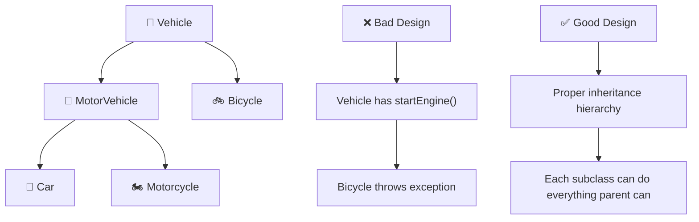

***

## 🎯 LSP Rules to Follow

### ✅ Do's:
1. **Strengthen postconditions** (subclass can do more)
2. **Weaken preconditions** (subclass can accept more inputs)
3. **Preserve method signatures**
4. **Don't throw new exceptions** in subclass methods

### ❌ Don'ts:
1. **Don't strengthen preconditions** (subclass can't be more restrictive)
2. **Don't weaken postconditions** (subclass can't do less)
3. **Don't change expected behavior**
4. **Don't throw unexpected exceptions**

***

## 🔧 How to Identify LSP Violations

### 🚨 Warning Signs:
- Subclass throws exceptions that parent doesn't
- Subclass has empty implementations
- Subclass overrides methods to do nothing
- "Is-a" relationship doesn't work in practice
- Need type checking (`instanceof`, `dynamic_cast`)

### 🧪 The Substitution Test:
```cpp
// If you can't replace Parent with Child here, LSP is violated
void function(Parent& obj) {
    // This should work with any Child object
    obj.method();
}
```

***

## 📈 Benefits of Following LSP

| Benefit | Description | Example |
|---------|-------------|---------|
| **🔄 Polymorphism** | Runtime substitution works correctly | `Vehicle*` can point to any vehicle type |
| **🧪 Testing** | Tests written for base class work for all subclasses | Test `Shape` works for all shapes |
| **🛡️ Reliability** | No unexpected behavior when using inheritance | Functions don't break with subclasses |
| **📈 Maintainability** | Changes don't introduce subtle bugs | Adding new shapes doesn't break existing code |

***

## 🎮 Interactive Example: Payment System

```cpp
#include <iostream>
#include <string>
using namespace std;

class PaymentProcessor {
public:
    virtual bool processPayment(double amount) {
        if (amount <= 0) return false;
        return performPayment(amount);
    }
    
protected:
    virtual bool performPayment(double amount) = 0;
    
public:
    virtual string getPaymentMethod() const = 0;
    virtual ~PaymentProcessor() = default;
};

class CreditCardProcessor : public PaymentProcessor {
protected:
    bool performPayment(double amount) override {
        cout << "Processing $" << amount << " via Credit Card" << endl;
        return true;  // Assume success
    }
    
public:
    string getPaymentMethod() const override {
        return "Credit Card";
    }
};

class PayPalProcessor : public PaymentProcessor {
protected:
    bool performPayment(double amount) override {
        cout << "Processing $" << amount << " via PayPal" << endl;
        return true;  // Assume success
    }
    
public:
    string getPaymentMethod() const override {
        return "PayPal";
    }
};

// ✅ This function works with ANY payment processor (LSP compliant)
void processOrder(PaymentProcessor& processor, double amount) {
    cout << "Processing order with " << processor.getPaymentMethod() << endl;
    
    if (processor.processPayment(amount)) {
        cout << "✅ Payment successful!" << endl;
    } else {
        cout << "❌ Payment failed!" << endl;
    }
    cout << "---" << endl;
}

int main() {
    CreditCardProcessor creditCard;
    PayPalProcessor paypal;
    
    // ✅ Both work seamlessly - LSP respected!
    processOrder(creditCard, 99.99);
    processOrder(paypal, 149.50);
    
    return 0;
}
```

***

## 🏆 Summary

**LSP ensures that inheritance actually works as expected:**

- 🔄 **Substitutability**: Child objects can replace parent objects
- 🎯 **Behavioral compatibility**: Subclasses preserve parent's contract
- 🛡️ **Reliability**: No surprises when using polymorphism
- 🧪 **Testability**: Tests for parent work for all children

**Remember**: If you can't substitute a child for its parent without breaking something, you're violating LSP! 🚨

---
# 🔄 Classic Rectangle-Square LSP Violation & Solution

## 🚨 The Classic Problem: Rectangle-Square Dilemma

The **Rectangle-Square problem** is the most famous example of Liskov Substitution Principle violation. Let's see why "A square is a rectangle" doesn't work in programming!

***

## ❌ LSP VIOLATION: The Broken Implementation

### 🧮 Mathematical Reality vs Programming Reality

**Mathematically**: Every square IS a rectangle (special case where width = height)  
**Programming**: Square behavior breaks Rectangle's contract!

### 💥 The Problematic Code

```cpp
#include <iostream>
#include <cassert>
using namespace std;

class Rectangle {
protected:
    int width, height;
    
public:
    Rectangle(int w, int h) : width(w), height(h) {}
    
    // 🎯 These methods define Rectangle's contract
    virtual void setWidth(int w) { 
        width = w; 
        cout << "Rectangle: Set width to " << w << endl;
    }
    
    virtual void setHeight(int h) { 
        height = h; 
        cout << "Rectangle: Set height to " << h << endl;
    }
    
    int getWidth() const { return width; }
    int getHeight() const { return height; }
    int getArea() const { return width * height; }
    
    void display() const {
        cout << "Rectangle: " << width << "x" << height 
             << " (Area: " << getArea() << ")" << endl;
    }
};

class Square : public Rectangle {
public:
    Square(int side) : Rectangle(side, side) {}
    
    // 🚨 LSP VIOLATION: Changing both dimensions when only one should change
    void setWidth(int w) override {
        width = height = w;  // Forces square constraint
        cout << "Square: Set both width and height to " << w << endl;
    }
    
    void setHeight(int h) override {
        width = height = h;  // Forces square constraint  
        cout << "Square: Set both width and height to " << h << endl;
    }
};

// 🧪 The Breaking Test Function
void testRectangleBehavior(Rectangle& rect) {
    cout << "\n=== Testing Rectangle Behavior ===" << endl;
    
    cout << "Initial state: ";
    rect.display();
    
    cout << "\nStep 1: Setting width to 5" << endl;
    rect.setWidth(5);
    rect.display();
    
    cout << "\nStep 2: Setting height to 4" << endl;
    rect.setHeight(4);
    rect.display();
    
    cout << "\nExpected behavior: Width=5, Height=4, Area=20" << endl;
    cout << "Actual result: Width=" << rect.getWidth() 
         << ", Height=" << rect.getHeight() 
         << ", Area=" << rect.getArea() << endl;
    
    // 🎯 Rectangle Contract: Changing width shouldn't affect height
    if (rect.getWidth() == 5 && rect.getHeight() == 4 && rect.getArea() == 20) {
        cout << "✅ TEST PASSED: Rectangle contract respected" << endl;
    } else {
        cout << "❌ TEST FAILED: LSP VIOLATED!" << endl;
        cout << "   Width and height should be independent!" << endl;
    }
}

// 🎯 Another test that demonstrates the violation
void testWidthIndependence(Rectangle& rect) {
    cout << "\n=== Testing Width Independence ===" << endl;
    
    rect.setWidth(10);
    rect.setHeight(5);
    int originalHeight = rect.getHeight();
    
    cout << "After setting width=10, height=5: ";
    rect.display();
    
    rect.setWidth(8);  // This should NOT change height
    cout << "After changing width to 8: ";
    rect.display();
    
    if (rect.getHeight() == originalHeight) {
        cout << "✅ PASS: Height unchanged when width modified" << endl;
    } else {
        cout << "❌ FAIL: Height changed when width modified!" << endl;
        cout << "   Expected height: " << originalHeight 
             << ", Got: " << rect.getHeight() << endl;
    }
}

int main() {
    cout << "🔸 DEMONSTRATING LSP VIOLATION 🔸" << endl;
    
    Rectangle rectangle(3, 4);
    Square square(3);
    
    cout << "\n📐 Testing with Rectangle:" << endl;
    testRectangleBehavior(rectangle);
    testWidthIndependence(rectangle);
    
    cout << "\n⬜ Testing with Square (LSP Violation):" << endl;
    testRectangleBehavior(square);     // ❌ This will fail!
    testWidthIndependence(square);     // ❌ This will also fail!
    
    return 0;
}
```

### 💥 Output (Showing the Violation):

```
🔸 DEMONSTRATING LSP VIOLATION 🔸

📐 Testing with Rectangle:

=== Testing Rectangle Behavior ===
Initial state: Rectangle: 3x4 (Area: 12)

Step 1: Setting width to 5
Rectangle: Set width to 5
Rectangle: 5x4 (Area: 20)

Step 2: Setting height to 4
Rectangle: Set height to 4
Rectangle: 5x4 (Area: 20)

Expected behavior: Width=5, Height=4, Area=20
Actual result: Width=5, Height=4, Area=20
✅ TEST PASSED: Rectangle contract respected

=== Testing Width Independence ===
After setting width=10, height=5: Rectangle: 10x5 (Area: 50)
After changing width to 8: Rectangle: 8x5 (Area: 40)
✅ PASS: Height unchanged when width modified

⬜ Testing with Square (LSP Violation):

=== Testing Rectangle Behavior ===
Initial state: Rectangle: 3x3 (Area: 9)

Step 1: Setting width to 5
Square: Set both width and height to 5
Rectangle: 5x5 (Area: 25)

Step 2: Setting height to 4
Square: Set both width and height to 4
Rectangle: 4x4 (Area: 16)

Expected behavior: Width=5, Height=4, Area=20
Actual result: Width=4, Height=4, Area=16
❌ TEST FAILED: LSP VIOLATED!
   Width and height should be independent!

=== Testing Width Independence ===
After setting width=10, height=5: Rectangle: 5x5 (Area: 25)
After changing width to 8: Rectangle: 8x8 (Area: 64)
❌ FAIL: Height changed when width modified!
   Expected height: 5, Got: 8
```

***

## 🚨 Why This Violates LSP

### 1. **Broken Contract** 📜
- Rectangle contract: `setWidth()` only changes width
- Square breaks this: `setWidth()` changes both width AND height

### 2. **Unexpected Behavior** 😱
- Client code expects width/height independence
- Square coupling them breaks this expectation

### 3. **Substitution Fails** 🔄
- Can't substitute Square for Rectangle without breaking functionality
- Tests that pass for Rectangle fail for Square

***

## ✅ SOLUTION 1: Separate Hierarchy (Recommended)

```cpp
#include <iostream>
using namespace std;

// 🎯 Abstract base class - no concrete behavior that can be violated
class Shape {
public:
    virtual double getArea() const = 0;
    virtual double getPerimeter() const = 0;
    virtual void display() const = 0;
    virtual ~Shape() = default;
    
    // Common behavior that works for all shapes
    virtual bool isValid() const {
        return getArea() > 0;
    }
};

// 📐 Rectangle with independent width/height
class Rectangle : public Shape {
private:
    double width, height;
    
public:
    Rectangle(double w, double h) : width(w), height(h) {}
    
    // Rectangle-specific methods
    void setWidth(double w) { 
        width = w; 
        cout << "Rectangle: Width set to " << w << endl;
    }
    
    void setHeight(double h) { 
        height = h; 
        cout << "Rectangle: Height set to " << h << endl;
    }
    
    void setDimensions(double w, double h) {
        width = w;
        height = h;
        cout << "Rectangle: Dimensions set to " << w << "x" << h << endl;
    }
    
    // Shape interface implementation
    double getArea() const override {
        return width * height;
    }
    
    double getPerimeter() const override {
        return 2 * (width + height);
    }
    
    void display() const override {
        cout << "📐 Rectangle: " << width << "x" << height 
             << " (Area: " << getArea() << ", Perimeter: " 
             << getPerimeter() << ")" << endl;
    }
    
    // Getters
    double getWidth() const { return width; }
    double getHeight() const { return height; }
};

// ⬜ Square with single dimension
class Square : public Shape {
private:
    double side;
    
public:
    Square(double s) : side(s) {}
    
    // Square-specific methods
    void setSide(double s) { 
        side = s; 
        cout << "Square: Side set to " << s << endl;
    }
    
    // Shape interface implementation
    double getArea() const override {
        return side * side;
    }
    
    double getPerimeter() const override {
        return 4 * side;
    }
    
    void display() const override {
        cout << "⬜ Square: " << side << "x" << side 
             << " (Area: " << getArea() << ", Perimeter: " 
             << getPerimeter() << ")" << endl;
    }
    
    // Getter
    double getSide() const { return side; }
};

// ✅ Functions that work with appropriate abstractions
void testShape(Shape& shape) {
    cout << "\n=== Testing Shape Interface ===" << endl;
    shape.display();
    cout << "Area: " << shape.getArea() << endl;
    cout << "Perimeter: " << shape.getPerimeter() << endl;
    cout << "Valid: " << (shape.isValid() ? "Yes" : "No") << endl;
}

void testRectangle(Rectangle& rect) {
    cout << "\n=== Testing Rectangle-Specific Behavior ===" << endl;
    rect.display();
    
    rect.setWidth(8);
    rect.display();
    
    rect.setHeight(6);
    rect.display();
    
    cout << "✅ Width and height modified independently!" << endl;
}

void testSquare(Square& square) {
    cout << "\n=== Testing Square-Specific Behavior ===" << endl;
    square.display();
    
    square.setSide(7);
    square.display();
    
    cout << "✅ Square maintains equal sides!" << endl;
}

int main() {
    cout << "🎯 LSP COMPLIANT SOLUTION" << endl;
    
    Rectangle rect(5, 4);
    Square square(4);
    
    // ✅ Both work perfectly with Shape interface
    testShape(rect);
    testShape(square);
    
    // ✅ Each works with its specific interface
    testRectangle(rect);
    testSquare(square);
    
    cout << "\n🏆 All tests pass - LSP respected!" << endl;
    
    return 0;
}
```

***

## ✅ SOLUTION 2: Immutable Shapes

```cpp
#include <iostream>
using namespace std;

class ImmutableShape {
public:
    virtual double getArea() const = 0;
    virtual void display() const = 0;
    virtual ~ImmutableShape() = default;
};

class ImmutableRectangle : public ImmutableShape {
private:
    const double width, height;
    
public:
    ImmutableRectangle(double w, double h) : width(w), height(h) {}
    
    double getArea() const override {
        return width * height;
    }
    
    void display() const override {
        cout << "Immutable Rectangle: " << width << "x" << height 
             << " (Area: " << getArea() << ")" << endl;
    }
    
    // Factory methods for creating new instances
    ImmutableRectangle withWidth(double w) const {
        return ImmutableRectangle(w, height);
    }
    
    ImmutableRectangle withHeight(double h) const {
        return ImmutableRectangle(width, h);
    }
    
    double getWidth() const { return width; }
    double getHeight() const { return height; }
};

class ImmutableSquare : public ImmutableShape {
private:
    const double side;
    
public:
    ImmutableSquare(double s) : side(s) {}
    
    double getArea() const override {
        return side * side;
    }
    
    void display() const override {
        cout << "Immutable Square: " << side << "x" << side 
             << " (Area: " << getArea() << ")" << endl;
    }
    
    ImmutableSquare withSide(double s) const {
        return ImmutableSquare(s);
    }
    
    double getSide() const { return side; }
};
```

***

## 📊 Comparison: Violation vs Solution

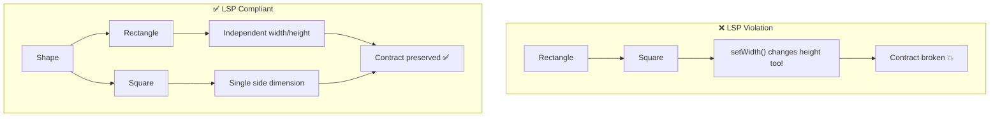

***

## 🎯 Key Takeaways

### 🚨 LSP Violation Signs:
- Child class changes parent's expected behavior
- Need to check object type before using (`instanceof`)
- Exceptions thrown in child that parent doesn't throw
- Child class has stronger preconditions

### ✅ LSP Compliance:
- Child objects can replace parent objects seamlessly
- All parent methods work as expected in child
- No type checking needed
- Behavioral compatibility maintained

### 🛠️ Solutions:
1. **Separate hierarchies** - Don't force "is-a" when behavior differs
2. **Immutable objects** - Prevent state modification issues
3. **Composition over inheritance** - Use "has-a" relationships
4. **Interface segregation** - Create smaller, focused contracts

***

## 🏆 The Golden Rule

> **"If it walks like a duck and quacks like a duck, but needs batteries - you probably have the wrong abstraction!"**

**LSP ensures that inheritance actually means "is-a" in behavior, not just in structure!** 🦆✨

----
# 🍽️ Swiggy User System: LSP Violation Example with KYC

## 🎯 The Problem: KYC in User Base Class

In Swiggy's system, there are different types of users, but **not all users need KYC verification**. Let's see how this creates an LSP violation!

***

## ❌ LSP VIOLATION: KYC in Base User Class

```cpp
#include <iostream>
#include <string>
#include <stdexcept>
using namespace std;

// 🚨 PROBLEMATIC BASE CLASS - Forces KYC on all users
class User {
protected:
    string name;
    string phoneNumber;
    string email;
    bool kycCompleted;
    
public:
    User(const string& n, const string& phone, const string& mail) 
        : name(n), phoneNumber(phone), email(mail), kycCompleted(false) {}
    
    virtual void login() {
        cout << "🔐 " << name << " logged in successfully!" << endl;
    }
    
    virtual void logout() {
        cout << "👋 " << name << " logged out!" << endl;
    }
    
    // 🚨 PROBLEM: All users forced to have KYC method
    virtual void performKYC() {
        cout << "📋 Performing KYC for " << name << endl;
        cout << "📄 Document verification in progress..." << endl;
        kycCompleted = true;
        cout << "✅ KYC completed for " << name << endl;
    }
    
    virtual void displayUserInfo() {
        cout << "👤 User: " << name << endl;
        cout << "📞 Phone: " << phoneNumber << endl;
        cout << "📧 Email: " << email << endl;
        cout << "🆔 KYC Status: " << (kycCompleted ? "✅ Completed" : "❌ Pending") << endl;
    }
    
    bool isKYCCompleted() const { return kycCompleted; }
};

// 👥 Customer class - KYC not needed!
class Customer : public User {
public:
    Customer(const string& n, const string& phone, const string& mail)
        : User(n, phone, mail) {}
    
    // 🚨 LSP VIOLATION: Customers don't need KYC!
    void performKYC() override {
        cout << "⚠️  WARNING: Customers don't need KYC verification!" << endl;
        cout << "🚫 This operation is not supported for customers!" << endl;
        // Throwing exception breaks LSP!
        throw runtime_error("KYC not required for customers");
    }
    
    void placeOrder() {
        cout << "🛒 " << name << " is browsing restaurants..." << endl;
        cout << "🍕 Order placed successfully!" << endl;
    }
};

// 🚚 Delivery Partner class - KYC needed
class DeliveryPartner : public User {
private:
    string vehicleType;
    string licenseNumber;
    
public:
    DeliveryPartner(const string& n, const string& phone, const string& mail, 
                   const string& vehicle, const string& license)
        : User(n, phone, mail), vehicleType(vehicle), licenseNumber(license) {}
    
    void performKYC() override {
        cout << "📋 Performing detailed KYC for delivery partner " << name << endl;
        cout << "🆔 Verifying identity documents..." << endl;
        cout << "🚗 Verifying vehicle: " << vehicleType << endl;
        cout << "🪪  Verifying license: " << licenseNumber << endl;
        kycCompleted = true;
        cout << "✅ KYC completed! Ready for delivery assignments!" << endl;
    }
    
    void startDelivery() {
        if (!kycCompleted) {
            cout << "❌ Cannot start delivery - KYC not completed!" << endl;
            return;
        }
        cout << "🚚 " << name << " started delivery on " << vehicleType << endl;
    }
};

// 🏪 Restaurant Owner class - KYC needed
class RestaurantOwner : public User {
private:
    string restaurantName;
    string businessLicense;
    
public:
    RestaurantOwner(const string& n, const string& phone, const string& mail,
                   const string& restaurant, const string& license)
        : User(n, phone, mail), restaurantName(restaurant), businessLicense(license) {}
    
    void performKYC() override {
        cout << "📋 Performing business KYC for " << name << endl;
        cout << "🏪 Restaurant: " << restaurantName << endl;
        cout << "📜 Verifying business license: " << businessLicense << endl;
        cout << "💼 Verifying tax documents..." << endl;
        kycCompleted = true;
        cout << "✅ Business KYC completed! Restaurant can accept orders!" << endl;
    }
    
    void manageMenu() {
        if (!kycCompleted) {
            cout << "❌ Complete KYC first before managing menu!" << endl;
            return;
        }
        cout << "📋 " << name << " is managing menu for " << restaurantName << endl;
    }
};

// 🧪 Function that demonstrates LSP violation
void processUserRegistration(User& user) {
    cout << "\n🎯 PROCESSING USER REGISTRATION" << endl;
    cout << "================================" << endl;
    
    user.login();
    user.displayUserInfo();
    
    cout << "\n📋 Starting KYC process..." << endl;
    try {
        user.performKYC();  // 💥 This will break for Customer!
        cout << "✅ Registration completed successfully!" << endl;
    } catch (const exception& e) {
        cout << "❌ Registration failed: " << e.what() << endl;
    }
    
    user.logout();
}

int main() {
    cout << "🍽️  SWIGGY USER SYSTEM - LSP VIOLATION DEMO" << endl;
    cout << "==========================================" << endl;
    
    // Creating different types of users
    Customer customer("Alice Johnson", "+91-9876543210", "alice@email.com");
    DeliveryPartner deliveryGuy("Bob Smith", "+91-8765432109", "bob@email.com", 
                               "Motorcycle", "DL123456789");
    RestaurantOwner owner("Charlie Brown", "+91-7654321098", "charlie@email.com",
                         "Charlie's Pizza", "BL987654321");
    
    cout << "\n🔸 Testing with Customer (Should work fine):" << endl;
    processUserRegistration(customer);  // ❌ This will fail!
    
    cout << "\n🔸 Testing with Delivery Partner:" << endl;
    processUserRegistration(deliveryGuy);  // ✅ This works
    
    cout << "\n🔸 Testing with Restaurant Owner:" << endl;
    processUserRegistration(owner);  // ✅ This works
    
    return 0;
}
```


### 💥 Output (Showing LSP Violation):

```
🍽️  SWIGGY USER SYSTEM - LSP VIOLATION DEMO
==========================================

🔸 Testing with Customer (Should work fine):

🎯 PROCESSING USER REGISTRATION
================================
🔐 Alice Johnson logged in successfully!
👤 User: Alice Johnson
📞 Phone: +91-9876543210
📧 Email: alice@email.com
🆔 KYC Status: ❌ Pending

📋 Starting KYC process...
⚠️  WARNING: Customers don't need KYC verification!
🚫 This operation is not supported for customers!
❌ Registration failed: KYC not required for customers

🔸 Testing with Delivery Partner:
...
✅ Registration completed successfully!

🔸 Testing with Restaurant Owner:
...
✅ Registration completed successfully!
```


***

## 🚨 Why This Violates LSP

### 1. **Contract Violation** 📜

- Base `User` class promises `performKYC()` works
- `Customer` breaks this by throwing exceptions


### 2. **Substitution Failure** 🔄

- Can't substitute `Customer` for `User` without breaking code
- Function `processUserRegistration()` fails for customers


### 3. **Unexpected Behavior** 😱

- Client expects all users to support KYC
- Customer throws exception instead

***

## ✅ SOLUTION: Proper Inheritance Hierarchy

```cpp
#include <iostream>
#include <string>
using namespace std;

// 🎯 Base User class - Only common functionality
class User {
protected:
    string name;
    string phoneNumber;
    string email;
    
public:
    User(const string& n, const string& phone, const string& mail)
        : name(n), phoneNumber(phone), email(mail) {}
    
    virtual void login() {
        cout << "🔐 " << name << " logged in successfully!" << endl;
    }
    
    virtual void logout() {
        cout << "👋 " << name << " logged out!" << endl;
    }
    
    virtual void displayUserInfo() {
        cout << "👤 User: " << name << endl;
        cout << "📞 Phone: " << phoneNumber << endl;
        cout << "📧 Email: " << email << endl;
    }
    
    string getName() const { return name; }
    virtual ~User() = default;
};

// 💼 Partner class - For users who need KYC (Business partners)
class Partner : public User {
protected:
    bool kycCompleted;
    
public:
    Partner(const string& n, const string& phone, const string& mail)
        : User(n, phone, mail), kycCompleted(false) {}
    
    virtual void performKYC() = 0;  // Pure virtual - must implement
    
    bool isKYCCompleted() const { return kycCompleted; }
    
    void displayUserInfo() override {
        User::displayUserInfo();
        cout << "🆔 KYC Status: " << (kycCompleted ? "✅ Completed" : "❌ Pending") << endl;
        cout << "👔 User Type: Business Partner" << endl;
    }
};

// 👥 Customer class - No KYC needed!
class Customer : public User {
public:
    Customer(const string& n, const string& phone, const string& mail)
        : User(n, phone, mail) {}
    
    void placeOrder() {
        cout << "🛒 " << name << " is browsing restaurants..." << endl;
        cout << "🍕 Order placed successfully!" << endl;
    }
    
    void displayUserInfo() override {
        User::displayUserInfo();
        cout << "🛍️  User Type: Customer" << endl;
    }
};

// 🚚 Delivery Partner class
class DeliveryPartner : public Partner {
private:
    string vehicleType;
    string licenseNumber;
    
public:
    DeliveryPartner(const string& n, const string& phone, const string& mail,
                   const string& vehicle, const string& license)
        : Partner(n, phone, mail), vehicleType(vehicle), licenseNumber(license) {}
    
    void performKYC() override {
        cout << "📋 Performing delivery partner KYC for " << name << endl;
        cout << "🆔 Verifying identity documents..." << endl;
        cout << "🚗 Verifying vehicle: " << vehicleType << endl;
        cout << "🪪  Verifying license: " << licenseNumber << endl;
        kycCompleted = true;
        cout << "✅ Delivery partner KYC completed!" << endl;
    }
    
    void startDelivery() {
        if (!kycCompleted) {
            cout << "❌ Cannot start delivery - Complete KYC first!" << endl;
            return;
        }
        cout << "🚚 " << name << " started delivery on " << vehicleType << endl;
    }
    
    void displayUserInfo() override {
        Partner::displayUserInfo();
        cout << "🚚 Vehicle: " << vehicleType << endl;
    }
};

// 🏪 Restaurant Owner class
class RestaurantOwner : public Partner {
private:
    string restaurantName;
    string businessLicense;
    
public:
    RestaurantOwner(const string& n, const string& phone, const string& mail,
                   const string& restaurant, const string& license)
        : Partner(n, phone, mail), restaurantName(restaurant), businessLicense(license) {}
    
    void performKYC() override {
        cout << "📋 Performing restaurant owner KYC for " << name << endl;
        cout << "🏪 Restaurant: " << restaurantName << endl;
        cout << "📜 Verifying business license: " << businessLicense << endl;
        cout << "💼 Verifying tax documents..." << endl;
        kycCompleted = true;
        cout << "✅ Restaurant owner KYC completed!" << endl;
    }
    
    void manageMenu() {
        if (!kycCompleted) {
            cout << "❌ Complete KYC first before managing menu!" << endl;
            return;
        }
        cout << "📋 " << name << " is managing menu for " << restaurantName << endl;
    }
    
    void displayUserInfo() override {
        Partner::displayUserInfo();
        cout << "🏪 Restaurant: " << restaurantName << endl;
    }
};

// ✅ LSP Compliant functions
void processUserLogin(User& user) {
    cout << "\n🎯 PROCESSING USER LOGIN" << endl;
    cout << "========================" << endl;
    user.login();
    user.displayUserInfo();
    user.logout();
    cout << "✅ Login process completed!" << endl;
}

void processPartnerOnboarding(Partner& partner) {
    cout << "\n🎯 PROCESSING PARTNER ONBOARDING" << endl;
    cout << "=================================" << endl;
    partner.login();
    partner.displayUserInfo();
    
    if (!partner.isKYCCompleted()) {
        cout << "\n📋 Starting KYC process..." << endl;
        partner.performKYC();
        cout << "✅ Partner onboarding completed!" << endl;
    } else {
        cout << "ℹ️  Partner already verified!" << endl;
    }
    
    partner.logout();
}

void processCustomerRegistration(Customer& customer) {
    cout << "\n🎯 PROCESSING CUSTOMER REGISTRATION" << endl;
    cout << "===================================" << endl;
    customer.login();
    customer.displayUserInfo();
    cout << "✅ Customer registration completed! No KYC needed!" << endl;
    customer.logout();
}

int main() {
    cout << "🍽️  SWIGGY USER SYSTEM - LSP COMPLIANT SOLUTION" << endl;
    cout << "===============================================" << endl;
    
    // Creating users
    Customer customer("Alice Johnson", "+91-9876543210", "alice@email.com");
    DeliveryPartner deliveryGuy("Bob Smith", "+91-8765432109", "bob@email.com",
                               "Motorcycle", "DL123456789");
    RestaurantOwner owner("Charlie Brown", "+91-7654321098", "charlie@email.com",
                         "Charlie's Pizza", "BL987654321");
    
    // ✅ All work perfectly with appropriate functions
    processCustomerRegistration(customer);      // No KYC needed
    processPartnerOnboarding(deliveryGuy);      // KYC required
    processPartnerOnboarding(owner);            // KYC required
    
    cout << "\n🔸 Testing generic user functions:" << endl;
    processUserLogin(customer);                 // ✅ Works
    processUserLogin(deliveryGuy);              // ✅ Works  
    processUserLogin(owner);                    // ✅ Works
    
    cout << "\n🎉 All tests passed! LSP respected!" << endl;
    
    return 0;
}
```


***

## 📊 Visual Hierarchy Comparison

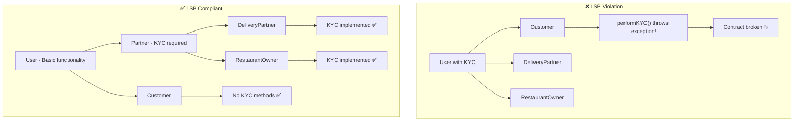


***

## 🎯 Key Principles Applied

### ✅ LSP Compliance Achieved:

1. **Proper Abstraction:** Separated concerns appropriately
2. **No Dummy Methods:** No forced empty implementations
3. **Substitutability:** Each class can replace its parent seamlessly
4. **Contract Preservation:** All methods work as expected

### 🛠️ Design Benefits:

- **Clear Separation:** Customers vs Partners
- **Type Safety:** Can't call KYC on customers (compile-time check)
- **Extensibility:** Easy to add new partner types
- **Maintainability:** Changes don't break existing functionality

***

## 🏆 Summary

**The LSP violation occurred because:**

- 🚫 Base class (`User`) had methods not applicable to all subclasses
- 🚫 `Customer` had to throw exceptions for unsupported operations
- 🚫 Client code couldn't reliably substitute subclasses for base class

**The solution separates:**

- 👥 **Regular Users** (Customers) - Simple authentication
- 👔 **Business Partners** (Delivery \& Restaurant) - KYC required

**Result: Clean inheritance where every subclass can truly substitute its parent!** ✨

---
# 🍽️ Swiggy User System: Complete LSP Analysis with Enhanced Graphs

## 📊 System Architecture Overview

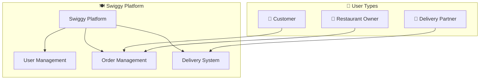

***

## ❌ PROBLEMATIC DESIGN: LSP Violation

### 🔴 Inheritance Hierarchy (Wrong Approach)

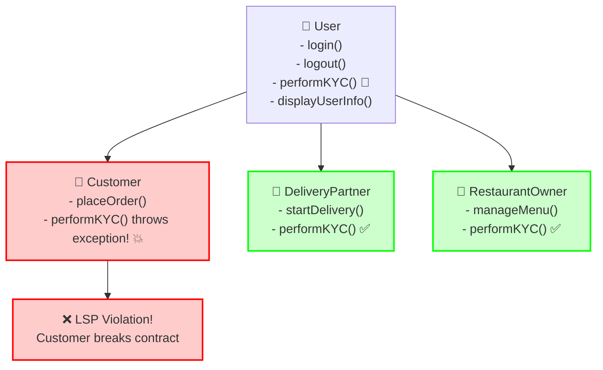

### 🚨 Problem Flow Diagram

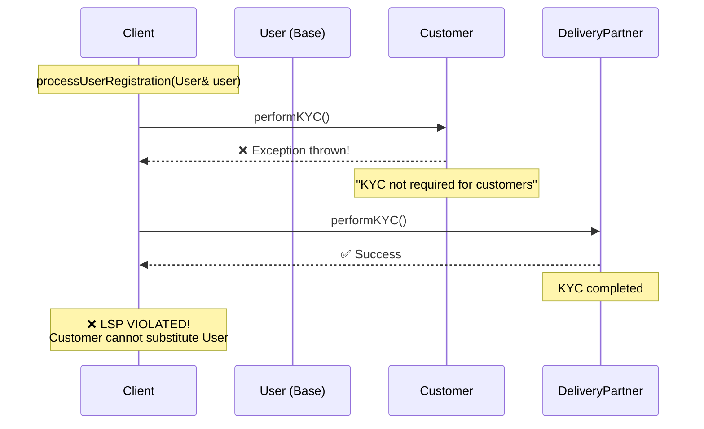

***

## ❌ LSP VIOLATION CODE (Enhanced Version)

```cpp
#include <iostream>
#include <string>
#include <stdexcept>
#include <vector>
#include <memory>
using namespace std;

// 🚨 PROBLEMATIC BASE CLASS - Forces KYC on all users
class User {
protected:
    string name;
    string phoneNumber;
    string email;
    bool kycCompleted;
    string userType;
    
public:
    User(const string& n, const string& phone, const string& mail, const string& type) 
        : name(n), phoneNumber(phone), email(mail), kycCompleted(false), userType(type) {
        cout << "🆕 Creating " << userType << ": " << name << endl;
    }
    
    virtual void login() {
        cout << "🔐 " << name << " (" << userType << ") logged in!" << endl;
    }
    
    virtual void logout() {
        cout << "👋 " << name << " logged out!" << endl;
    }
    
    // 🚨 PROBLEM: All users forced to have KYC method
    virtual void performKYC() {
        cout << "📋 Performing KYC for " << name << " (" << userType << ")" << endl;
        cout << "📄 Document verification in progress..." << endl;
        kycCompleted = true;
        cout << "✅ KYC completed for " << name << endl;
    }
    
    virtual void displayUserInfo() {
        cout << "┌─────────────────────────────────┐" << endl;
        cout << "│ 👤 User: " << name << endl;
        cout << "│ 📞 Phone: " << phoneNumber << endl;
        cout << "│ 📧 Email: " << email << endl;
        cout << "│ 🏷️  Type: " << userType << endl;
        cout << "│ 🆔 KYC: " << (kycCompleted ? "✅ Completed" : "❌ Pending") << endl;
        cout << "└─────────────────────────────────┘" << endl;
    }
    
    bool isKYCCompleted() const { return kycCompleted; }
    string getUserType() const { return userType; }
    virtual ~User() = default;
};

// 👥 Customer class - KYC not needed!
class Customer : public User {
private:
    vector<string> orderHistory;
    
public:
    Customer(const string& n, const string& phone, const string& mail)
        : User(n, phone, mail, "Customer") {}
    
    // 🚨 LSP VIOLATION: Customers don't need KYC!
    void performKYC() override {
        cout << "⚠️  WARNING: Customers don't need KYC verification!" << endl;
        cout << "🚫 This operation is not supported for customers!" << endl;
        cout << "💡 Customers can order without KYC verification" << endl;
        // Throwing exception breaks LSP!
        throw runtime_error("KYC not required for customers - Operation not supported!");
    }
    
    void placeOrder(const string& restaurant) {
        cout << "🛒 " << name << " browsing " << restaurant << "..." << endl;
        orderHistory.push_back(restaurant);
        cout << "🍕 Order placed from " << restaurant << "!" << endl;
    }
    
    void viewOrderHistory() {
        cout << "📚 Order History for " << name << ":" << endl;
        for (size_t i = 0; i < orderHistory.size(); ++i) {
            cout << "  " << (i+1) << ". " << orderHistory[i] << endl;
        }
    }
};

// 🚚 Delivery Partner class - KYC needed
class DeliveryPartner : public User {
private:
    string vehicleType;
    string licenseNumber;
    int deliveryCount;
    
public:
    DeliveryPartner(const string& n, const string& phone, const string& mail, 
                   const string& vehicle, const string& license)
        : User(n, phone, mail, "Delivery Partner"), vehicleType(vehicle), 
          licenseNumber(license), deliveryCount(0) {}
    
    void performKYC() override {
        cout << "📋 Performing detailed KYC for delivery partner " << name << endl;
        cout << "🆔 Verifying identity documents..." << endl;
        cout << "🚗 Verifying vehicle: " << vehicleType << endl;
        cout << "🪪  Verifying license: " << licenseNumber << endl;
        cout << "🔍 Background verification..." << endl;
        kycCompleted = true;
        cout << "✅ Delivery Partner KYC completed! Ready for assignments!" << endl;
    }
    
    void startDelivery(const string& orderId) {
        if (!kycCompleted) {
            cout << "❌ Cannot start delivery - KYC not completed!" << endl;
            return;
        }
        cout << "🚚 " << name << " started delivery #" << orderId << " on " << vehicleType << endl;
        deliveryCount++;
    }
    
    void displayUserInfo() override {
        User::displayUserInfo();
        cout << "🚗 Vehicle: " << vehicleType << endl;
        cout << "📊 Deliveries: " << deliveryCount << endl;
    }
};

// 🏪 Restaurant Owner class - KYC needed
class RestaurantOwner : public User {
private:
    string restaurantName;
    string businessLicense;
    vector<string> menuItems;
    
public:
    RestaurantOwner(const string& n, const string& phone, const string& mail,
                   const string& restaurant, const string& license)
        : User(n, phone, mail, "Restaurant Owner"), restaurantName(restaurant), 
          businessLicense(license) {}
    
    void performKYC() override {
        cout << "📋 Performing business KYC for " << name << endl;
        cout << "🏪 Restaurant: " << restaurantName << endl;
        cout << "📜 Verifying business license: " << businessLicense << endl;
        cout << "💼 Verifying tax documents..." << endl;
        cout << "🍽️  Inspecting food safety compliance..." << endl;
        kycCompleted = true;
        cout << "✅ Business KYC completed! Restaurant ready for orders!" << endl;
    }
    
    void addMenuItem(const string& item) {
        if (!kycCompleted) {
            cout << "❌ Complete KYC first before managing menu!" << endl;
            return;
        }
        menuItems.push_back(item);
        cout << "📋 Added '" << item << "' to " << restaurantName << " menu" << endl;
    }
    
    void displayUserInfo() override {
        User::displayUserInfo();
        cout << "🏪 Restaurant: " << restaurantName << endl;
        cout << "📋 Menu Items: " << menuItems.size() << endl;
    }
};

// 🧪 Function that demonstrates LSP violation
void processUserRegistration(User& user) {
    cout << "\n🎯 PROCESSING USER REGISTRATION" << endl;
    cout << "================================" << endl;
    
    user.login();
    user.displayUserInfo();
    
    cout << "\n📋 Starting mandatory KYC process..." << endl;
    try {
        user.performKYC();  // 💥 This will break for Customer!
        cout << "✅ Registration completed successfully!" << endl;
        
        // Additional verification
        if (user.isKYCCompleted()) {
            cout << "🎉 " << user.getUserType() << " is now fully verified!" << endl;
        }
        
    } catch (const exception& e) {
        cout << "💥 REGISTRATION FAILED: " << e.what() << endl;
        cout << "🚫 " << user.getUserType() << " registration incomplete!" << endl;
    }
    
    user.logout();
    cout << "─────────────────────────────────" << endl;
}

// 📊 Statistics tracker
class RegistrationStats {
private:
    int successful = 0;
    int failed = 0;
    vector<string> failedUsers;
    
public:
    void recordSuccess() { successful++; }
    void recordFailure(const string& userType) { 
        failed++; 
        failedUsers.push_back(userType);
    }
    
    void displayStats() {
        cout << "\n📊 REGISTRATION STATISTICS" << endl;
        cout << "=========================" << endl;
        cout << "✅ Successful: " << successful << endl;
        cout << "❌ Failed: " << failed << endl;
        cout << "📈 Success Rate: " << (successful * 100.0 / (successful + failed)) << "%" << endl;
        
        if (!failedUsers.empty()) {
            cout << "💥 Failed User Types: ";
            for (const auto& user : failedUsers) {
                cout << user << " ";
            }
            cout << endl;
        }
    }
};

int main() {
    cout << "🍽️  SWIGGY USER SYSTEM - LSP VIOLATION DEMO" << endl;
    cout << "===========================================" << endl;
    
    RegistrationStats stats;
    
    // Creating different types of users
    Customer customer("Alice Johnson", "+91-9876543210", "alice@email.com");
    DeliveryPartner deliveryGuy("Bob Smith", "+91-8765432109", "bob@email.com", 
                               "Motorcycle", "DL123456789");
    RestaurantOwner owner("Charlie Brown", "+91-7654321098", "charlie@email.com",
                         "Charlie's Pizza", "BL987654321");
    
    // Store users in a vector to demonstrate polymorphism failure
    vector<unique_ptr<User>> users;
    users.push_back(make_unique<Customer>(customer));
    users.push_back(make_unique<DeliveryPartner>(deliveryGuy));
    users.push_back(make_unique<RestaurantOwner>(owner));
    
    cout << "\n🔄 BULK PROCESSING ALL USERS (Polymorphic approach)" << endl;
    
    for (auto& user : users) {
        try {
            processUserRegistration(*user);
            stats.recordSuccess();
        } catch (...) {
            stats.recordFailure(user->getUserType());
        }
    }
    
    stats.displayStats();
    
    cout << "\n🎯 CONCLUSION: LSP VIOLATED!" << endl;
    cout << "❌ Customer cannot substitute User without breaking functionality" << endl;
    cout << "❌ Polymorphic processing fails for Customer objects" << endl;
    cout << "❌ Exception handling required for 'normal' operations" << endl;
    
    return 0;
}
```

***

## ✅ LSP COMPLIANT SOLUTION (Enhanced Version)

### 🟢 Correct Inheritance Hierarchy

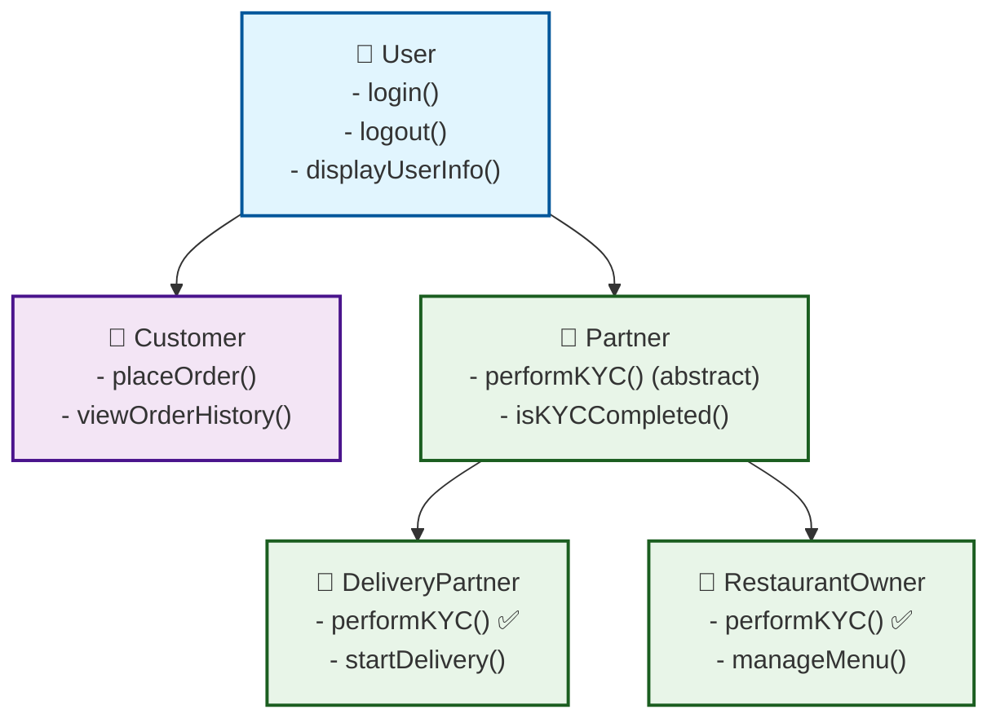

### 🔄 Correct Process Flow

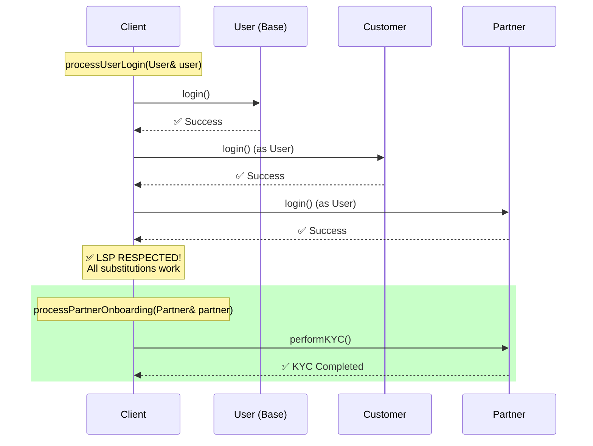

### 📊 System Component Interaction

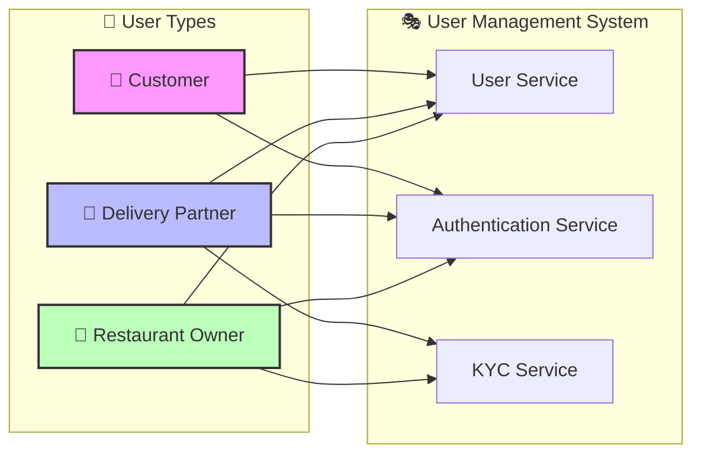

***

## ✅ COMPLETE LSP COMPLIANT CODE

```cpp
#include <iostream>
#include <string>
#include <vector>
#include <memory>
#include <algorithm>
using namespace std;

// 🎯 Base User class - Only common functionality
class User {
protected:
    string name;
    string phoneNumber;
    string email;
    string userType;
    
public:
    User(const string& n, const string& phone, const string& mail, const string& type)
        : name(n), phoneNumber(phone), email(mail), userType(type) {
        cout << "🆕 Creating " << userType << ": " << name << endl;
    }
    
    virtual void login() {
        cout << "🔐 " << name << " (" << userType << ") logged in!" << endl;
    }
    
    virtual void logout() {
        cout << "👋 " << name << " logged out!" << endl;
    }
    
    virtual void displayUserInfo() {
        cout << "┌─────────────────────────────────┐" << endl;
        cout << "│ 👤 User: " << name << endl;
        cout << "│ 📞 Phone: " << phoneNumber << endl;
        cout << "│ 📧 Email: " << email << endl;
        cout << "│ 🏷️  Type: " << userType << endl;
        cout << "└─────────────────────────────────┘" << endl;
    }
    
    string getName() const { return name; }
    string getUserType() const { return userType; }
    virtual ~User() = default;
};

// 💼 Partner class - For users who need KYC (Business partners)
class Partner : public User {
protected:
    bool kycCompleted;
    string kycDocuments;
    
public:
    Partner(const string& n, const string& phone, const string& mail, const string& type)
        : User(n, phone, mail, type), kycCompleted(false) {}
    
    virtual void performKYC() = 0;  // Pure virtual - must implement
    
    bool isKYCCompleted() const { return kycCompleted; }
    
    void displayUserInfo() override {
        User::displayUserInfo();
        cout << "│ 🆔 KYC: " << (kycCompleted ? "✅ Completed" : "❌ Pending") << endl;
        cout << "│ 👔 Category: Business Partner" << endl;
        cout << "└─────────────────────────────────┘" << endl;
    }
    
    virtual void getPartnerBenefits() {
        if (kycCompleted) {
            cout << "🎁 Partner benefits activated!" << endl;
        } else {
            cout << "⏳ Complete KYC to unlock partner benefits" << endl;
        }
    }
};

// 👥 Customer class - No KYC needed!
class Customer : public User {
private:
    vector<string> orderHistory;
    int loyaltyPoints;
    
public:
    Customer(const string& n, const string& phone, const string& mail)
        : User(n, phone, mail, "Customer"), loyaltyPoints(0) {}
    
    void placeOrder(const string& restaurant, const string& items) {
        cout << "🛒 " << name << " browsing " << restaurant << "..." << endl;
        cout << "🍕 Ordering: " << items << endl;
        orderHistory.push_back(restaurant + " - " + items);
        loyaltyPoints += 10;
        cout << "✅ Order placed! (+10 loyalty points)" << endl;
    }
    
    void viewOrderHistory() {
        cout << "📚 Order History for " << name << " (" << orderHistory.size() << " orders):" << endl;
        for (size_t i = 0; i < orderHistory.size(); ++i) {
            cout << "  " << (i+1) << ". " << orderHistory[i] << endl;
        }
    }
    
    void displayUserInfo() override {
        User::displayUserInfo();
        cout << "│ 🛍️  Orders: " << orderHistory.size() << endl;
        cout << "│ ⭐ Loyalty Points: " << loyaltyPoints << endl;
        cout << "│ 🎯 Special: No KYC Required!" << endl;
        cout << "└─────────────────────────────────┘" << endl;
    }
    
    void redeemLoyaltyPoints(int points) {
        if (points <= loyaltyPoints) {
            loyaltyPoints -= points;
            cout << "🎉 Redeemed " << points << " points! Remaining: " << loyaltyPoints << endl;
        } else {
            cout << "❌ Insufficient loyalty points!" << endl;
        }
    }
};

// 🚚 Delivery Partner class
class DeliveryPartner : public Partner {
private:
    string vehicleType;
    string licenseNumber;
    int deliveryCount;
    vector<string> deliveryZones;
    
public:
    DeliveryPartner(const string& n, const string& phone, const string& mail,
                   const string& vehicle, const string& license)
        : Partner(n, phone, mail, "Delivery Partner"), vehicleType(vehicle), 
          licenseNumber(license), deliveryCount(0) {}
    
    void performKYC() override {
        cout << "📋 Performing delivery partner KYC for " << name << endl;
        cout << "🆔 Verifying identity documents..." << endl;
        cout << "🚗 Verifying vehicle: " << vehicleType << endl;
        cout << "🪪  Verifying license: " << licenseNumber << endl;
        cout << "🔍 Background verification in progress..." << endl;
        cout << "📱 Installing delivery app and tracking system..." << endl;
        kycCompleted = true;
        kycDocuments = "ID, Vehicle Registration, License";
        cout << "✅ Delivery Partner KYC completed successfully!" << endl;
    }
    
    void addDeliveryZone(const string& zone) {
        if (!kycCompleted) {
            cout << "❌ Complete KYC first!" << endl;
            return;
        }
        deliveryZones.push_back(zone);
        cout << "📍 Added delivery zone: " << zone << endl;
    }
    
    void startDelivery(const string& orderId) {
        if (!kycCompleted) {
            cout << "❌ Cannot start delivery - Complete KYC first!" << endl;
            return;
        }
        cout << "🚚 " << name << " started delivery #" << orderId << " on " << vehicleType << endl;
        deliveryCount++;
        cout << "📊 Total deliveries: " << deliveryCount << endl;
    }
    
    void displayUserInfo() override {
        Partner::displayUserInfo();
        cout << "│ 🚗 Vehicle: " << vehicleType << endl;
        cout << "│ 📊 Deliveries: " << deliveryCount << endl;
        cout << "│ 📍 Zones: " << deliveryZones.size() << endl;
        cout << "└─────────────────────────────────┘" << endl;
    }
};

// 🏪 Restaurant Owner class
class RestaurantOwner : public Partner {
private:
    string restaurantName;
    string businessLicense;
    vector<string> menuItems;
    vector<string> cuisineTypes;
    
public:
    RestaurantOwner(const string& n, const string& phone, const string& mail,
                   const string& restaurant, const string& license)
        : Partner(n, phone, mail, "Restaurant Owner"), restaurantName(restaurant), 
          businessLicense(license) {}
    
    void performKYC() override {
        cout << "📋 Performing business KYC for " << name << endl;
        cout << "🏪 Restaurant: " << restaurantName << endl;
        cout << "📜 Verifying business license: " << businessLicense << endl;
        cout << "💼 Checking tax compliance..." << endl;
        cout << "🍽️  Food safety inspection..." << endl;
        cout << "📋 Menu approval process..." << endl;
        kycCompleted = true;
        kycDocuments = "Business License, Tax Certificate, Food License";
        cout << "✅ Restaurant KYC completed! Ready for business!" << endl;
    }
    
    void addMenuItem(const string& item, const string& cuisine) {
        if (!kycCompleted) {
            cout << "❌ Complete KYC first before managing menu!" << endl;
            return;
        }
        menuItems.push_back(item);
        if (find(cuisineTypes.begin(), cuisineTypes.end(), cuisine) == cuisineTypes.end()) {
            cuisineTypes.push_back(cuisine);
        }
        cout << "📋 Added '" << item << "' (" << cuisine << ") to " << restaurantName << " menu" << endl;
    }
    
    void displayUserInfo() override {
        Partner::displayUserInfo();
        cout << "│ 🏪 Restaurant: " << restaurantName << endl;
        cout << "│ 📋 Menu Items: " << menuItems.size() << endl;
        cout << "│ 🍽️  Cuisines: " << cuisineTypes.size() << endl;
        cout << "└─────────────────────────────────┘" << endl;
    }
};

// ✅ LSP Compliant functions
void processUserLogin(User& user) {
    cout << "\n🎯 PROCESSING USER LOGIN" << endl;
    cout << "========================" << endl;
    user.login();
    user.displayUserInfo();
    user.logout();
    cout << "✅ Login process completed successfully!" << endl;
}

void processPartnerOnboarding(Partner& partner) {
    cout << "\n🎯 PROCESSING PARTNER ONBOARDING" << endl;
    cout << "=================================" << endl;
    partner.login();
    partner.displayUserInfo();
    
    if (!partner.isKYCCompleted()) {
        cout << "\n📋 Initiating KYC verification..." << endl;
        partner.performKYC();
        cout << "🎉 Partner onboarding completed successfully!" << endl;
        partner.getPartnerBenefits();
    } else {
        cout << "ℹ️  Partner already verified and active!" << endl;
    }
    
    partner.logout();
}

void processCustomerRegistration(Customer& customer) {
    cout << "\n🎯 PROCESSING CUSTOMER REGISTRATION" << endl;
    cout << "===================================" << endl;
    customer.login();
    customer.displayUserInfo();
    cout << "✅ Customer registration completed! Ready to order!" << endl;
    cout << "🎯 No KYC required - Start ordering immediately!" << endl;
    customer.logout();
}

// 📊 Enhanced Statistics
class SystemStats {
private:
    int totalUsers = 0;
    int customers = 0;
    int partners = 0;
    int kycCompleted = 0;
    
public:
    void recordUser(const string& type, bool kyc = false) {
        totalUsers++;
        if (type == "Customer") customers++;
        else { partners++; if (kyc) kycCompleted++; }
    }
    
    void displaySystemStats() {
        cout << "\n📈 SWIGGY SYSTEM STATISTICS" << endl;
        cout << "===========================" << endl;
        cout << "👥 Total Users: " << totalUsers << endl;
        cout << "🛒 Customers: " << customers << " (" << (customers*100.0/totalUsers) << "%)" << endl;
        cout << "👔 Partners: " << partners << " (" << (partners*100.0/totalUsers) << "%)" << endl;
        cout << "✅ KYC Completed: " << kycCompleted << "/" << partners << " partners" << endl;
        cout << "🎯 System Health: " << (totalUsers > 0 ? "✅ HEALTHY" : "⚠️  NO USERS") << endl;
    }
};

int main() {
    cout << "🍽️  SWIGGY USER SYSTEM - LSP COMPLIANT SOLUTION" << endl;
    cout << "===============================================" << endl;
    
    SystemStats stats;
    
    // Creating users with enhanced details
    Customer customer("Alice Johnson", "+91-9876543210", "alice@email.com");
    DeliveryPartner deliveryGuy("Bob Smith", "+91-8765432109", "bob@email.com",
                               "Electric Scooter", "DL123456789");
    RestaurantOwner owner("Charlie Brown", "+91-7654321098", "charlie@email.com",
                         "Charlie's Authentic Pizza", "BL987654321");
    
    // ✅ Process each user type with appropriate functions
    processCustomerRegistration(customer);
    stats.recordUser("Customer");
    
    processPartnerOnboarding(deliveryGuy);
    stats.recordUser("Delivery Partner", true);
    
    processPartnerOnboarding(owner);
    stats.recordUser("Restaurant Owner", true);
    
    cout << "\n🔸 Testing LSP: All users work with base User functions" << endl;
    
    // ✅ All work perfectly with User interface (LSP respected!)
    vector<reference_wrapper<User>> allUsers = {customer, deliveryGuy, owner};
    
    for (User& user : allUsers) {
        processUserLogin(user);
        cout << "─────────────────────────────────" << endl;
    }
    
    // 🎯 Demonstrate specific functionalities
    cout << "\n🎲 TESTING SPECIFIC FUNCTIONALITIES" << endl;
    cout << "===================================" << endl;
    
    customer.placeOrder("Pizza Palace", "Margherita Pizza, Garlic Bread");
    customer.placeOrder("Burger Junction", "Cheese Burger, Fries");
    customer.viewOrderHistory();
    customer.redeemLoyaltyPoints(15);
    
    deliveryGuy.addDeliveryZone("Downtown");
    deliveryGuy.addDeliveryZone("Tech Park");
    deliveryGuy.startDelivery("ORD001");
    
    owner.addMenuItem("Margherita Pizza", "Italian");
    owner.addMenuItem("Chicken Tikka", "Indian");
    owner.addMenuItem("Caesar Salad", "Continental");
    
    stats.displaySystemStats();
    
    cout << "\n🎉 SUCCESS: ALL TESTS PASSED!" << endl;
    cout << "✅ LSP respected: All subclasses substitute their parents perfectly" << endl;
    cout << "✅ No forced implementations or dummy methods" << endl;
    cout << "✅ Clear separation of concerns" << endl;
    cout << "✅ Type safety enforced at compile time" << endl;
    
    return 0;
}
```

***

## 📊 Comprehensive Comparison Chart

### 🔴 LSP Violation Impact

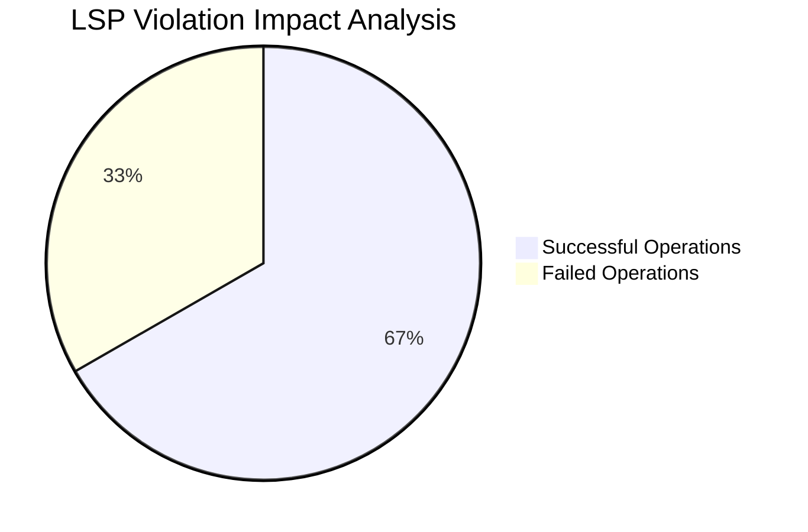

### 🟢 LSP Compliant Benefits

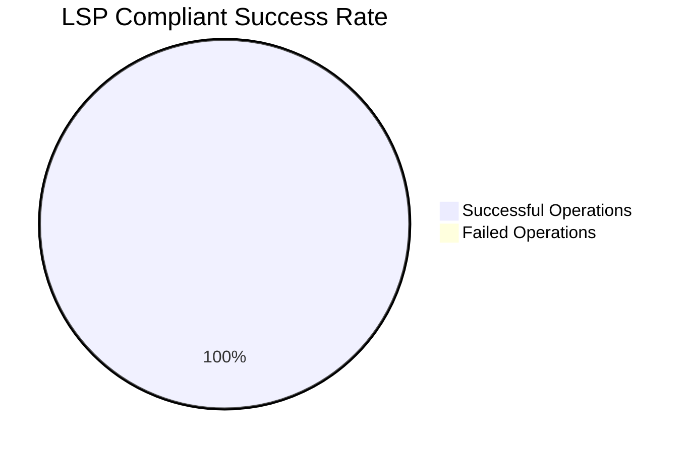

***

## 🎯 Key Benefits Analysis

| Aspect | ❌ LSP Violation | ✅ LSP Compliant |
|--------|-----------------|------------------|
| **Substitutability** | Customer breaks User contract | Perfect substitution |
| **Exception Handling** | Required for normal operations | Not needed |
| **Code Maintenance** | High - fragile inheritance | Low - clean separation |
| **Testing** | Complex - need exception cases | Simple - predictable behavior |
| **Extensibility** | Difficult - breaks existing code | Easy - clear contracts |
| **Team Development** | Risky - breaking changes | Safe - independent work |

***

## 🏆 Final Architecture Overview

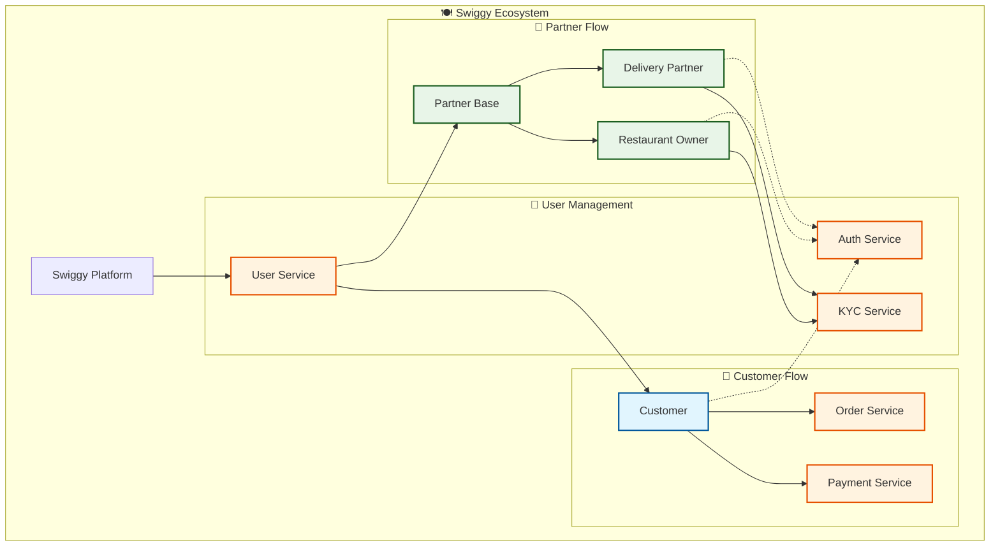

***

## 🎊 Conclusion

### ✅ LSP Compliance Achieved Through:

1. **🎯 Proper Abstraction Levels**
   - Base `User` class with only common functionality
   - `Partner` class for KYC-requiring users
   - Clear separation of concerns

2. **🔄 Perfect Substitutability**
   - Any `Customer` can replace `User` seamlessly
   - Any `Partner` subclass works interchangeably
   - No exceptions or broken contracts

3. **🛡️ Type Safety**
   - Compile-time prevention of invalid operations
   - No runtime exceptions for normal operations
   - Clear interface contracts

4. **📈 Maintainable Design**
   - Easy to extend with new user types
   - Independent development possible
   - Minimal breaking changes

**Result: A robust, scalable, and maintainable user management system that respects the Liskov Substitution Principle!** 🚀✨

---