# 🧩 Interface Segregation Principle (ISP) Complete Guide with Swiggy Example

## 🎯 What is Interface Segregation Principle?

**ISP Definition**: Clients should not be forced to depend on methods that they do not use.

> **"Many client-specific interfaces are better than one general-purpose interface"** - Robert C. Martin

***

## 📊 I in SOLID = Interface Segregation Principle

```mermaid
graph TB
    subgraph "🧩 Interface Segregation Principle"
        A["❌ Fat Interface<br/>(Forces unnecessary methods)"] 
        B["✅ Segregated Interfaces<br/>(Only necessary methods)"]
        
        A --> C["🚫 Client must implement<br/>methods it doesn't need"]
        B --> D["✅ Client implements<br/>only what it needs"]
    end
    
    classDef bad fill:#ffebee,stroke:#c62828,stroke-width:2px
    classDef good fill:#e8f5e8,stroke:#2e7d32,stroke-width:2px
    
    class A,C bad
    class B,D good
```



***

## 🚨 Problem Analysis: Fat Interfaces

### 🔴 What Happens Without ISP?

```mermaid
graph TB
    A["💥 Fat User Interface<br/>All methods for all users"] --> B["👥 Customer"]
    A --> C["🚚 DeliveryPartner"] 
    A --> D["🏪 RestaurantOwner"]
    
    B --> E["❌ Must implement KYC<br/>(Not needed)"]
    B --> F["❌ Must implement business methods<br/>(Not applicable)"]
    
    C --> G["❌ Must implement customer methods<br/>(Not relevant)"]
    
    D --> H["❌ Must implement delivery methods<br/>(Not relevant)"]
    
    classDef problem fill:#ffebee,stroke:#c62828,stroke-width:2px
    classDef fat fill:#fce4ec,stroke:#ad1457,stroke-width:2px
    
    class A fat
    class B,C,D,E,F,G,H problem
```



***

## ❌ BAD EXAMPLE: Fat Interface Violation in Swiggy

### 🚨 Monolithic User Interface

```cpp
#include <iostream>
#include <string>
#include <vector>
#include <stdexcept>
using namespace std;

// 🚨 FAT INTERFACE - Forces all users to implement everything!
class IUser {
public:
    // Authentication methods (needed by all)
    virtual void login() = 0;
    virtual void logout() = 0;
    virtual void updateProfile() = 0;
    
    // Customer-specific methods
    virtual void browseRestaurants() = 0;
    virtual void placeOrder() = 0;
    virtual void trackOrder() = 0;
    virtual void rateOrder() = 0;
    virtual void applyPromoCode() = 0;
    
    // Delivery Partner methods  
    virtual void acceptDelivery() = 0;
    virtual void updateLocation() = 0;
    virtual void markDeliveryComplete() = 0;
    virtual void viewEarnings() = 0;
    
    // Restaurant Owner methods
    virtual void manageMenu() = 0;
    virtual void viewOrders() = 0;
    virtual void updateOrderStatus() = 0;
    virtual void viewAnalytics() = 0;
    
    // Business Partner methods (KYC)
    virtual void performKYC() = 0;
    virtual void uploadDocuments() = 0;
    virtual void verifyBankDetails() = 0;
    
    // Financial methods
    virtual void processPayments() = 0;
    virtual void generateInvoice() = 0;
    virtual void viewTransactionHistory() = 0;
    
    virtual ~IUser() = default;
};

// 👥 Customer - Forced to implement methods it doesn't need!
class Customer : public IUser {
private:
    string name;
    string email;
    vector<string> orderHistory;
    
public:
    Customer(const string& n, const string& e) : name(n), email(e) {}
    
    // ✅ Methods customer actually needs
    void login() override {
        cout << "👤 Customer " << name << " logged in" << endl;
    }
    
    void logout() override {
        cout << "👋 Customer " << name << " logged out" << endl;
    }
    
    void updateProfile() override {
        cout << "📝 Customer profile updated" << endl;
    }
    
    void browseRestaurants() override {
        cout << "🍽️ Browsing restaurants..." << endl;
    }
    
    void placeOrder() override {
        cout << "🛒 Order placed successfully!" << endl;
        orderHistory.push_back("Order #" + to_string(orderHistory.size() + 1));
    }
    
    void trackOrder() override {
        cout << "📍 Tracking your order..." << endl;
    }
    
    void rateOrder() override {
        cout << "⭐ Thank you for rating!" << endl;
    }
    
    void applyPromoCode() override {
        cout << "🎫 Promo code applied!" << endl;
    }
    
    // 🚨 FORCED TO IMPLEMENT - Customer doesn't need these!
    void acceptDelivery() override {
        cout << "⚠️ WARNING: Customer cannot accept deliveries!" << endl;
        throw runtime_error("Operation not supported for customers");
    }
    
    void updateLocation() override {
        cout << "⚠️ WARNING: Customer doesn't need to update delivery location!" << endl;
        throw runtime_error("Operation not supported for customers");
    }
    
    void markDeliveryComplete() override {
        cout << "⚠️ WARNING: Customer cannot mark deliveries complete!" << endl;
        throw runtime_error("Operation not supported for customers");
    }
    
    void viewEarnings() override {
        cout << "⚠️ WARNING: Customer has no delivery earnings!" << endl;
        throw runtime_error("Operation not supported for customers");
    }
    
    void manageMenu() override {
        cout << "⚠️ WARNING: Customer cannot manage restaurant menu!" << endl;
        throw runtime_error("Operation not supported for customers");
    }
    
    void viewOrders() override {
        cout << "⚠️ WARNING: Customer cannot view restaurant orders!" << endl;
        throw runtime_error("Operation not supported for customers");
    }
    
    void updateOrderStatus() override {
        cout << "⚠️ WARNING: Customer cannot update order status!" << endl;
        throw runtime_error("Operation not supported for customers");
    }
    
    void viewAnalytics() override {
        cout << "⚠️ WARNING: Customer cannot view business analytics!" << endl;
        throw runtime_error("Operation not supported for customers");
    }
    
    void performKYC() override {
        cout << "⚠️ WARNING: Customer doesn't need KYC!" << endl;
        throw runtime_error("KYC not required for customers");
    }
    
    void uploadDocuments() override {
        cout << "⚠️ WARNING: Customer doesn't upload business documents!" << endl;
        throw runtime_error("Operation not supported for customers");
    }
    
    void verifyBankDetails() override {
        cout << "⚠️ WARNING: Customer doesn't need bank verification!" << endl;
        throw runtime_error("Operation not supported for customers");
    }
    
    void processPayments() override {
        cout << "⚠️ WARNING: Customer doesn't process payments!" << endl;
        throw runtime_error("Operation not supported for customers");
    }
    
    void generateInvoice() override {
        cout << "⚠️ WARNING: Customer doesn't generate invoices!" << endl;
        throw runtime_error("Operation not supported for customers");
    }
    
    void viewTransactionHistory() override {
        cout << "⚠️ WARNING: Customer cannot view business transactions!" << endl;
        throw runtime_error("Operation not supported for customers");
    }
};

// 🚚 Delivery Partner - Also forced to implement irrelevant methods!
class DeliveryPartner : public IUser {
private:
    string name;
    string vehicleType;
    bool isAvailable;
    
public:
    DeliveryPartner(const string& n, const string& vehicle) 
        : name(n), vehicleType(vehicle), isAvailable(true) {}
    
    // ✅ Methods delivery partner actually needs
    void login() override {
        cout << "🚚 Delivery Partner " << name << " logged in" << endl;
    }
    
    void logout() override {
        cout << "👋 Delivery Partner " << name << " logged out" << endl;
    }
    
    void updateProfile() override {
        cout << "📝 Delivery partner profile updated" << endl;
    }
    
    void acceptDelivery() override {
        cout << "✅ Delivery accepted by " << name << endl;
        isAvailable = false;
    }
    
    void updateLocation() override {
        cout << "📍 Location updated for " << name << endl;
    }
    
    void markDeliveryComplete() override {
        cout << "🎉 Delivery marked complete by " << name << endl;
        isAvailable = true;
    }
    
    void viewEarnings() override {
        cout << "💰 Viewing earnings for " << name << endl;
    }
    
    void performKYC() override {
        cout << "📋 KYC verification for delivery partner " << name << endl;
    }
    
    void uploadDocuments() override {
        cout << "📄 Documents uploaded by " << name << endl;
    }
    
    void verifyBankDetails() override {
        cout << "🏦 Bank details verified for " << name << endl;
    }
    
    // 🚨 FORCED TO IMPLEMENT - Delivery partner doesn't need these!
    void browseRestaurants() override {
        cout << "⚠️ WARNING: Delivery partner doesn't browse restaurants!" << endl;
        throw runtime_error("Operation not supported for delivery partners");
    }
    
    void placeOrder() override {
        cout << "⚠️ WARNING: Delivery partner doesn't place orders!" << endl;
        throw runtime_error("Operation not supported for delivery partners");
    }
    
    void trackOrder() override {
        cout << "⚠️ WARNING: Delivery partner doesn't track orders as customer!" << endl;
        throw runtime_error("Operation not supported for delivery partners");
    }
    
    void rateOrder() override {
        cout << "⚠️ WARNING: Delivery partner doesn't rate orders as customer!" << endl;
        throw runtime_error("Operation not supported for delivery partners");
    }
    
    void applyPromoCode() override {
        cout << "⚠️ WARNING: Delivery partner doesn't apply promo codes!" << endl;
        throw runtime_error("Operation not supported for delivery partners");
    }
    
    void manageMenu() override {
        cout << "⚠️ WARNING: Delivery partner cannot manage restaurant menu!" << endl;
        throw runtime_error("Operation not supported for delivery partners");
    }
    
    void viewOrders() override {
        cout << "⚠️ WARNING: Delivery partner cannot view restaurant orders!" << endl;
        throw runtime_error("Operation not supported for delivery partners");
    }
    
    void updateOrderStatus() override {
        cout << "⚠️ WARNING: Delivery partner cannot update restaurant order status!" << endl;
        throw runtime_error("Operation not supported for delivery partners");
    }
    
    void viewAnalytics() override {
        cout << "⚠️ WARNING: Delivery partner cannot view restaurant analytics!" << endl;
        throw runtime_error("Operation not supported for delivery partners");
    }
    
    void processPayments() override {
        cout << "⚠️ WARNING: Delivery partner doesn't process merchant payments!" << endl;
        throw runtime_error("Operation not supported for delivery partners");
    }
    
    void generateInvoice() override {
        cout << "⚠️ WARNING: Delivery partner doesn't generate business invoices!" << endl;
        throw runtime_error("Operation not supported for delivery partners");
    }
    
    void viewTransactionHistory() override {
        cout << "⚠️ WARNING: Delivery partner cannot view business transaction history!" << endl;
        throw runtime_error("Operation not supported for delivery partners");
    }
};

// 🧪 Testing the problematic design
void testFatInterface() {
    cout << "\n🚨 TESTING FAT INTERFACE - ISP VIOLATION" << endl;
    cout << "=========================================" << endl;
    
    Customer customer("Alice Johnson", "alice@example.com");
    DeliveryPartner partner("Bob Smith", "Motorcycle");
    
    cout << "\n✅ Testing valid customer operations:" << endl;
    customer.login();
    customer.browseRestaurants();
    customer.placeOrder();
    
    cout << "\n❌ Testing invalid customer operations (will throw exceptions):" << endl;
    try {
        customer.acceptDelivery();  // Should not be allowed!
    } catch (const exception& e) {
        cout << "💥 Exception: " << e.what() << endl;
    }
    
    try {
        customer.manageMenu();  // Should not be allowed!
    } catch (const exception& e) {
        cout << "💥 Exception: " << e.what() << endl;
    }
    
    cout << "\n✅ Testing valid delivery partner operations:" << endl;
    partner.login();
    partner.acceptDelivery();
    partner.updateLocation();
    
    cout << "\n❌ Testing invalid delivery partner operations (will throw exceptions):" << endl;
    try {
        partner.placeOrder();  // Should not be allowed!
    } catch (const exception& e) {
        cout << "💥 Exception: " << e.what() << endl;
    }
}

int main() {
    cout << "🚨 SWIGGY USER SYSTEM - ISP VIOLATION DEMO" << endl;
    cout << "===========================================" << endl;
    
    testFatInterface();
    
    cout << "\n💥 PROBLEMS WITH FAT INTERFACE:" << endl;
    cout << "===============================" << endl;
    cout << "❌ Customer forced to implement 15+ irrelevant methods" << endl;
    cout << "❌ DeliveryPartner forced to implement 10+ irrelevant methods" << endl;
    cout << "❌ Code bloated with dummy implementations" << endl;
    cout << "❌ Runtime exceptions for normal interface usage" << endl;
    cout << "❌ Violates LSP (substitution fails)" << endl;
    cout << "❌ Hard to maintain and extend" << endl;
    cout << "❌ Confusing for developers (which methods to use?)" << endl;
    
    return 0;
}
```

### 💥 Problems with Fat Interface:

```mermaid
graph TD
    A["🚨 Fat Interface Problems"] --> B["💥 Code Bloat"]
    A --> C["🧪 Hard to Test"]
    A --> D["🔒 Runtime Exceptions"]
    A --> E["😵 Developer Confusion"]
    
    B --> F["Many dummy implementations"]
    B --> G["Unnecessary method dependencies"]
    
    C --> H["Must mock irrelevant methods"]
    C --> I["Complex test setup"]
    
    D --> J["Methods throw 'not supported' exceptions"]
    D --> K["Violates expected behavior"]
    
    E --> L["Which methods should I use?"]
    E --> M["Fear of calling wrong methods"]
```



***

## ✅ SOLUTION: Interface Segregation in Swiggy System

### 🎯 Segregated Interface Architecture

```mermaid
graph TB
    subgraph "🏗️ ISP Architecture - Segregated Interfaces"
        A["IAuthenticatable<br/>login(), logout(), updateProfile()"]
        B["ICustomer<br/>browseRestaurants(), placeOrder()"]
        C["IDeliveryPartner<br/>acceptDelivery(), updateLocation()"]
        D["IRestaurantOwner<br/>manageMenu(), viewOrders()"]
        E["IKYCCapable<br/>performKYC(), uploadDocuments()"]
        F["IFinancialOperations<br/>processPayments(), generateInvoice()"]
    end
    
    subgraph "👥 Implementations"
        G["Customer<br/>implements IAuthenticatable + ICustomer"]
        H["DeliveryPartner<br/>implements IAuthenticatable + IDeliveryPartner + IKYCCapable"]
        I["RestaurantOwner<br/>implements IAuthenticatable + IRestaurantOwner + IKYCCapable + IFinancialOperations"]
    end
    
    G -.->|implements| A
    G -.->|implements| B
    
    H -.->|implements| A
    H -.->|implements| C
    H -.->|implements| E
    
    I -.->|implements| A
    I -.->|implements| D
    I -.->|implements| E
    I -.->|implements| F
    
    classDef interface fill:#e3f2fd,stroke:#1976d2,stroke-width:2px
    classDef implementation fill:#e8f5e8,stroke:#388e3c,stroke-width:2px
    
    class A,B,C,D,E,F interface
    class G,H,I implementation

```



### ✅ Complete ISP-Compliant Implementation

```cpp
#include <iostream>
#include <string>
#include <vector>
#include <memory>
#include <map>
#include <algorithm>
using namespace std;

// 🎯 SMALL, FOCUSED INTERFACES

// 🔐 Basic authentication interface (needed by all users)
class IAuthenticatable {
public:
    virtual void login() = 0;
    virtual void logout() = 0;
    virtual void updateProfile() = 0;
    virtual string getUserId() const = 0;
    virtual ~IAuthenticatable() = default;
};

// 🛒 Customer-specific operations
class ICustomer {
public:
    virtual void browseRestaurants() = 0;
    virtual void placeOrder(const string& restaurant, const vector<string>& items) = 0;
    virtual void trackOrder(const string& orderId) = 0;
    virtual void rateOrder(const string& orderId, int rating) = 0;
    virtual void applyPromoCode(const string& code) = 0;
    virtual vector<string> getOrderHistory() const = 0;
    virtual ~ICustomer() = default;
};

// 🚚 Delivery partner operations
class IDeliveryPartner {
public:
    virtual void acceptDelivery(const string& orderId) = 0;
    virtual void updateLocation(double latitude, double longitude) = 0;
    virtual void markDeliveryComplete(const string& orderId) = 0;
    virtual void setAvailability(bool available) = 0;
    virtual double getEarnings() const = 0;
    virtual ~IDeliveryPartner() = default;
};

// 🏪 Restaurant owner operations
class IRestaurantOwner {
public:
    virtual void manageMenu(const string& action, const string& item) = 0;
    virtual vector<string> getIncomingOrders() const = 0;
    virtual void updateOrderStatus(const string& orderId, const string& status) = 0;
    virtual void viewAnalytics() const = 0;
    virtual string getRestaurantName() const = 0;
    virtual ~IRestaurantOwner() = default;
};

// 📋 KYC operations (for business partners)
class IKYCCapable {
public:
    virtual void performKYC() = 0;
    virtual void uploadDocuments(const vector<string>& documents) = 0;
    virtual void verifyBankDetails(const string& accountNumber, const string& ifsc) = 0;
    virtual bool isKYCCompleted() const = 0;
    virtual ~IKYCCapable() = default;
};

// 💰 Financial operations (for business users)
class IFinancialOperations {
public:
    virtual void processPayments() = 0;
    virtual void generateInvoice(const string& orderId) = 0;
    virtual vector<string> getTransactionHistory() const = 0;
    virtual double getAccountBalance() const = 0;
    virtual ~IFinancialOperations() = default;
};

// 📊 Rating system (optional for customers and partners)
class IRateable {
public:
    virtual void rateService(const string& serviceId, int rating, const string& feedback) = 0;
    virtual double getAverageRating() const = 0;
    virtual ~IRateable() = default;
};

// ✅ CUSTOMER IMPLEMENTATION - Only implements what it needs!
class Customer : public IAuthenticatable, public ICustomer, public IRateable {
private:
    string userId;
    string name;
    string email;
    string phoneNumber;
    vector<string> orderHistory;
    vector<string> promoCodesUsed;
    double totalRating;
    int ratingCount;
    
public:
    Customer(const string& id, const string& n, const string& e, const string& phone)
        : userId(id), name(n), email(e), phoneNumber(phone), totalRating(0), ratingCount(0) {
        cout << "🆕 Customer account created: " << name << endl;
    }
    
    // IAuthenticatable implementation
    void login() override {
        cout << "🔐 Customer " << name << " logged in successfully!" << endl;
    }
    
    void logout() override {
        cout << "👋 Customer " << name << " logged out. See you soon!" << endl;
    }
    
    void updateProfile() override {
        cout << "📝 " << name << "'s profile updated successfully" << endl;
    }
    
    string getUserId() const override {
        return userId;
    }
    
    // ICustomer implementation
    void browseRestaurants() override {
        cout << "🍽️ " << name << " is browsing restaurants..." << endl;
        cout << "   📍 Found: Pizza Palace, Burger Junction, Sushi Master" << endl;
    }
    
    void placeOrder(const string& restaurant, const vector<string>& items) override {
        string orderId = "ORD" + to_string(orderHistory.size() + 1001);
        cout << "🛒 " << name << " placing order at " << restaurant << endl;
        cout << "   📋 Items: ";
        for (const auto& item : items) {
            cout << item << " ";
        }
        cout << endl;
        cout << "   🎫 Order ID: " << orderId << endl;
        orderHistory.push_back(orderId + " - " + restaurant);
        cout << "✅ Order placed successfully!" << endl;
    }
    
    void trackOrder(const string& orderId) override {
        cout << "📍 Tracking order " << orderId << " for " << name << endl;
        cout << "   🍳 Status: Being prepared by restaurant" << endl;
        cout << "   ⏱️ Estimated delivery: 25 minutes" << endl;
    }
    
    void rateOrder(const string& orderId, int rating) override {
        cout << "⭐ " << name << " rated order " << orderId << ": " << rating << "/5 stars" << endl;
        cout << "   💬 Thank you for your feedback!" << endl;
    }
    
    void applyPromoCode(const string& code) override {
        cout << "🎫 Applying promo code '" << code << "' for " << name << endl;
        promoCodesUsed.push_back(code);
        cout << "✅ Promo code applied! 10% discount received" << endl;
    }
    
    vector<string> getOrderHistory() const override {
        return orderHistory;
    }
    
    // IRateable implementation (customers can rate the platform)
    void rateService(const string& serviceId, int rating, const string& feedback) override {
        cout << "⭐ " << name << " rated service " << serviceId << ": " << rating << "/5" << endl;
        cout << "   💬 Feedback: " << feedback << endl;
        totalRating += rating;
        ratingCount++;
    }
    
    double getAverageRating() const override {
        return ratingCount > 0 ? totalRating / ratingCount : 0.0;
    }
    
    // Customer-specific utility methods
    void displayProfile() const {
        cout << "\n📋 CUSTOMER PROFILE" << endl;
        cout << "===================" << endl;
        cout << "👤 Name: " << name << endl;
        cout << "📧 Email: " << email << endl;
        cout << "📞 Phone: " << phoneNumber << endl;
        cout << "📦 Total Orders: " << orderHistory.size() << endl;
        cout << "🎫 Promo Codes Used: " << promoCodesUsed.size() << endl;
        cout << "⭐ Service Rating: " << getAverageRating() << "/5" << endl;
    }
};

// ✅ DELIVERY PARTNER IMPLEMENTATION - Only implements what it needs!
class DeliveryPartner : public IAuthenticatable, public IDeliveryPartner, public IKYCCapable {
private:
    string userId;
    string name;
    string vehicleType;
    string licenseNumber;
    bool isAvailable;
    bool kycCompleted;
    double earnings;
    vector<string> completedDeliveries;
    double currentLatitude, currentLongitude;
    
public:
    DeliveryPartner(const string& id, const string& n, const string& vehicle, const string& license)
        : userId(id), name(n), vehicleType(vehicle), licenseNumber(license), 
          isAvailable(true), kycCompleted(false), earnings(0.0), 
          currentLatitude(0.0), currentLongitude(0.0) {
        cout << "🆕 Delivery partner registered: " << name << " with " << vehicle << endl;
    }
    
    // IAuthenticatable implementation
    void login() override {
        cout << "🔐 Delivery Partner " << name << " logged in!" << endl;
        cout << "   🚚 Vehicle: " << vehicleType << endl;
        cout << "   📍 Status: " << (isAvailable ? "Available" : "Busy") << endl;
    }
    
    void logout() override {
        cout << "👋 Delivery Partner " << name << " logged out!" << endl;
    }
    
    void updateProfile() override {
        cout << "📝 Delivery partner " << name << "'s profile updated" << endl;
    }
    
    string getUserId() const override {
        return userId;
    }
    
    // IDeliveryPartner implementation
    void acceptDelivery(const string& orderId) override {
        if (!kycCompleted) {
            cout << "❌ Cannot accept delivery - KYC not completed!" << endl;
            return;
        }
        
        if (!isAvailable) {
            cout << "❌ Cannot accept delivery - Currently busy!" << endl;
            return;
        }
        
        cout << "✅ " << name << " accepted delivery " << orderId << endl;
        cout << "   🚚 Vehicle: " << vehicleType << endl;
        cout << "   📍 Heading to pickup location..." << endl;
        isAvailable = false;
    }
    
    void updateLocation(double latitude, double longitude) override {
        currentLatitude = latitude;
        currentLongitude = longitude;
        cout << "📍 " << name << " location updated: (" << latitude << ", " << longitude << ")" << endl;
    }
    
    void markDeliveryComplete(const string& orderId) override {
        cout << "🎉 " << name << " completed delivery " << orderId << "!" << endl;
        completedDeliveries.push_back(orderId);
        earnings += 50.0; // Base delivery fee
        isAvailable = true;
        cout << "   💰 Earnings: ₹" << earnings << endl;
    }
    
    void setAvailability(bool available) override {
        isAvailable = available;
        cout << "📊 " << name << " is now " << (available ? "Available" : "Unavailable") << endl;
    }
    
    double getEarnings() const override {
        return earnings;
    }
    
    // IKYCCapable implementation
    void performKYC() override {
        cout << "📋 Performing KYC verification for delivery partner " << name << endl;
        cout << "   🆔 Verifying identity documents..." << endl;
        cout << "   🚗 Vehicle verification: " << vehicleType << endl;
        cout << "   🪪 License verification: " << licenseNumber << endl;
        cout << "   📱 Background check in progress..." << endl;
        kycCompleted = true;
        cout << "✅ KYC completed! " << name << " can now accept deliveries" << endl;
    }
    
    void uploadDocuments(const vector<string>& documents) override {
        cout << "📄 " << name << " uploading documents:" << endl;
        for (const auto& doc : documents) {
            cout << "   📋 " << doc << endl;
        }
        cout << "✅ All documents uploaded successfully!" << endl;
    }
    
    void verifyBankDetails(const string& accountNumber, const string& ifsc) override {
        cout << "🏦 Verifying bank details for " << name << endl;
        cout << "   💳 Account: " << accountNumber.substr(0, 4) << "****" << endl;
        cout << "   🏪 IFSC: " << ifsc << endl;
        cout << "✅ Bank details verified successfully!" << endl;
    }
    
    bool isKYCCompleted() const override {
        return kycCompleted;
    }
    
    // Delivery partner specific methods
    void displayStats() const {
        cout << "\n📊 DELIVERY PARTNER STATISTICS" << endl;
        cout << "===============================" << endl;
        cout << "👤 Name: " << name << endl;
        cout << "🚚 Vehicle: " << vehicleType << endl;
        cout << "📍 Status: " << (isAvailable ? "Available" : "Busy") << endl;
        cout << "🆔 KYC Status: " << (kycCompleted ? "✅ Completed" : "❌ Pending") << endl;
        cout << "📦 Deliveries Completed: " << completedDeliveries.size() << endl;
        cout << "💰 Total Earnings: ₹" << earnings << endl;
    }
};

// ✅ RESTAURANT OWNER IMPLEMENTATION - Only implements what it needs!
class RestaurantOwner : public IAuthenticatable, public IRestaurantOwner, 
                        public IKYCCapable, public IFinancialOperations {
private:
    string userId;
    string ownerName;
    string restaurantName;
    string businessLicense;
    bool kycCompleted;
    vector<string> menuItems;
    vector<string> incomingOrders;
    vector<string> transactionHistory;
    double accountBalance;
    
public:
    RestaurantOwner(const string& id, const string& owner, const string& restaurant, const string& license)
        : userId(id), ownerName(owner), restaurantName(restaurant), 
          businessLicense(license), kycCompleted(false), accountBalance(0.0) {
        cout << "🆕 Restaurant owner registered: " << owner << " (Owner of " << restaurant << ")" << endl;
    }
    
    // IAuthenticatable implementation
    void login() override {
        cout << "🔐 Restaurant Owner " << ownerName << " logged in!" << endl;
        cout << "   🏪 Restaurant: " << restaurantName << endl;
        cout << "   🆔 KYC: " << (kycCompleted ? "✅ Verified" : "❌ Pending") << endl;
    }
    
    void logout() override {
        cout << "👋 Restaurant Owner " << ownerName << " logged out!" << endl;
    }
    
    void updateProfile() override {
        cout << "📝 Restaurant owner " << ownerName << "'s profile updated" << endl;
    }
    
    string getUserId() const override {
        return userId;
    }
    
    // IRestaurantOwner implementation
    void manageMenu(const string& action, const string& item) override {
        if (!kycCompleted) {
            cout << "❌ Complete KYC verification first!" << endl;
            return;
        }
        
        cout << "📋 " << ownerName << " managing menu for " << restaurantName << endl;
        
        if (action == "ADD") {
            menuItems.push_back(item);
            cout << "   ➕ Added '" << item << "' to menu" << endl;
        } else if (action == "REMOVE") {
            auto it = find(menuItems.begin(), menuItems.end(), item);
            if (it != menuItems.end()) {
                menuItems.erase(it);
                cout << "   ➖ Removed '" << item << "' from menu" << endl;
            }
        }
        
        cout << "✅ Menu updated successfully!" << endl;
    }
    
    vector<string> getIncomingOrders() const override {
        return incomingOrders;
    }
    
    void updateOrderStatus(const string& orderId, const string& status) override {
        cout << "📋 " << restaurantName << " updating order " << orderId << endl;
        cout << "   📊 Status: " << status << endl;
        cout << "✅ Order status updated!" << endl;
    }
    
    void viewAnalytics() const override {
        cout << "📊 ANALYTICS for " << restaurantName << endl;
        cout << "=====================================" << endl;
        cout << "📋 Menu Items: " << menuItems.size() << endl;
        cout << "📦 Orders Today: " << incomingOrders.size() << endl;
        cout << "💰 Revenue: ₹" << accountBalance << endl;
        cout << "⭐ Average Rating: 4.5/5" << endl;
    }
    
    string getRestaurantName() const override {
        return restaurantName;
    }
    
    // IKYCCapable implementation
    void performKYC() override {
        cout << "📋 Performing business KYC for " << ownerName << endl;
        cout << "   🏪 Restaurant: " << restaurantName << endl;
        cout << "   📜 Business License: " << businessLicense << endl;
        cout << "   💼 Tax compliance verification..." << endl;
        cout << "   🍽️ Food safety certification..." << endl;
        kycCompleted = true;
        cout << "✅ Business KYC completed! " << restaurantName << " is now live!" << endl;
    }
    
    void uploadDocuments(const vector<string>& documents) override {
        cout << "📄 " << ownerName << " uploading business documents:" << endl;
        for (const auto& doc : documents) {
            cout << "   📋 " << doc << endl;
        }
        cout << "✅ All business documents uploaded!" << endl;
    }
    
    void verifyBankDetails(const string& accountNumber, const string& ifsc) override {
        cout << "🏦 Verifying business bank account for " << restaurantName << endl;
        cout << "   💳 Account: " << accountNumber.substr(0, 4) << "****" << endl;
        cout << "   🏪 IFSC: " << ifsc << endl;
        cout << "✅ Business bank account verified!" << endl;
    }
    
    bool isKYCCompleted() const override {
        return kycCompleted;
    }
    
    // IFinancialOperations implementation
    void processPayments() override {
        cout << "💳 Processing payments for " << restaurantName << endl;
        cout << "   💰 Settlement amount: ₹1,250" << endl;
        accountBalance += 1250.0;
        transactionHistory.push_back("Credit: ₹1,250 - Order settlements");
        cout << "✅ Payments processed successfully!" << endl;
    }
    
    void generateInvoice(const string& orderId) override {
        cout << "🧾 Generating invoice for order " << orderId << endl;
        cout << "   🏪 Restaurant: " << restaurantName << endl;
        cout << "   📅 Date: Today" << endl;
        cout << "   💰 Amount: ₹450" << endl;
        transactionHistory.push_back("Invoice: " + orderId + " - ₹450");
        cout << "✅ Invoice generated and sent!" << endl;
    }
    
    vector<string> getTransactionHistory() const override {
        return transactionHistory;
    }
    
    double getAccountBalance() const override {
        return accountBalance;
    }
    
    // Restaurant specific methods
    void displayBusinessProfile() const {
        cout << "\n🏪 RESTAURANT BUSINESS PROFILE" << endl;
        cout << "==============================" << endl;
        cout << "👤 Owner: " << ownerName << endl;
        cout << "🏪 Restaurant: " << restaurantName << endl;
        cout << "🆔 KYC Status: " << (kycCompleted ? "✅ Verified" : "❌ Pending") << endl;
        cout << "📋 Menu Items: " << menuItems.size() << endl;
        cout << "💰 Account Balance: ₹" << accountBalance << endl;
        cout << "📊 Transactions: " << transactionHistory.size() << endl;
    }
};

// 🧪 Testing ISP Compliant Design
class SwiggySystem {
private:
    vector<shared_ptr<IAuthenticatable>> allUsers;
    vector<shared_ptr<ICustomer>> customers;
    vector<shared_ptr<IDeliveryPartner>> deliveryPartners;
    vector<shared_ptr<IRestaurantOwner>> restaurantOwners;
    
public:
    void registerCustomer(shared_ptr<Customer> customer) {
        allUsers.push_back(customer);
        customers.push_back(customer);
        cout << "🎯 Customer registered in Swiggy system" << endl;
    }
    
    void registerDeliveryPartner(shared_ptr<DeliveryPartner> partner) {
        allUsers.push_back(partner);
        deliveryPartners.push_back(partner);
        cout << "🎯 Delivery partner registered in Swiggy system" << endl;
    }
    
    void registerRestaurantOwner(shared_ptr<RestaurantOwner> owner) {
        allUsers.push_back(owner);
        restaurantOwners.push_back(owner);
        cout << "🎯 Restaurant owner registered in Swiggy system" << endl;
    }
    
    void processUserLogins() {
        cout << "\n🔐 PROCESSING ALL USER LOGINS" << endl;
        cout << "=============================" << endl;
        
        for (auto& user : allUsers) {
            user->login();
            cout << "────────────────────────────" << endl;
        }
    }
    
    void simulateCustomerActivity() {
        cout << "\n🛒 SIMULATING CUSTOMER ACTIVITIES" << endl;
        cout << "=================================" << endl;
        
        for (auto& customer : customers) {
            customer->browseRestaurants();
            customer->placeOrder("Pizza Palace", {"Margherita Pizza", "Garlic Bread"});
            customer->trackOrder("ORD1001");
            customer->rateOrder("ORD1001", 5);
            cout << "────────────────────────────" << endl;
        }
    }
    
    void simulateDeliveryActivity() {
        cout << "\n🚚 SIMULATING DELIVERY ACTIVITIES" << endl;
        cout << "==================================" << endl;
        
        for (auto& partner : deliveryPartners) {
            partner->acceptDelivery("ORD1001");
            partner->updateLocation(12.9716, 77.5946); // Bangalore coordinates
            partner->markDeliveryComplete("ORD1001");
            cout << "────────────────────────────" << endl;
        }
    }
    
    void simulateRestaurantActivity() {
        cout << "\n🏪 SIMULATING RESTAURANT ACTIVITIES" << endl;
        cout << "===================================" << endl;
        
        for (auto& owner : restaurantOwners) {
            owner->manageMenu("ADD", "Cheese Burst Pizza");
            owner->updateOrderStatus("ORD1001", "Preparing");
            owner->generateInvoice("ORD1001");
            owner->processPayments();
            cout << "────────────────────────────" << endl;
        }
    }
    
    void displaySystemStats() {
        cout << "\n📊 SWIGGY SYSTEM STATISTICS" << endl;
        cout << "===========================" << endl;
        cout << "👥 Total Users: " << allUsers.size() << endl;
        cout << "🛒 Customers: " << customers.size() << endl;
        cout << "🚚 Delivery Partners: " << deliveryPartners.size() << endl;
        cout << "🏪 Restaurant Owners: " << restaurantOwners.size() << endl;
    }
};

int main() {
    cout << "✅ SWIGGY USER SYSTEM - ISP COMPLIANT IMPLEMENTATION" << endl;
    cout << "====================================================" << endl;
    
    SwiggySystem swiggy;
    
    // Create users with different capabilities
    auto customer = make_shared<Customer>("CUST001", "Alice Johnson", "alice@example.com", "+91-9876543210");
    auto partner = make_shared<DeliveryPartner>("DEL001", "Bob Smith", "Electric Scooter", "DL123456789");
    auto owner = make_shared<RestaurantOwner>("REST001", "Charlie Brown", "Charlie's Authentic Pizza", "BL987654321");
    
    // Register users in system
    cout << "\n🔧 REGISTERING USERS IN SWIGGY SYSTEM" << endl;
    cout << "=====================================" << endl;
    swiggy.registerCustomer(customer);
    swiggy.registerDeliveryPartner(partner);
    swiggy.registerRestaurantOwner(owner);
    
    // Perform KYC for business users
    cout << "\n📋 KYC VERIFICATION FOR BUSINESS PARTNERS" << endl;
    cout << "=========================================" << endl;
    
    partner->uploadDocuments({"Aadhar Card", "Driving License", "Vehicle Registration"});
    partner->verifyBankDetails("1234567890", "SBIN0001234");
    partner->performKYC();
    
    cout << "────────────────────────────" << endl;
    
    owner->uploadDocuments({"Business License", "GST Certificate", "Food Safety License"});
    owner->verifyBankDetails("9876543210", "HDFC0002345");
    owner->performKYC();
    
    // Test all user activities
    swiggy.processUserLogins();
    swiggy.simulateCustomerActivity();
    swiggy.simulateDeliveryActivity();
    swiggy.simulateRestaurantActivity();
    
    // Display individual profiles
    cout << "\n📋 USER PROFILES" << endl;
    cout << "=================" << endl;
    customer->displayProfile();
    partner->displayStats();
    owner->displayBusinessProfile();
    
    swiggy.displaySystemStats();
    
    cout << "\n🎉 BENEFITS OF ISP IMPLEMENTATION:" << endl;
    cout << "==================================" << endl;
    cout << "✅ Customer only implements customer methods - no confusion!" << endl;
    cout << "✅ Delivery Partner only implements delivery methods - clean interface!" << endl;
    cout << "✅ Restaurant Owner only implements restaurant methods - focused!" << endl;
    cout << "✅ No dummy implementations or runtime exceptions!" << endl;
    cout << "✅ Easy to test - mock only relevant interfaces!" << endl;
    cout << "✅ Easy to extend - add new interfaces without breaking existing code!" << endl;
    cout << "✅ Clear separation of concerns!" << endl;
    cout << "✅ Each interface has a single, well-defined purpose!" << endl;
    
    return 0;
}
```

***

## 📊 ISP Benefits Visualization

### 🔄 Before vs After Interface Comparison

```mermaid
graph TB
    subgraph "❌ Fat Interface (ISP Violation)"
        A[IUser with 20+ methods] --> B[Customer<br/>implements all 20+ methods<br/>15+ throw exceptions!]
        A --> C[DeliveryPartner<br/>implements all 20+ methods<br/>10+ throw exceptions!]  
        A --> D[RestaurantOwner<br/>implements all 20+ methods<br/>5+ throw exceptions!]
    end
    
    subgraph "✅ Segregated Interfaces (ISP Compliant)"
        E[IAuthenticatable<br/>3 methods] --> H[Customer]
        F[ICustomer<br/>6 methods] --> H
        G[IRateable<br/>2 methods] --> H
        
        E --> I[DeliveryPartner]
        I1[IDeliveryPartner<br/>5 methods] --> I
        I2[IKYCCapable<br/>4 methods] --> I
        
        E --> J[RestaurantOwner]
        J1[IRestaurantOwner<br/>5 methods] --> J
        I2 --> J
        J2[IFinancialOperations<br/>4 methods] --> J
    end
    
    classDef bad fill:#ffebee,stroke:#c62828,stroke-width:2px
    classDef good fill:#e8f5e8,stroke:#2e7d32,stroke-width:2px
    
    class A,B,C,D bad
    class E,F,G,H,I,I1,I2,J,J1,J2 good
```



### 📈 Method Implementation Comparison


***

## 🧪 Testing Benefits Analysis

### 🔴 Testing Fat Interface vs 🟢 Testing Segregated Interface

```mermaid
sequenceDiagram
    participant Test as Unit Test
    participant Customer as Customer
    participant Methods as 20+ Methods
    
    Note over Test: ❌ Testing Fat Interface
    Test->>Customer: Test customer functionality
    Customer->>Methods: Must mock all 20+ methods!
    Methods-->>Customer: Most throw exceptions
    Customer-->>Test: Complex, fragile tests
    
    Note over Test: Confusing setup, hard to maintain 😰
```

```mermaid
sequenceDiagram
    participant Test as Unit Test
    participant Customer as Customer
    participant ICustomer as ICustomer (6 methods)
    participant IAuth as IAuthenticatable (3 methods)
    
    Note over Test: ✅ Testing Segregated Interfaces
    Test->>Customer: Test customer functionality
    Customer->>ICustomer: Mock only customer methods
    Customer->>IAuth: Mock only auth methods
    ICustomer-->>Customer: Clean, focused responses
    IAuth-->>Customer: Simple auth responses
    Customer-->>Test: Clean, maintainable tests
    
    Note over Test: Clear, fast, reliable tests! ⚡
```





***

## 🎯 ISP Implementation Patterns

### 🔧 Role-Based Interface Segregation

```cpp
// ✅ Separate interfaces for different roles
class ICustomerOperations {
public:
    virtual void placeOrder() = 0;
    virtual void trackOrder() = 0;
};

class IBusinessOperations {
public:
    virtual void performKYC() = 0;
    virtual void generateReports() = 0;
};

class IDeliveryOperations {
public:
    virtual void acceptDelivery() = 0;
    virtual void updateLocation() = 0;
};
```

### 🔧 Feature-Based Interface Segregation

```cpp
// ✅ Separate interfaces for different features
class IPaymentCapable {
public:
    virtual void processPayment() = 0;
    virtual void refundPayment() = 0;
};

class INotificationCapable {
public:
    virtual void sendNotification() = 0;
    virtual void subscribeToUpdates() = 0;
};

class IRatingCapable {
public:
    virtual void rateService() = 0;
    virtual double getAverageRating() = 0;
};
```

### 🔧 Capability-Based Interface Segregation

```cpp
// ✅ Separate interfaces for different capabilities
class IReadOperations {
public:
    virtual vector<string> getData() = 0;
    virtual string getById(int id) = 0;
};

class IWriteOperations {
public:
    virtual void create(const string& data) = 0;
    virtual void update(int id, const string& data) = 0;
    virtual void deleteById(int id) = 0;
};

class IAdminOperations {
public:
    virtual void backup() = 0;
    virtual void restore() = 0;
    virtual void purge() = 0;
};
```

***

## 📊 ISP Benefits & Impact Analysis

| Aspect | ❌ Fat Interface | ✅ Segregated Interface |
|--------|-----------------|-------------------------|
| **Methods per Interface** | 20+ methods | 2-6 methods per interface |
| **Dummy Implementations** | 70% of methods | 0% - all methods relevant |
| **Runtime Exceptions** | Many "not supported" | None - compile-time safety |
| **Testing Complexity** | High (mock 20+ methods) | Low (mock 2-6 methods) |
| **Code Readability** | Confusing (which methods to use?) | Clear (focused interfaces) |
| **Maintenance** | High (changes affect all users) | Low (changes affect only relevant users) |
| **Developer Onboarding** | Slow (must learn irrelevant methods) | Fast (focused interfaces) |
| **Interface Evolution** | Risky (breaks all implementers) | Safe (only affects relevant implementers) |

***

## 🎯 Real-World ISP Applications

### 🏗️ Where ISP is Used:

1. **🗄️ Database Operations** - Separate Read, Write, Admin interfaces
2. **🌐 Web APIs** - Different endpoints for different user types
3. **📱 Mobile Apps** - Role-based features (user, admin, moderator)
4. **☁️ Cloud Services** - Service-specific interfaces (storage, compute, network)
5. **🎮 Game Development** - Different interfaces for players, NPCs, admin tools
6. **🏪 E-commerce** - Customer, vendor, admin interfaces

***

## 🎪 Interface Segregation Best Practices

### ✅ Do's:
- **🎯 Single Responsibility per Interface** - Each interface should have one purpose
- **📏 Keep Interfaces Small** - 2-7 methods per interface is ideal
- **🏷️ Use Descriptive Names** - Interface names should clearly indicate purpose
- **🔄 Compose Interfaces** - Classes can implement multiple small interfaces
- **🧪 Design for Testability** - Small interfaces are easier to mock

### ❌ Don'ts:
- **🚫 Don't Create God Interfaces** - Avoid interfaces with 10+ methods
- **🚫 Don't Mix Concerns** - Don't combine unrelated operations
- **🚫 Don't Force Implementation** - Don't make classes implement irrelevant methods
- **🚫 Don't Break Cohesion** - Related methods should stay together
- **🚫 Don't Over-Segregate** - Avoid creating too many tiny interfaces

***

## 🏆 Summary: ISP Benefits

### ✅ Technical Benefits:
- **🧩 Modular Design** - Small, focused interfaces
- **🧪 Easy Testing** - Simple mocking and verification
- **🔄 Flexible Composition** - Mix and match interfaces as needed
- **🛡️ Compile-time Safety** - No runtime "not supported" exceptions
- **📈 Better Maintainability** - Changes affect fewer classes

### ✅ Business Benefits:
- **⚡ Faster Development** - Developers understand interfaces quickly
- **💰 Lower Training Costs** - New team members learn focused interfaces
- **🚀 Parallel Development** - Teams can work on different interfaces independently
- **🔄 Easy Feature Addition** - New interfaces don't break existing code
- **📊 Clear Requirements** - Interface segregation matches business roles

***

## 🎊 Conclusion

**Interface Segregation Principle transforms bloated, confusing interfaces into clean, focused contracts:**

1. **🎯 Small, focused interfaces** instead of large, monolithic ones
2. **🧩 Clients implement only what they need** - no forced dependencies
3. **🔄 Easy to extend and maintain** - changes affect only relevant classes
4. **🧪 Simple testing** with minimal mocking overhead
5. **📈 Scalable design** that grows naturally with business needs

**Result: A Swiggy system where customers focus on ordering, delivery partners focus on delivery, and restaurant owners focus on their business - each with clean, relevant interfaces!** ✨🚀
 
 ---