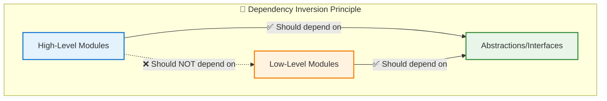
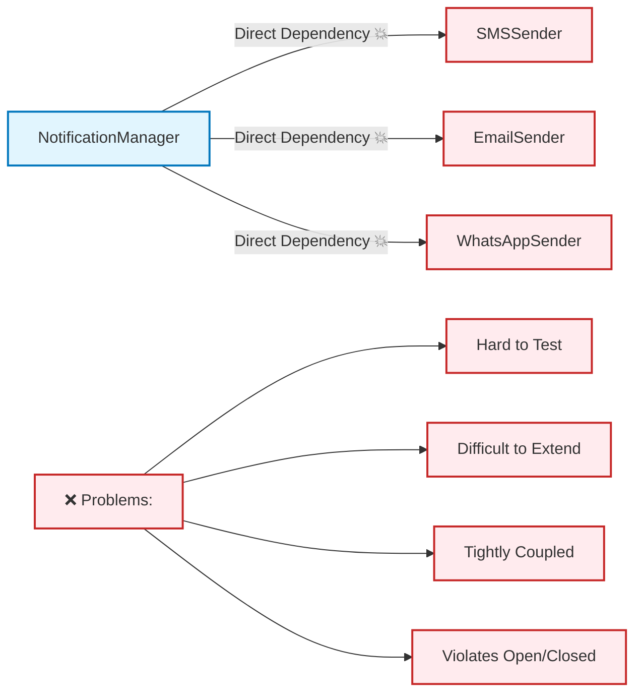
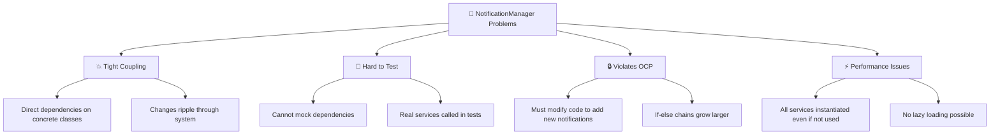
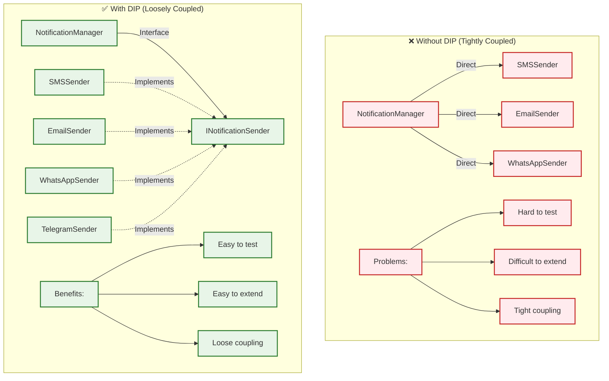
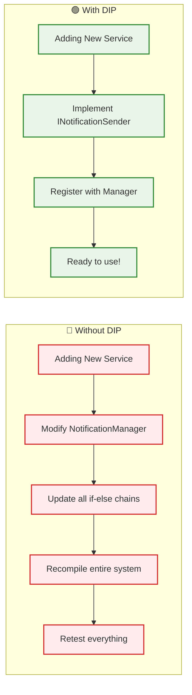
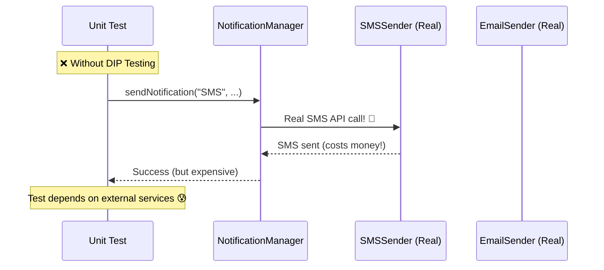
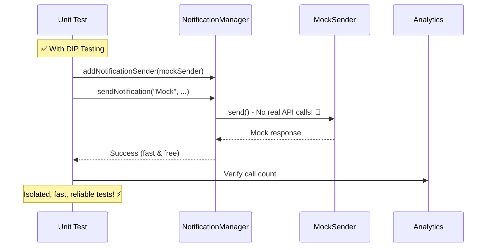

# 🔄 Dependency Inversion Principle (DIP): Complete Guide with Notification Manager

## 🎯 What is Dependency Inversion Principle?

**DIP Definition**: High-level modules should not depend on low-level modules. Both should depend on abstractions.[1][2][7]

> **"Abstractions should not depend on details. Details should depend on abstractions."** - Robert C. Martin

***

## 📊 D in SOLID = Dependency Inversion Principle



***

## 🚨 Problem Analysis: Tight Coupling

### 🔴 What Happens Without DIP?



***

## ❌ BAD EXAMPLE: Notification Manager WITHOUT DIP

### 🚨 Tightly Coupled Implementation

```cpp
#include <iostream>
#include <string>
#include <vector>
using namespace std;

// 📱 SMS Sender - Low-level module
class SMSSender {
public:
    void sendSMS(const string& phoneNumber, const string& message) {
        cout << "📱 SMS sent to " << phoneNumber << ": " << message << endl;
        // Simulate SMS API call
        cout << "   └─ Using SMS Gateway API..." << endl;
    }
};

// 📧 Email Sender - Low-level module
class EmailSender {
public:
    void sendEmail(const string& email, const string& subject, const string& body) {
        cout << "📧 Email sent to " << email << endl;
        cout << "   ├─ Subject: " << subject << endl;
        cout << "   ├─ Body: " << body << endl;
        cout << "   └─ Using SMTP server..." << endl;
    }
};

// 💬 WhatsApp Sender - Low-level module
class WhatsAppSender {
public:
    void sendWhatsApp(const string& phoneNumber, const string& message) {
        cout << "💬 WhatsApp sent to " << phoneNumber << ": " << message << endl;
        cout << "   └─ Using WhatsApp Business API..." << endl;
    }
};

// 📺 Slack Sender - Low-level module
class SlackSender {
public:
    void sendSlackMessage(const string& channel, const string& message) {
        cout << "📺 Slack message sent to #" << channel << ": " << message << endl;
        cout << "   └─ Using Slack Webhook..." << endl;
    }
};

// 🚨 HIGH-LEVEL MODULE WITH TIGHT COUPLING
class NotificationManager {
private:
    SMSSender smsService;           // 💥 Direct dependency!
    EmailSender emailService;       // 💥 Direct dependency!
    WhatsAppSender whatsappService; // 💥 Direct dependency!
    SlackSender slackService;       // 💥 Direct dependency!
    
public:
    // 🚨 PROBLEMS: Hard-coded dependencies, violates OCP
    void sendNotification(const string& type, const string& recipient, 
                         const string& message, const string& subject = "") {
        
        if (type == "SMS") {
            smsService.sendSMS(recipient, message);
        }
        else if (type == "EMAIL") {
            emailService.sendEmail(recipient, subject, message);
        }
        else if (type == "WHATSAPP") {
            whatsappService.sendWhatsApp(recipient, message);
        }
        else if (type == "SLACK") {
            slackService.sendSlackMessage(recipient, message);
        }
        // 🚨 Adding TELEGRAM means modifying this method!
        else {
            cout << "❌ Unsupported notification type: " << type << endl;
        }
    }
    
    // 💥 What if we want to send to multiple channels?
    void sendUrgentNotification(const string& recipient, const string& message) {
        // Hard-coded logic - difficult to change!
        smsService.sendSMS(recipient, "URGENT: " + message);
        emailService.sendEmail(recipient, "URGENT ALERT", message);
        whatsappService.sendWhatsApp(recipient, "⚠️ URGENT: " + message);
    }
};

// 🧪 Testing becomes difficult!
class NotificationManagerTest {
public:
    void testSendNotification() {
        NotificationManager manager;
        
        cout << "\n🧪 TESTING NOTIFICATION MANAGER (Difficult to test!)" << endl;
        cout << "====================================================" << endl;
        
        // 💥 Problem: Can't mock dependencies!
        // Real SMS, Email, WhatsApp will be sent during testing!
        manager.sendNotification("SMS", "+1234567890", "Test message");
        manager.sendNotification("EMAIL", "test@example.com", "Test body", "Test Subject");
        
        cout << "\n❌ Problems with testing:" << endl;
        cout << "  - Can't mock external services" << endl;
        cout << "  - Real notifications sent during tests" << endl;
        cout << "  - Expensive API calls in tests" << endl;
        cout << "  - Tests depend on external services being available" << endl;
    }
};

int main() {
    cout << "🚨 NOTIFICATION SYSTEM - DIP VIOLATION DEMO" << endl;
    cout << "===========================================" << endl;
    
    NotificationManager manager;
    
    cout << "\n📱 Sending various notifications:" << endl;
    manager.sendNotification("SMS", "+91-9876543210", "Your order is confirmed!");
    manager.sendNotification("EMAIL", "user@example.com", "Order confirmation details", "Order Confirmed");
    manager.sendNotification("WHATSAPP", "+91-9876543210", "Your delivery is on the way!");
    
    cout << "\n🚨 Trying to send urgent notification:" << endl;
    manager.sendUrgentNotification("+91-9876543210", "System maintenance in 5 minutes");
    
    // Testing difficulties
    NotificationManagerTest test;
    test.testSendNotification();
    
    cout << "\n💥 PROBLEMS WITH THIS DESIGN:" << endl;
    cout << "=============================" << endl;
    cout << "❌ NotificationManager tightly coupled to concrete classes" << endl;
    cout << "❌ Hard to add new notification types (violates OCP)" << endl;
    cout << "❌ Difficult to test (can't mock dependencies)" << endl;
    cout << "❌ All dependencies created whether needed or not" << endl;
    cout << "❌ If SMS service changes, NotificationManager must change" << endl;
    cout << "❌ No way to configure which services to use" << endl;
    
    return 0;
}
```

### 💥 Problems with Above Code:



***

## ✅ SOLUTION: Notification Manager WITH DIP

### 🎯 Dependency Inversion Architecture

```mermaid
graph TB
    subgraph "🏗️ DIP Architecture"
        A[NotificationManager<br/>High-Level Module]
        B[INotificationSender<br/>Abstraction Layer]
        
        subgraph "📱 Concrete Implementations"
            C[SMSNotificationSender]
            D[EmailNotificationSender] 
            E[WhatsAppNotificationSender]
            F[SlackNotificationSender]
            G[TelegramNotificationSender]
        end
    end
    
    A -->|"✅ Depends on Abstraction"| B
    C -.->|"✅ Implements"| B
    D -.->|"✅ Implements"| B
    E -.->|"✅ Implements"| B
    F -.->|"✅ Implements"| B
    G -.->|"✅ Implements"| B
    
    classDef high fill:#e3f2fd,stroke:#1976d2,stroke-width:3px
    classDef abstract fill:#e8f5e8,stroke:#388e3c,stroke-width:3px
    classDef concrete fill:#fff3e0,stroke:#f57c00,stroke-width:2px
    
    class A high
    class B abstract  
    class C,D,E,F,G concrete
```

### ✅ Complete DIP-Compliant Implementation

```cpp
#include <iostream>
#include <string>
#include <vector>
#include <memory>
#include <map>
#include <algorithm>
using namespace std;

// 🎯 ABSTRACTION LAYER - Interface for all notification senders
class INotificationSender {
public:
    virtual void send(const string& recipient, const string& message, 
                     const map<string, string>& metadata = {}) = 0;
    virtual string getServiceName() const = 0;
    virtual bool isServiceAvailable() const = 0;
    virtual ~INotificationSender() = default;
};

// 📊 Notification Result for better error handling
struct NotificationResult {
    bool success;
    string serviceName;
    string message;
    string errorCode;
    
    NotificationResult(bool s, const string& service, const string& msg, const string& error = "")
        : success(s), serviceName(service), message(msg), errorCode(error) {}
};

// 📱 SMS Notification Sender - Implements abstraction
class SMSNotificationSender : public INotificationSender {
private:
    string apiKey;
    string gateway;
    
public:
    SMSNotificationSender(const string& key, const string& gw) 
        : apiKey(key), gateway(gw) {}
    
    void send(const string& recipient, const string& message, 
              const map<string, string>& metadata = {}) override {
        cout << "📱 SMS Notification Service" << endl;
        cout << "├─ Gateway: " << gateway << endl;
        cout << "├─ To: " << recipient << endl;
        cout << "├─ Message: " << message << endl;
        
        // Add metadata if available
        if (!metadata.empty()) {
            cout << "├─ Metadata:" << endl;
            for (const auto& [key, value] : metadata) {
                cout << "│  └─ " << key << ": " << value << endl;
            }
        }
        cout << "└─ ✅ SMS sent successfully via " << gateway << endl;
    }
    
    string getServiceName() const override { return "SMS"; }
    
    bool isServiceAvailable() const override {
        // Simulate service health check
        cout << "🔍 Checking SMS service availability..." << endl;
        return !apiKey.empty();
    }
};

// 📧 Email Notification Sender - Implements abstraction
class EmailNotificationSender : public INotificationSender {
private:
    string smtpServer;
    string username;
    
public:
    EmailNotificationSender(const string& server, const string& user)
        : smtpServer(server), username(user) {}
    
    void send(const string& recipient, const string& message, 
              const map<string, string>& metadata = {}) override {
        cout << "📧 Email Notification Service" << endl;
        cout << "├─ SMTP Server: " << smtpServer << endl;
        cout << "├─ From: " << username << endl;
        cout << "├─ To: " << recipient << endl;
        
        string subject = "Notification";
        if (metadata.find("subject") != metadata.end()) {
            subject = metadata.at("subject");
        }
        
        cout << "├─ Subject: " << subject << endl;
        cout << "├─ Body: " << message << endl;
        cout << "└─ ✅ Email sent successfully via SMTP" << endl;
    }
    
    string getServiceName() const override { return "Email"; }
    
    bool isServiceAvailable() const override {
        cout << "🔍 Checking email service availability..." << endl;
        return !smtpServer.empty();
    }
};

// 💬 WhatsApp Notification Sender - Implements abstraction
class WhatsAppNotificationSender : public INotificationSender {
private:
    string businessApiKey;
    
public:
    WhatsAppNotificationSender(const string& apiKey) : businessApiKey(apiKey) {}
    
    void send(const string& recipient, const string& message, 
              const map<string, string>& metadata = {}) override {
        cout << "💬 WhatsApp Business Notification Service" << endl;
        cout << "├─ API: WhatsApp Business API" << endl;
        cout << "├─ To: " << recipient << endl;
        cout << "├─ Message: " << message << endl;
        
        // WhatsApp supports media
        if (metadata.find("mediaType") != metadata.end()) {
            cout << "├─ Media Type: " << metadata.at("mediaType") << endl;
        }
        
        cout << "└─ ✅ WhatsApp message sent successfully" << endl;
    }
    
    string getServiceName() const override { return "WhatsApp"; }
    
    bool isServiceAvailable() const override {
        cout << "🔍 Checking WhatsApp Business API availability..." << endl;
        return !businessApiKey.empty();
    }
};

// 📺 Slack Notification Sender - Implements abstraction
class SlackNotificationSender : public INotificationSender {
private:
    string webhookUrl;
    string botToken;
    
public:
    SlackNotificationSender(const string& webhook, const string& token)
        : webhookUrl(webhook), botToken(token) {}
    
    void send(const string& recipient, const string& message, 
              const map<string, string>& metadata = {}) override {
        cout << "📺 Slack Notification Service" << endl;
        cout << "├─ Channel: #" << recipient << endl;
        cout << "├─ Message: " << message << endl;
        
        if (metadata.find("color") != metadata.end()) {
            cout << "├─ Color: " << metadata.at("color") << endl;
        }
        
        cout << "└─ ✅ Slack message posted successfully" << endl;
    }
    
    string getServiceName() const override { return "Slack"; }
    
    bool isServiceAvailable() const override {
        cout << "🔍 Checking Slack webhook availability..." << endl;
        return !webhookUrl.empty();
    }
};

// 🆕 Telegram Notification Sender - Easy to add new service!
class TelegramNotificationSender : public INotificationSender {
private:
    string botToken;
    
public:
    TelegramNotificationSender(const string& token) : botToken(token) {}
    
    void send(const string& recipient, const string& message, 
              const map<string, string>& metadata = {}) override {
        cout << "🤖 Telegram Bot Notification Service" << endl;
        cout << "├─ Bot Token: " << botToken.substr(0, 10) << "..." << endl;
        cout << "├─ Chat ID: " << recipient << endl;
        cout << "├─ Message: " << message << endl;
        cout << "└─ ✅ Telegram message sent successfully" << endl;
    }
    
    string getServiceName() const override { return "Telegram"; }
    
    bool isServiceAvailable() const override {
        cout << "🔍 Checking Telegram Bot API availability..." << endl;
        return !botToken.empty();
    }
};

// ✅ HIGH-LEVEL MODULE - Now depends only on abstraction!
class NotificationManager {
private:
    vector<shared_ptr<INotificationSender>> notificationSenders;
    map<string, shared_ptr<INotificationSender>> serviceMap;
    
public:
    // ✅ Dependency Injection - depends on abstraction!
    void addNotificationSender(shared_ptr<INotificationSender> sender) {
        notificationSenders.push_back(sender);
        serviceMap[sender->getServiceName()] = sender;
        cout << "📌 Registered notification service: " << sender->getServiceName() << endl;
    }
    
    // ✅ Send via specific service
    NotificationResult sendNotification(const string& serviceName, const string& recipient, 
                                       const string& message, 
                                       const map<string, string>& metadata = {}) {
        
        auto it = serviceMap.find(serviceName);
        if (it == serviceMap.end()) {
            return NotificationResult(false, serviceName, "Service not found", "SERVICE_NOT_FOUND");
        }
        
        auto sender = it->second;
        
        if (!sender->isServiceAvailable()) {
            return NotificationResult(false, serviceName, "Service unavailable", "SERVICE_UNAVAILABLE");
        }
        
        try {
            sender->send(recipient, message, metadata);
            return NotificationResult(true, serviceName, "Message sent successfully");
        } catch (const exception& e) {
            return NotificationResult(false, serviceName, e.what(), "SEND_FAILED");
        }
    }
    
    // ✅ Broadcast to all available services
    vector<NotificationResult> broadcastNotification(const string& recipient, const string& message,
                                                    const map<string, string>& metadata = {}) {
        vector<NotificationResult> results;
        
        cout << "\n📢 BROADCASTING NOTIFICATION TO ALL SERVICES" << endl;
        cout << "════════════════════════════════════════════" << endl;
        
        for (auto& sender : notificationSenders) {
            if (sender->isServiceAvailable()) {
                try {
                    sender->send(recipient, message, metadata);
                    results.emplace_back(true, sender->getServiceName(), "Broadcast successful");
                } catch (const exception& e) {
                    results.emplace_back(false, sender->getServiceName(), e.what(), "BROADCAST_FAILED");
                }
                cout << "────────────────────────────────────" << endl;
            } else {
                results.emplace_back(false, sender->getServiceName(), "Service unavailable", "SERVICE_DOWN");
            }
        }
        
        return results;
    }
    
    // ✅ Get available services
    vector<string> getAvailableServices() const {
        vector<string> available;
        
        for (const auto& sender : notificationSenders) {
            if (sender->isServiceAvailable()) {
                available.push_back(sender->getServiceName());
            }
        }
        
        return available;
    }
    
    // ✅ Health check for all services
    void performHealthCheck() {
        cout << "\n🏥 NOTIFICATION SERVICES HEALTH CHECK" << endl;
        cout << "====================================" << endl;
        
        for (const auto& sender : notificationSenders) {
            cout << "🔍 Checking " << sender->getServiceName() << ": ";
            if (sender->isServiceAvailable()) {
                cout << "✅ HEALTHY" << endl;
            } else {
                cout << "❌ UNHEALTHY" << endl;
            }
        }
    }
};

// 🧪 EASY TESTING with Dependency Injection!
class MockNotificationSender : public INotificationSender {
private:
    string serviceName;
    bool shouldFail;
    
public:
    MockNotificationSender(const string& name, bool fail = false) 
        : serviceName(name), shouldFail(fail) {}
    
    void send(const string& recipient, const string& message, 
              const map<string, string>& metadata = {}) override {
        if (shouldFail) {
            throw runtime_error("Mock service intentionally failed");
        }
        cout << "🧪 MOCK " << serviceName << " - Message sent to " << recipient 
             << ": " << message << endl;
    }
    
    string getServiceName() const override { return "Mock" + serviceName; }
    bool isServiceAvailable() const override { return !shouldFail; }
};

// 📊 Statistics and Analytics
class NotificationAnalytics {
private:
    map<string, int> serviceCounts;
    map<string, int> successCounts;
    map<string, int> failureCounts;
    
public:
    void recordResult(const NotificationResult& result) {
        serviceCounts[result.serviceName]++;
        if (result.success) {
            successCounts[result.serviceName]++;
        } else {
            failureCounts[result.serviceName]++;
        }
    }
    
    void displayAnalytics() {
        cout << "\n📊 NOTIFICATION ANALYTICS" << endl;
        cout << "=========================" << endl;
        
        for (const auto& [service, count] : serviceCounts) {
            int success = successCounts[service];
            int failure = failureCounts[service];
            double successRate = (success * 100.0) / count;
            
            cout << "📈 " << service << ":" << endl;
            cout << "   ├─ Total: " << count << endl;
            cout << "   ├─ Success: " << success << " ✅" << endl;
            cout << "   ├─ Failures: " << failure << " ❌" << endl;
            cout << "   └─ Success Rate: " << successRate << "%" << endl;
        }
    }
};

int main() {
    cout << "✅ NOTIFICATION SYSTEM - DIP COMPLIANT IMPLEMENTATION" << endl;
    cout << "====================================================" << endl;
    
    NotificationManager manager;
    NotificationAnalytics analytics;
    
    // ✅ Dependency Injection - Add services dynamically
    cout << "\n🔧 CONFIGURING NOTIFICATION SERVICES" << endl;
    cout << "====================================" << endl;
    
    auto smsService = make_shared<SMSNotificationSender>("SMS_API_KEY_123", "Twilio");
    auto emailService = make_shared<EmailNotificationSender>("smtp.company.com", "notifications@company.com");
    auto whatsappService = make_shared<WhatsAppNotificationSender>("WA_BUSINESS_API_456");
    auto slackService = make_shared<SlackNotificationSender>("https://hooks.slack.com/webhook", "BOT_TOKEN_789");
    auto telegramService = make_shared<TelegramNotificationSender>("TELEGRAM_BOT_TOKEN_101");
    
    manager.addNotificationSender(smsService);
    manager.addNotificationSender(emailService);
    manager.addNotificationSender(whatsappService);
    manager.addNotificationSender(slackService);
    manager.addNotificationSender(telegramService);
    
    // Health check
    manager.performHealthCheck();
    
    // ✅ Send individual notifications
    cout << "\n📱 SENDING INDIVIDUAL NOTIFICATIONS" << endl;
    cout << "===================================" << endl;
    
    auto result1 = manager.sendNotification("SMS", "+91-9876543210", "Your order #12345 is confirmed!");
    analytics.recordResult(result1);
    
    cout << "────────────────────────────────────" << endl;
    
    map<string, string> emailMeta = {{"subject", "Order Confirmation"}};
    auto result2 = manager.sendNotification("Email", "customer@example.com", 
                                           "Thank you for your order. It will be delivered soon!", 
                                           emailMeta);
    analytics.recordResult(result2);
    
    cout << "────────────────────────────────────" << endl;
    
    map<string, string> whatsappMeta = {{"mediaType", "text"}};
    auto result3 = manager.sendNotification("WhatsApp", "+91-9876543210", 
                                           "🍕 Your pizza is being prepared!", whatsappMeta);
    analytics.recordResult(result3);
    
    // ✅ Broadcast notification
    cout << "\n📢 BROADCASTING URGENT NOTIFICATION" << endl;
    cout << "===================================" << endl;
    
    map<string, string> urgentMeta = {
        {"priority", "high"},
        {"subject", "URGENT: System Maintenance"},
        {"color", "red"}
    };
    
    auto broadcastResults = manager.broadcastNotification(
        "+91-9876543210", 
        "🚨 URGENT: System will be down for maintenance in 10 minutes. Please save your work!",
        urgentMeta
    );
    
    for (const auto& result : broadcastResults) {
        analytics.recordResult(result);
    }
    
    // ✅ Testing with Mock services
    cout << "\n🧪 TESTING WITH MOCK SERVICES" << endl;
    cout << "=============================" << endl;
    
    NotificationManager testManager;
    auto mockSMS = make_shared<MockNotificationSender>("SMS");
    auto mockEmailFail = make_shared<MockNotificationSender>("Email", true); // This will fail
    
    testManager.addNotificationSender(mockSMS);
    testManager.addNotificationSender(mockEmailFail);
    
    auto mockResult1 = testManager.sendNotification("MockSMS", "test-recipient", "Test message");
    auto mockResult2 = testManager.sendNotification("MockEmail", "test@test.com", "Test email");
    
    cout << "Mock SMS Result: " << (mockResult1.success ? "✅ Success" : "❌ Failed") << endl;
    cout << "Mock Email Result: " << (mockResult2.success ? "✅ Success" : "❌ Failed") << endl;
    
    // Analytics
    analytics.displayAnalytics();
    
    // ✅ Show available services
    cout << "\n🎯 AVAILABLE SERVICES" << endl;
    cout << "=====================" << endl;
    auto availableServices = manager.getAvailableServices();
    for (const string& service : availableServices) {
        cout << "✅ " << service << " is available" << endl;
    }
    
    cout << "\n🎉 BENEFITS OF DIP IMPLEMENTATION:" << endl;
    cout << "==================================" << endl;
    cout << "✅ Easy to add new notification services (Telegram added seamlessly)" << endl;
    cout << "✅ Easy to test with mock implementations" << endl;
    cout << "✅ Services can be configured at runtime" << endl;
    cout << "✅ NotificationManager doesn't know about concrete implementations" << endl;
    cout << "✅ Loose coupling between high-level and low-level modules" << endl;
    cout << "✅ Follows Open/Closed Principle" << endl;
    cout << "✅ Individual services can be developed independently" << endl;
    
    return 0;
}
```

***

## 📊 DIP Benefits Visualization

### 🔄 Before vs After Comparison



### 📈 Scalability Comparison



***

## 🧪 Testing Benefits Analysis

### 🔴 Testing Without DIP vs 🟢 Testing With DIP





***

## 🎯 Key DIP Principles Applied

### 1. 🎯 High-level modules don't depend on low-level modules

```cpp
// ❌ Without DIP
class NotificationManager {
    SMSSender sms;     // Direct dependency!
    EmailSender email; // Direct dependency!
};

// ✅ With DIP  
class NotificationManager {
    vector<shared_ptr<INotificationSender>> senders; // Depends on abstraction!
};
```

### 2. 🔄 Both depend on abstractions

```cpp
// ✅ Abstraction that both depend on
class INotificationSender {
public:
    virtual void send(const string& recipient, const string& message) = 0;
    virtual ~INotificationSender() = default;
};
```

### 3. 🧩 Details depend on abstractions (not the reverse)

```cpp
// ✅ Concrete implementation depends on interface
class SMSSender : public INotificationSender {
public:
    void send(const string& recipient, const string& message) override {
        // Implementation details
    }
};
```

***

## 🚀 DIP Implementation Patterns

### 🔧 Constructor Injection

```cpp
class NotificationManager {
    vector<shared_ptr<INotificationSender>> senders;
    
public:
    NotificationManager(vector<shared_ptr<INotificationSender>> injectedSenders) 
        : senders(std::move(injectedSenders)) {}
};
```

### 🔧 Setter Injection

```cpp
class NotificationManager {
public:
    void addNotificationSender(shared_ptr<INotificationSender> sender) {
        senders.push_back(sender);
    }
};
```

### 🔧 Factory Pattern

```cpp
class NotificationSenderFactory {
public:
    static shared_ptr<INotificationSender> create(const string& type) {
        if (type == "SMS") return make_shared<SMSSender>();
        if (type == "Email") return make_shared<EmailSender>();
        return nullptr;
    }
};
```

***

## 📊 Performance & Benefits Analysis

| Aspect | ❌ Without DIP | ✅ With DIP |
|--------|---------------|-------------|
| **Adding New Service** | Modify existing code | Create new class only |
| **Testing** | Hard (real dependencies) | Easy (mock dependencies) |
| **Maintenance** | High coupling, risky changes | Low coupling, safe changes |
| **Team Development** | Conflicts in same files | Independent development |
| **Configuration** | Compile-time only | Runtime configuration possible |
| **Performance** | All services loaded | Lazy loading possible |
| **Error Handling** | Hard to isolate failures | Service-specific error handling |

***

## 🎯 Real-World Applications

### 🏗️ Where DIP is Used:

1. **🗄️ Database Access Layers** - Repository pattern
2. **🌐 Web Frameworks** - Controller dependency injection
3. **📱 Mobile Apps** - Service locator pattern
4. **☁️ Cloud Services** - Provider abstraction layers
5. **🧪 Testing Frameworks** - Mock injection
6. **🔌 Plugin Systems** - Interface-based plugins

***

## 🏆 Summary: DIP Benefits

### ✅ Technical Benefits:
- **🔄 Loose Coupling** - Components are independent
- **🧪 Testability** - Easy mocking and unit testing  
- **🔧 Flexibility** - Runtime configuration possible
- **📈 Scalability** - Easy to add new implementations
- **🛡️ Maintainability** - Changes are localized

### ✅ Business Benefits:
- **⚡ Faster Development** - Teams work independently
- **💰 Cost Effective** - Less regression testing needed
- **🚀 Quick Time-to-Market** - Features can be developed in parallel
- **🔄 Easy Integration** - Third-party services easy to swap
- **📊 Better Monitoring** - Service-specific analytics possible

***

## 🎊 Conclusion

**Dependency Inversion Principle transforms rigid, tightly-coupled systems into flexible, maintainable architectures:**

1. **🎯 High-level modules** (NotificationManager) don't depend on low-level modules (SMS, Email)
2. **🔄 Both depend on abstractions** (INotificationSender interface)
3. **🧩 Details depend on abstractions**, not the reverse
4. **🧪 Easy testing** with dependency injection and mocking
5. **📈 Scalable design** that grows with business needs

**Result: A notification system that's robust, testable, maintainable, and ready for the future!** ✨🚀

---